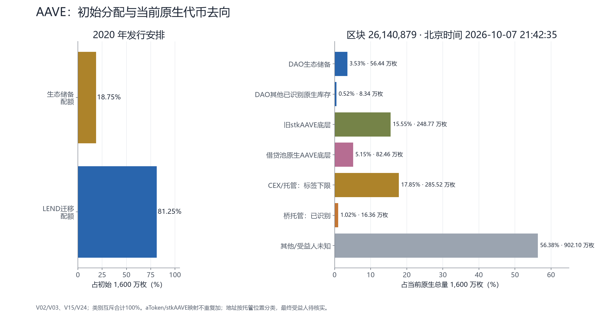
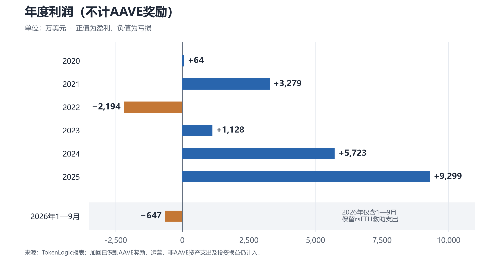
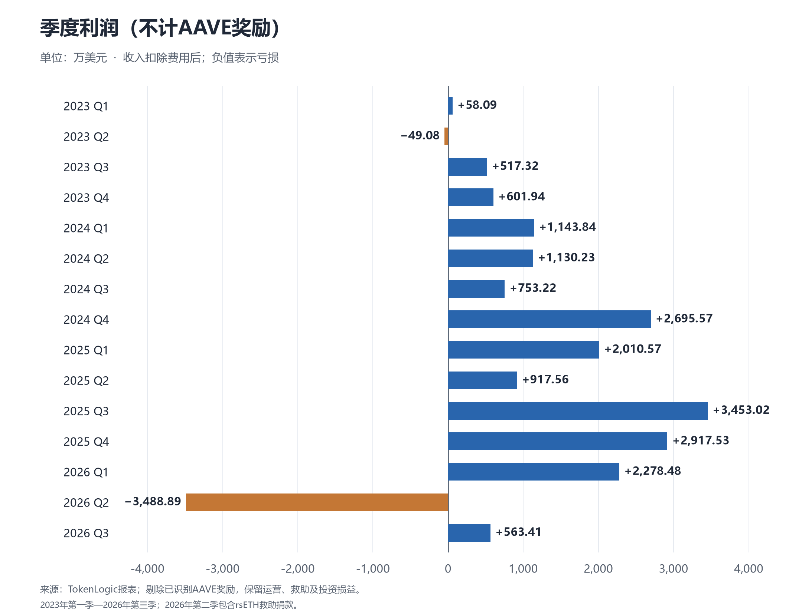

# AAVE：筹码流通、收入赋能与当前估值

价格、筹码及回购状态截至2026年10月7日；财务期间见各表。文字更新：10月11日。

Aave是[去中心化借贷协议](https://aave.com/docs/aave-v3/overview)：用户存币赚利息，或抵押资产借款，由智能合约执行。AAVE是其[治理代币](https://aave.com/docs/ecosystem/aave)，持有人可参与协议决策。

## 一、代币筹码结构与流通量

### 原始分配

2017年先发行LEND；2020年按100:1换成AAVE，并增加DAO生态储备。

**早期团队的24个月锁定期按计划已结束，后续释放主要来自DAO库存、奖励和拨款。**

原始分配的说明与来源

LEND出售配额10亿枚（含6,000万预售），开发基金3亿枚；白皮书未单列用户奖励配额。

AAVE的1,300万枚迁移配额承接原LEND持有人，包含投资人与开发基金份额；新增300万枚归DAO。

来源：[LEND官方白皮书](https://github.com/ETHLend/Documentation/blob/master/ETHLendWhitePaper.md)、[Aavenomics](https://github.com/aave/aavenomics)、[AIP 1](https://aave.github.io/aip/AIP-1/)。

### 当前流通量

| AAVE总量 | 已计入流通 | 未计入流通 |
| ---: | ---: | ---: |
| **1,600万枚** | **1,543.55万枚 · 96.47%** | **56.45万枚 · 3.53%** |

流通量据CoinGecko。DAO持仓与未流通部分有重叠，不能相加。

### DAO手里还有多少

<figure class="holdings-figure" data-chart-id="aave-dao-inventory">
<strong>DAO持有88.83万枚 · 占总量5.55%</strong>

<svg class="holdings-pie" viewBox="0 0 320 320" role="group" aria-labelledby="aave-dao-inventory-title"><title id="aave-dao-inventory-title">DAO库存及已安排用途</title><path class="pie-sector" d="M 160 160 L 160.00000 24.00000 A 136 136 0 1 1 71.87878 56.41114 Z" fill="#a22665" tabindex="0" role="img" aria-label="其余DAO库存：78.87万枚，88.78%"><title>其余DAO库存：78.87万枚，88.78%</title></path><text class="pie-percent" x="190.38" y="242.59" aria-hidden="true">88.78%</text><path class="pie-sector" d="M 160 160 L 71.87878 56.41114 A 136 136 0 0 1 136.02594 26.12975 Z" fill="#315e9e" tabindex="0" role="img" aria-label="已批准分期拨款：7.46万枚，8.40%"><title>已批准分期拨款：7.46万枚，8.40%</title></path><text class="pie-percent" x="122.43" y="80.42" aria-hidden="true">8.40%</text><path class="pie-sector" d="M 160 160 L 136.02594 26.12975 A 136 136 0 0 1 160.00000 24.00000 Z" fill="#aa7625" tabindex="0" role="img" aria-label="奖励合约库存：2.51万枚，2.82%"><title>奖励合约库存：2.51万枚，2.82%</title></path></svg><ul class="pie-legend"><li><i class="pie-swatch" style="background:#a22665" aria-hidden="true"></i>
其余DAO库存<small>78.87万枚 AAVE</small>
<strong>88.78%</strong></li><li><i class="pie-swatch" style="background:#315e9e" aria-hidden="true"></i>
已批准分期拨款<small>7.46万枚 AAVE</small>
<strong>8.40%</strong></li><li><i class="pie-swatch" style="background:#aa7625" aria-hidden="true"></i>
奖励合约库存<small>2.51万枚 AAVE</small>
<strong>2.82%</strong></li></ul>
<figcaption>比例以DAO持有的88.83万枚为分母2026年10月7日</figcaption></figure>

| 放在哪里 | AAVE数量 | 后续用途／进入市场的方式 |
| --- | ---: | --- |
| 生态储备 | **56.44万枚** | 支付质押奖励、服务商拨款和生态预算 |
| 回购钱包存入借贷池 | **24.05万枚** | 可提款后按DAO安排使用 |
| DAO多签 | **5.83万枚** | 按多签及治理安排使用 |
| 奖励合约 | **2.51万枚** | 向符合条件的用户发放 |
| 合计 | **88.83万枚** | **占总量5.55%** |

**DAO库存发给服务商或用户后，可能进入市场，形成卖压。**

库存动用受治理和提款条件约束，尚未扣尽全部预算；团队个人持仓未知。

### 已安排的后续释放

| 发给谁 | 尚未领取 | 计划发放至 |
| --- | ---: | --- |
| Aave Labs | **6.63万枚** | 2030-04-12 |
| LlamaRisk | **0.33万枚** | 2027-05-27 |
| TokenLogic | **0.50万枚** | 2027-06-27 |
| 合计 | **7.46万枚** | 分期发放 |

其中**7.27万枚尚未到领取时间**，拨款可取消。另有stkAAVE奖励**150枚／日**，按现速一年约**5.48万枚**，速率可由治理调整。

地址、拨款与流通口径明细

7.46万枚拨款已包含在生态储备中，其中约1,916枚已到领取时间、尚未领取。

DAO持仓含原生AAVE约64.78万枚和存款约24.05万枚；存款底层只计一次。未识别地址可能包含个人、机构和合约。

主要合约与DAO地址的实际余额

| 地址 / 合约 | 原生AAVE余额 | 属于谁 / 余额口径 |
| --- | ---: | --- |
| [生态储备](https://etherscan.io/address/0x25f2226b597e8f9514b3f68f00f494cf4f286491) | 564,446.952 | DAO；含下述分期拨款 |
| [回购Safe](https://etherscan.io/address/0x22740deba78d5a0c24c58c740e3715ec29de1bfa) | 0 | 另持有240,502.342枚aAAVE存款债权，底层位于V3池 |
| [Balancer Reclamm DAO多签](https://etherscan.io/address/0xaaa973fe8a6202947e21d0a3a43d8e83abe35c23) | 58,343.354 | DAO多签库存 |
| [奖励控制合约](https://etherscan.io/address/0xd784927ff2f95ba542bfc824c8a8a98f3495f6b5) | 25,054.205 | 奖励库存；未把整个余额列作可自由调度 |
| [Ethereum Collector](https://etherscan.io/address/0x464c71f6c2f760dda6093dcb91c24c39e5d6e18c) | 0 | 此行为AAVE余额，不代表国库其他资产为零 |
| [stkAAVE质押合约](https://etherscan.io/address/0x4da27a545c0c5b758a6ba100e3a049001de870f5) | 2,487,708.478 | 质押者的币；按快照规则退出需冷却 |
| [V3 aAAVE合约](https://etherscan.io/address/0xa700b4eb416be35b2911fd5dee80678ff64ff6c9) | 820,095.059 | 借贷池可用AAVE底层；含DAO存款的底层 |
| [V2 aAAVE合约](https://etherscan.io/address/0xffc97d72e13e01096502cb8eb52dee56f74dad7b) | 4,492.052 | V2池AAVE底层 |
| [LEND迁移合约](https://etherscan.io/address/0x317625234562b1526ea2fac4030ea499c5291de4) | 0 | 已关闭 |

已识别合约与DAO多签合计约412.37万枚，未覆盖全部未标注合约。

链上快照：Ethereum区块26,140,879，2026年10月7日21:42（北京时间）。拨款日期采用UTC。

来源：V09、V24、V25、V33、[余额与拨款核对](9dfd5b29-筹码归属核对.md)、[已识别地址CSV](94a30560-实际筹码_地址.csv)、[本章图表数据](ed51498d-第一章图表数据.json)。资金流允许取消的依据见[储备实现合约](https://eth.blockscout.com/address/0x10c74b37Ad4541E394c607d78062e6d22D9ad632?tab=contract)。

## 二、历史赋能与收入到代币的路径

### 代币权益的治理沿革

按运行期间排列；尚未结束的只列开始时间。状态截至2026年10月7日，日期采用UTC。

<ol class="aave-rights-history" aria-label="AAVE代币权益的治理沿革">
<li>
2020年9月

<strong>质押AAVE，领取库存奖励</strong>
把AAVE存入质押合约后，领取DAO库存中的AAVE。发多少、发多久，由治理分期决定。 <a href="https://github.com/aave/aip/blob/main/content/aips/AIP-1.md">启动方案</a>

</li>
<li>
2021-01-10至 2025-10-08

<strong>质押者同时承担坏账风险</strong>
当时质押本金可能被扣来补坏账，最高比例从30%逐步降到20%、10%，最后归零。这项担保已取消，库存奖励保留。 <a href="https://governance-v2.aave.com/governance/proposal/2/">启动提案</a> <a href="https://app.aave.com/governance/v3/proposal/?proposalId=385">取消担保</a>

</li>
<li>
2023-07-15至 2025-07-03

<strong>质押AAVE，借GHO可享利息折扣</strong>
借入GHO的stkAAVE质押者曾享受利息优惠，后来在V3.4升级中取消。 <a href="https://governance-v2.aave.com/governance/proposal/268/">上线提案</a> <a href="https://app.aave.com/governance/v3/proposal/?proposalId=334">取消折扣</a>

</li>
<li>
2025-04-09至 2026-04-19

<strong>开始回购AAVE：每周100万美元，先执行6个月</strong>
按约26周估算，首期计划约<b>2,600万美元</b>；首批授权<b>400万美元</b>，约覆盖1个月。DAO用协议收入买币，买来的AAVE进入生态储备，后续可用于奖励，不销毁。 <a href="https://governance.aave.com/t/arfc-aavenomics-implementation-part-one/21248">启动方案</a> <a href="https://app.aave.com/governance/v3/proposal/?proposalId=286">首批授权</a>

<b>2025年10月续期方案：</b>每年<b>5,000万美元</b>，每周可在25万—175万美元之间调整。 <a href="https://governance.aave.com/t/arfc-aave-buybacks-program-an-update/23290">续期方案</a> <b>2026年3月下调方案：</b>拟从每年5,000万降至<b>3,000万美元</b>，保留更多资金用于运营。 <a href="https://governance.aave.com/t/arfc-buyback-program-budget-adjustment/24229">调整方案</a>

</li>
<li>
2025-06-05

<strong>Umbrella开始按资产提供坏账保障</strong>
DAO先承担约定额度，超出的合格缺口由对应保障池承担。只覆盖已启用的资产与网络，AAVE原有的担保责任随后逐步退出。 <a href="https://app.aave.com/governance/v3/proposal/?proposalId=320">上线提案</a>

</li>
<li>
2026-03-24至 2026-06-13

<strong>每天的质押奖励从260枚降到220枚</strong>
这是整个stkAAVE池每天分的AAVE。退出冷却期同时从7天缩短到2天。 <a href="https://app.aave.com/governance/v3/proposal/?proposalId=459">调整提案</a>

</li>
<li>
2026-04-19

<strong>暂停回购，钱先留在国库</strong>
rsETH事故后暂停买币，优先保留资金应对风险。TokenLogic于4月22日提出暂停议案，4月28日—5月1日投票通过，确认此前暂停。 <a href="https://governance.aave.com/t/arfc-pause-aave-buybacks/24686">暂停提案</a> <a href="https://snapshot.box/#/s:aavedao.eth/proposal/0x10a2af0110b1ad6f4afd7a3a052b2a119d102cc22949e80e9bbd5132587107c8">投票结果</a>

截至10月7日仍未恢复。待rsETH情况更清楚后再评估，恢复安排通过资金更新披露，具体日期未知。

</li>
<li>
2026-06-13

<strong>每天的质押奖励再降到150枚</strong>
stkAAVE全池每天分150枚AAVE，仍由DAO库存支付。个人按质押占比领取，后续还可通过治理调整。 <a href="https://app.aave.com/governance/v3/proposal/?proposalId=491">调整提案</a>

</li>
</ol>

**尚未确认落地：Anti-GHO收入分配。** 2025年3月18日通过方向投票，拟用50%的GHO收入，按80%／20%分给stkAAVE／stkBPT；实际发放未知。

治理来源与完整记录

回购金额为计划或授权，实际支出见第三章。首期2,600万美元按100万美元×约26周估算，400万美元首批授权已含在首期计划内。2025年10月、2026年3月两次后续方案均通过方向投票，具体生效日未知；不把提案日期当作开始执行日期。来源：[回购预算核对](a9b6be67-回购计划核对.json)。

来源：[权益运行期间CSV](2e439e75-收入相关运行期间.csv)、[完整治理与权益时间线CSV](c0acff95-价值捕获时间线_v3.csv)、[历史机制来源](0fc0899f-02_新增来源与核查台账_v3.md)。回购起止日期见[TokenLogic资金说明](https://governance.aave.com/t/aave-dao-funding-insights/24192)及[暂停提案](https://governance.aave.com/t/arfc-pause-aave-buybacks/24686)。

来源：[TokenLogic暂停提案](https://governance.aave.com/t/arfc-pause-aave-buybacks/24686)、[Snapshot投票结果](https://snapshot.box/#/s:aavedao.eth/proposal/0x10a2af0110b1ad6f4afd7a3a052b2a119d102cc22949e80e9bbd5132587107c8)、[本轮日期与投票核查](a14a3559-暂停回购核查.md)。

### DAO收入与费用

DAO收入来自借贷分成、GHO、交易与清算，以及国库投资收益；普通存款人的利息已扣除。

<figure class="aave-map aave-v7">
<strong>DAO收入扣除费用后的利润</strong>2026年第三季度 · 不计AAVE奖励

<svg viewBox="0 0 960 615" role="img" aria-labelledby="costs18-title costs18-desc"><title id="costs18-title">DAO收入扣除费用后的利润</title><desc id="costs18-desc">逐项扣除本次费用；AAVE奖励不计支出，服务商占本次费用69.30%。</desc><text x="24" y="32" class="aave-small">2026年7月1日—9月30日 · 不计AAVE奖励 · 单位：万美元</text><text x="24" y="104" class="aave-title">DAO收入</text><text x="936" y="104" class="aave-v7-value">1,890.21</text><rect x="260" y="80" width="560.000" height="34" class="aave-v7-total"/><path d="M820 114 V142" class="aave-v7-connector"/><text x="24" y="166" class="">服务商</text><text x="936" y="166" class="aave-v7-value">919.41</text><rect x="547.612" y="142" width="272.388" height="34" class="aave-v7-deduction"/><path d="M547.612 176 V204" class="aave-v7-connector"/><text x="24" y="228" class="">用户与市场激励</text><text x="936" y="228" class="aave-v7-value">134.41</text><rect x="507.792" y="204" width="39.819" height="34" class="aave-v7-deduction"/><path d="M507.792 238 V266" class="aave-v7-connector"/><text x="24" y="290" class="">Umbrella奖励</text><text x="936" y="290" class="aave-v7-value">82.37</text><rect x="483.390" y="266" width="24.402" height="34" class="aave-v7-deduction"/><path d="M483.390 300 V328" class="aave-v7-connector"/><text x="24" y="352" class="">GHO费用</text><text x="936" y="352" class="aave-v7-value">189.52</text><rect x="427.241" y="328" width="56.149" height="34" class="aave-v7-deduction"/><path d="M427.241 362 V390" class="aave-v7-connector"/><text x="24" y="414" class="">合作及其他</text><text x="936" y="414" class="aave-v7-value">1.10</text><rect x="426.916" y="390" width="0.325" height="34" class="aave-v7-deduction"/><path d="M426.916 424 V452" class="aave-v7-connector"/><text x="24" y="476" class="aave-title">本次利润</text><text x="936" y="476" class="aave-v7-value aave-v7-net-value">563.41</text><rect x="260" y="452" width="166.916" height="34" class="aave-v7-total"/><text x="24" y="545" class="aave-title">收入1,890.21 − 费用1,326.81 = 利润563.41</text><text x="24" y="582" class="aave-small">本次费用已剔除159.40万美元AAVE奖励；收入已排除普通存款人利息。</text></svg>
<figcaption>逐项扣除本次费用；AAVE奖励不计支出，服务商占本次费用69.30%。</figcaption></figure>

| 本季费用（不计AAVE奖励） | 金额（万美元） | 收款人 / 用途 |
| --- | ---: | --- |
| 服务商 | 919.41 | 开发、安全、风控与财务团队 |
| 用户与市场激励 | 134.41 | 吸引存款、借款及流动性；已扣合作伙伴承担部分 |
| Umbrella奖励 | 82.37 | 向保障池质押者支付奖励 |
| GHO相关费用 | 189.52 | sGHO费用176.56万、CEX相关12.35万、流动性约0.61万 |
| 合作、网络与其他 | 1.10 | 合作款、Gas与跨链发送等费用 |

#### 服务商费用

服务商费用是支付给开发、安全、风控和财务运营团队的报酬。

| 服务商 / 费用项 | 第三季费用（万美元） | 工作内容 |
| --- | ---: | --- |
| Aave Labs | 685.95 | 协议与产品开发、维护、接入和增长 |
| TokenLogic | 76.96 | 国库管理、预算与报表、GHO及市场运营、增长 |
| Certora | 66.24 | 智能合约形式化验证与安全工作 |
| LlamaRisk | 51.76 | 抵押资产分析、参数管理与风险监测 |
| 服务商KPI奖励 | 38.50 | 按约定绩效奖励；此报表未进一步拆出机构归属 |
| 合计 | 919.41 | 占本次费用约69.30% |

费用口径与来源

费用按合同期间计提，与当季提款可能不同；支付资产含GHO、aToken和AAVE。服务报酬继续计入费用。

来源：[TokenLogic报表与方法说明](https://aave.tokenlogic.xyz/financials/statements)、[本季逐项数据](2b681cad-Q3_收支明细.csv)、[2026年服务商职责](https://governance.aave.com/t/arfc-governance-framework-v2/25348)、[TokenLogic续约方案](https://governance.aave.com/t/arfc-tokenlogic-phase-ii-extension/24846)。

### 坏账保障与国库承担

清算后仍有坏账，DAO先承担约定额度，再由对应的Umbrella保障池承担合格缺口。保障仅限指定资产和网络，其他损失需另筹资金。

赔付和救助融资会挤占运营与回购资金。旧stkAAVE罚没比例已为0%，与Umbrella分开。来源：[Umbrella规则](https://www.aave.com/docs/aave-v3/umbrella)、V33。

### 2026年两次事故与损失

| 事件 | 发生了什么 | 资金来源与确认进度 |
| --- | --- | --- |
| 3月10日wstETH误清算 | 预言机参数错误，约34个账户被误清算；协议未产生坏账 | 国库赔付授权513.19 WETH；扣回收与退款后，3月12日更新净成本为316.94 WETH，最终结算待核 |
| 4月18日rsETH跨链攻击 | 外部桥被攻击，受影响rsETH进入Aave抵押借款，造成资金缺口 | 追回资产、生态捐款、DAO国库与融资共同补缺口。5月26日回填完成、市场恢复；DAO列报捐款3,924.38万美元，最终净损失待结算 |

<figure class="aave-map aave-v7">
<strong>rsETH恢复的资金来源、用途与偿还顺序</strong>资金关系 · 实线为已确认机制，虚线为条件路径

<svg viewBox="0 0 960 805" role="img" aria-labelledby="rescue-title rescue-desc"><title id="rescue-title">rsETH恢复的资金来源、用途与偿还顺序</title><desc id="rescue-desc">顶部区分追回资产、捐款与借款；虚线保留方案及到账条件。市场恢复结果已获官方确认，最终财务损失仍需对账。</desc><defs><marker id="arrow-rescue" viewBox="0 0 10 10" refX="9" refY="5" markerWidth="7" markerHeight="7" orient="auto"><path d="M0 0 L10 5 L0 10z" fill="context-stroke"/></marker></defs><text x="24" y="30" class="aave-small">资金方案：2026年4月24日；恢复结果：官方5月31日复盘</text><text x="24" y="90" class="aave-stage">追回资产</text><text x="360" y="90" class="aave-stage">捐款与DAO承担</text><text x="690" y="90" class="aave-stage">临时贷款</text><rect x="24" y="110" width="292" height="180" rx="3" class="aave-panel "/><text x="42" y="150" class="aave-title">Kelp冻结 / 清算抵押品</text><text x="42" y="184" class="">Arbitrum冻结约30,766 ETH</text><text x="42" y="218" class="">Aave、Compound清算追回</text><text x="42" y="253" class="aave-small">金额与可动用时点分别确认</text><rect x="350" y="110" width="292" height="180" rx="3" class="aave-panel aave-dao"/><text x="368" y="150" class="aave-title">生态捐款 + DAO国库</text><text x="368" y="184" class="">DAO方案：25,000 ETH</text><text x="368" y="218" class="">报表捐款：3,924.38万美元</text><text x="368" y="253" class="aave-small">ETH预算与美元费用口径不同</text><rect x="676" y="110" width="260" height="180" rx="3" class="aave-panel aave-paused"/><text x="694" y="150" class="aave-title">Mantle等融资方</text><text x="694" y="184" class="">额度最高30,000 ETH</text><text x="694" y="218" class="">另拟短期过桥借款</text><text x="694" y="253" class="aave-small">实际提款 / 余额未核实</text><path d="M170 290 V355 H496" class="aave-edge aave-paused"/><path d="M496 290 V400" class="aave-edge " marker-end="url(#arrow-rescue)"/><path d="M806 290 V355 H496" class="aave-edge aave-paused"/><text x="24" y="331" class="aave-small">冻结及可追回资产有到账时间差</text><rect x="24" y="400" width="912" height="155" rx="3" class="aave-panel aave-dao"/><text x="44" y="439" class="aave-title">补足rsETH支撑资产 → 回填跨链适配器 → 恢复提款与市场</text><text x="44" y="479" class="">5月6日：八个攻击者仓位完成清算；Umbrella质押者未被罚没。</text><text x="44" y="515" class="">5月26日：第五批回填完成；官方称五批共116,131.72 rsETH。</text><path d="M480 555 V620" class="aave-edge " marker-end="url(#arrow-rescue)"/><rect x="24" y="620" width="912" height="150" rx="3" class="aave-panel "/><text x="44" y="662" class="aave-title">后续追回 / 新捐款：按方案优先偿还短期过桥，再偿还长期融资</text><text x="44" y="700" class="">补足用户与资产支撑之后，DAO捐款仍构成成本；贷款须另外核对本金和利息。</text><text x="44" y="737" class="aave-small">最终净损失与截至快照的贷款结清情况：尚缺完整结算披露。</text></svg>
<figcaption>顶部区分追回资产、捐款与借款；虚线保留方案及到账条件。市场恢复结果已获官方确认，最终财务损失仍需对账。</figcaption></figure>

**rsETH救助未罚没Umbrella质押者。** 资金方案包含DAO捐款、生态捐款和融资；过桥资金先补缺口，后续回收与捐款用于还债。

救助成本与核查说明

25,000 ETH是捐款预算，3,924.38万美元是报表费用，两者不相加。最高30,000 ETH融资额度不等于实际提款；借款余额、后续回收及最终净损失仍待结算。

rsETH回填汇总与逐批加总尚差1,000.29 rsETH，图中沿用官方汇总；筹款承诺与实际到账分开。

来源：[wstETH事故报告](https://governance.aave.com/t/post-mortem-exchange-rate-misallignment-on-wsteth-core-and-prime-instances/24269)、[赔付与追回更新](https://governance.aave.com/t/direct-to-aip-wsteth-capo-oracle-incident-user-reimbursement/24275)、[rsETH官方复盘](https://x.com/aave/status/2060901386611499378)。

来源：[4月资金方案](https://governance.aave.com/t/arfc-rseth-incident-funding-update/24740)、[5月31日官方复盘](https://x.com/aave/status/2060901386611499378)、[7月国库资金更新](https://governance.aave.com/t/direct-to-aip-july-2026-funding-update/25277)、[TokenLogic报表](https://aave.tokenlogic.xyz/financials/statements)。

### 当前回购、库存奖励与持币权益

<figure class="aave-map aave-v7">
<strong>经营资金到AAVE回购、库存与受益人的关系</strong>资金关系 · 实线为已确认机制，虚线为条件路径

<svg viewBox="0 0 960 775" role="img" aria-labelledby="capture7-title capture7-desc"><title id="capture7-title">经营资金到AAVE回购、库存与受益人的关系</title><desc id="capture7-desc">左侧美元收支与右侧AAVE库存分开。库存支付奖励可继续发生；回购是否恢复、全年实际净吸收，需要执行数据证明。</desc><defs><marker id="arrow-capture7" viewBox="0 0 10 10" refX="9" refY="5" markerWidth="7" markerHeight="7" orient="auto"><path d="M0 0 L10 5 L0 10z" fill="context-stroke"/></marker></defs><text x="24" y="32" class="aave-stage">DAO可动用资金</text><text x="576" y="32" class="aave-stage">DAO持有的AAVE库存</text><rect x="24" y="60" width="414" height="195" rx="3" class="aave-panel "/><text x="44" y="99" class="aave-title">收入和既有国库资产</text><text x="44" y="139" class="">支付运营费用与已承诺预算</text><text x="44" y="177" class="">承担坏账、救助及可能的融资偿还</text><text x="44" y="219" class="aave-small">可自由使用现金：未完整核实</text><rect x="576" y="60" width="360" height="195" rx="3" class="aave-panel aave-dao"/><text x="596" y="99" class="aave-title">生态储备约56.44万枚</text><text x="596" y="139" class="">来源：原始储备 + 历史回购</text><text x="596" y="177" class="">3条资金流未领约7.46万枚</text><text x="596" y="219" class="aave-small">拨款承诺已包含在库存里</text><path d="M438 158 H576" class="aave-edge aave-paused" marker-end="url(#arrow-capture7)"/><text x="458" y="125" class="aave-label">市场回购</text><text x="456" y="195" class="aave-small">已暂停</text><path d="M750 255 V325 H645 V385" class="aave-edge " marker-end="url(#arrow-capture7)"/><path d="M750 325 H235 V385" class="aave-edge " marker-end="url(#arrow-capture7)"/><text x="24" y="300" class="aave-small">4月19日起暂停，按10月7日执行快照</text><rect x="24" y="385" width="414" height="135" rx="3" class="aave-panel "/><text x="44" y="424" class="aave-title">stkAAVE质押者</text><text x="44" y="464" class="">全池合计150 AAVE / 日</text><text x="44" y="499" class="aave-small">库存奖励；当前罚没0%，冷却2天</text><rect x="576" y="385" width="360" height="135" rx="3" class="aave-panel "/><text x="596" y="424" class="aave-title">服务商 / 生态项目</text><text x="596" y="464" class="">按治理拨款与合同领取</text><text x="596" y="499" class="aave-small">AAVE属于服务补偿或激励</text><path d="M235 520 V575 H645" class="aave-edge "/><path d="M750 520 V575 H645" class="aave-edge "/><path d="M645 575 V630" class="aave-edge " marker-end="url(#arrow-capture7)"/><rect x="24" y="630" width="912" height="112" rx="3" class="aave-panel "/><text x="44" y="670" class="aave-title">领到的AAVE可以再进入市场；净吸收 = 买入量 − DAO再分发量</text><text x="44" y="710" class="aave-small">普通持币权益：治理。当前无自动现金分红；回购入库继续计入总供应。</text></svg>
<figcaption>左侧美元收支与右侧AAVE库存分开。库存支付奖励可继续发生；回购是否恢复、全年实际净吸收，需要执行数据证明。</figcaption></figure>

按150枚／日和快照质押量计算，stkAAVE年化币本位毛奖励率约2.20%，后续随质押量和治理调整。

来源：V16、V18、V38、H42、H43、H53。

## 三、当前收支与PE

AAVE价格<strong>$171.62</strong>

流通市值<strong>$26.49亿</strong>

PE（不计AAVE奖励）<strong>116.68倍</strong>

行情：2026年10月7日，采用CoinGecko流通市值。来源：V09、V30。

### 历史利润（不计AAVE奖励）

利润已扣存款人利息、运营和救助支出；AAVE发币奖励不计费用。

业务收入明细（未扣运营费用）

单位：万美元。借贷等收入已扣普通存款人利息；GHO另外扣除报表单列的sGHO回报。

| 期间 | 借贷与协议手续费 | GHO收入 | 减：sGHO回报 | 业务收入（扣息后） |
| --- | ---: | ---: | ---: | ---: |
| 2020 | 55.10 | 0.00 | 0.00 | **55.10** |
| 2021 | 1,442.30 | 0.00 | 0.00 | **1,442.30** |
| 2022 | 2,168.47 | 0.00 | 0.00 | **2,168.47** |
| 2023 | 2,179.80 | 9.07 | 0.00 | **2,188.86** |
| 2024 | 8,449.40 | 432.70 | 2.18 | **8,879.93** |
| 2025 | 12,746.47 | 1,601.27 | 3.05 | **14,344.68** |
| 2026年1—9月 | 6,542.35 | 801.90 | 261.30 | **7,082.95** |

业务收入已扣利息，尚未扣运营费用；国库投资及其他收益另列。

混合激励未完整拆分，按报表原分类保留。

来源：[TokenLogic报表与方法](https://aave.tokenlogic.xyz/financials/statements)、[GHO储蓄说明](https://www.aave.com/docs/ecosystem/gho/sgho)、[年度明细CSV](c4754af0-协议净收入_年度明细.csv)、[核算记录](4cd1f81e-协议净收入_核算.json)。

逐季度利润（不计AAVE奖励）

年度收支表

单位：万美元。**利润 = 业务收入 + 国库及其他收入 − 其他支出。** sGHO已在收入扣除，费用不含AAVE奖励。

| 期间 | 业务收入（扣息后） | 国库及其他收入 | 其他支出 | 利润 |
| --- | ---: | ---: | ---: | ---: |
| 2020 | 55.10 | 8.44 | 0.00 | **63.53** |
| 2021 | 1,442.30 | 2,172.52 | 335.34 | **3,279.49** |
| 2022 | 2,168.47 | −1,376.06 | 2,986.51 | **−2,194.10** |
| 2023 | 2,188.86 | 373.30 | 1,433.89 | **1,128.27** |
| 2024 | 8,879.93 | 726.72 | 3,883.79 | **5,722.86** |
| 2025 | 14,344.68 | 895.95 | 5,941.95 | **9,298.68** |
| 2026年1—9月 | 7,082.95 | 794.66 | 8,524.62 | **−647.01** |

2022年受服务商支出和资产处置损失影响。2026年前三季包含rsETH救助；剔除该项，利润为3,277.37万美元。

奖励剔除范围与原报表对照

剔除报表Staking项中已确认的AAVE奖励，含旧stkGHO。服务商报酬、非AAVE奖励及救助支出继续计费；混合激励未完整拆分，按原分类保留。

| 期间 | 原报表利润 | 加回AAVE奖励 | 本次利润 |
| --- | ---: | ---: | ---: |
| 2020 | −79.14 | 142.67 | 63.53 |
| 2021 | −9,279.57 | 12,559.05 | 3,279.49 |
| 2022 | −6,674.61 | 4,480.51 | −2,194.10 |
| 2023 | −1,738.12 | 2,866.39 | 1,128.27 |
| 2024 | 1,757.76 | 3,965.10 | 5,722.86 |
| 2025 | 4,320.59 | 4,978.09 | 9,298.68 |
| 2026年1—9月 | −1,351.15 | 704.14 | −647.01 |

2022年服务商费用约2,981.54万美元，国库资产处置损失约1,506.97万美元；剔除发币奖励后仍亏损。

完整年度从2020年起；2026年仅统计1—9月。

来源：[TokenLogic完整报表与方法](https://aave.tokenlogic.xyz/financials/statements)、[奖励资产与费用分类](https://aave.tokenlogic.xyz/financials/expenses)、[年度明细CSV](29f7c851-不计AAVE奖励_年度收支.csv)、[核算记录](653c051f-不计AAVE奖励_核算.json)。

### 最近12个月的质押奖励与回购

**奖励与回购总投入相当于流通市值的1.32%。**

2025年10月—2026年9月；单位：万美元。

| 回馈方式 | 金额 | 钱／币去了哪里 |
| --- | ---: | --- |
| AAVE质押奖励（stkAAVE） | **1,154.39** | 按报表确认的奖励价值，发给AAVE质押者 |
| 市场回购（官方月表披露） | **2,349.06** | 买回约15.59万枚AAVE，进入DAO国库 |
| 合计 | **3,503.45** | **质押奖励价值 + 回购金额** |

两项是总投入，可能包含买回后再发出的AAVE，不能当作现金分红或净回购。

回馈金额的拆分与计算口径

| stkAAVE奖励期间 | 金额（万美元） |
| --- | ---: |
| 2025年第四季 | 523.77 |
| 2026年第一季 | 305.62 |
| 2026年第二季 | 165.60 |
| 2026年第三季 | 159.40 |
| 合计 | **1,154.39** |

主表仅计stkAAVE奖励，采用报表当期应计美元值。若加上LP质押奖励275.63万美元，总投入为3,779.08万美元。

回购采用2025年10月至2026年4月的官方月表；5—9月处于暂停期。看板顶部累计与月表合计存在差额，本文以月表为准，尚未逐笔独立核对。

回购进入DAO库存，不再作为经营费用重复扣除。

来源：[官方季度报表](https://aave.tokenlogic.xyz/financials/statements)、[官方回购月表](https://aave.tokenlogic.xyz/financials/buyback)、[核算数据](7dbf89ca-持币回馈核算.json)、[回购月度CSV](51b4828f-回购月度明细.csv)。

### 利润与PE（不计AAVE奖励）

单位：万美元；末行另剔除rsETH捐款。

| 期间 | 收入合计 | 费用（不计AAVE奖励） | 利润 | PE |
| --- | ---: | ---: | ---: | ---: |
| 2025 | 15,243.68 | 5,945.00 | **9,298.68** | 28.49倍 |
| 最近12个月：2025-10—2026-09 | 12,859.89 | 10,589.37 | **2,270.52** | 116.68倍 |
| 2026年1—9月 | 8,138.91 | 8,785.92 | **−647.01** | 亏损，不适用 |
| 2026年第三季 | 1,890.21 | 1,326.81 | **563.41** | 118.52倍，年化 |
| 最近12个月，再剔除rsETH捐款 | 12,859.89 | 6,664.99 | **6,194.90** | 42.77倍 |

**PE = AAVE流通市值 ÷ 一年利润。** 不足一年按实际天数年化，亏损期间不列PE。

估值公式与原始报表口径

最近12个月利润已加回1,430.02万美元AAVE奖励，保留3,924.38万美元rsETH捐款。收入含国库及其他收益，sGHO计入费用。

估值采用报表应计利润，不代表可分配现金；救助借款与最终净损失仍待结算。

采用包含DeFi United捐款的TokenLogic完整报表；Aave Insights总览未列该项。

来源：[完整报表](https://aave.tokenlogic.xyz/financials/statements)、[原始口径核查](9398999d-核查与口径.md)、[本次剔除与核算](653c051f-不计AAVE奖励_核算.json)。

历史底稿与待核事项

历史底稿（旧版本）：[数据与估值台账](d3cfb7c9-02_来源与核查台账_v2.md)、[完整研究](ccc957ff-01_研究报告_v3.md)、[估值测算CSV](d527513d-valuation_sensitivity.csv)。

待核：完整DAO预算、未识别持仓、实际回购对价，以及救助借款与最终净损失。

