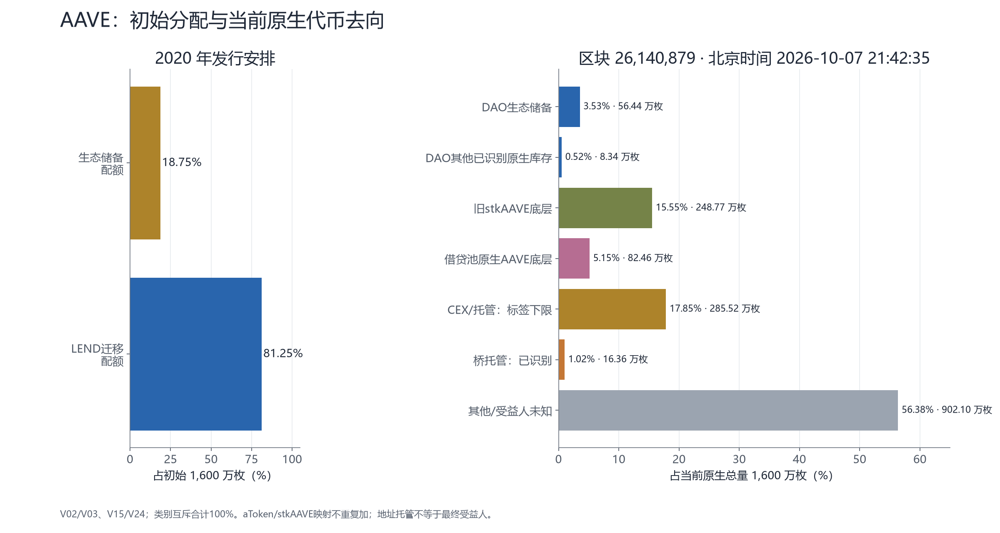
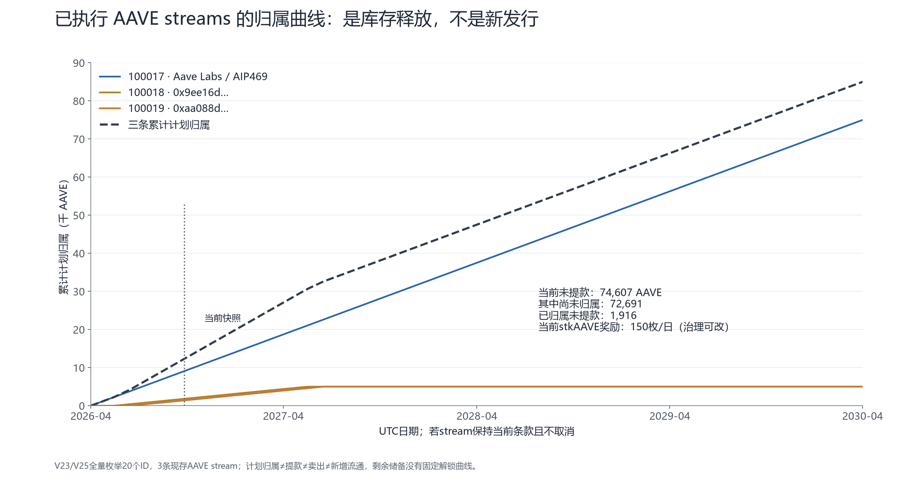
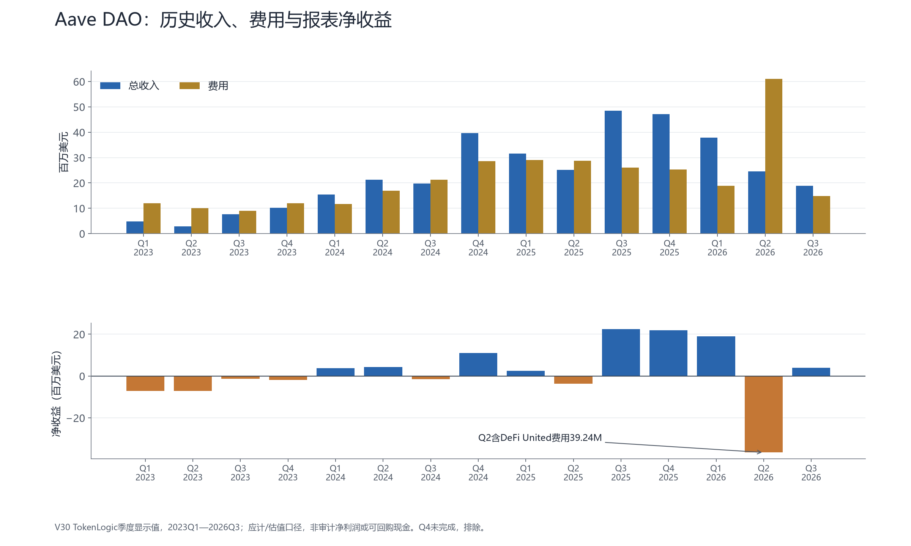
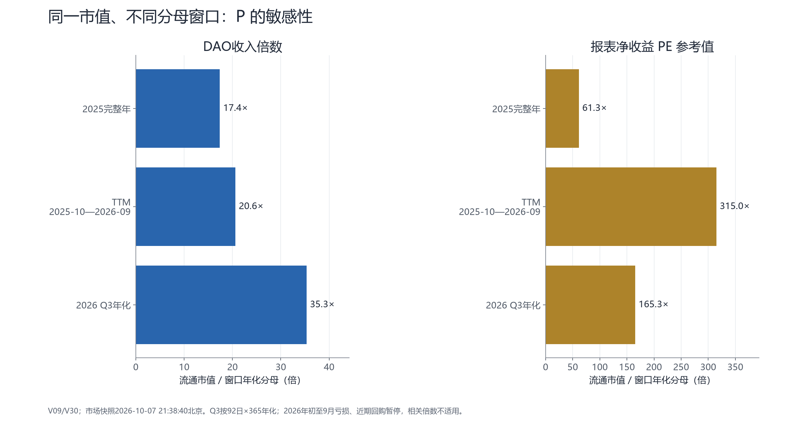

# AAVE：借贷收入怎样变成代币价值

历史参考底稿；最新正文和指标以网页当前版本为准。

Aave 的业务有收入，AAVE 的价值捕获却取决于收入留下多少、治理把钱用到哪里。同一约 **26.49 亿美元市值**，用2025年报表净收益算约61倍，用最近十二个月算约315倍；2026年前三季亏损，PE不适用。回购当晚仍暂停，历史盈利与当前买盘不能混为一谈。

## 一、先看业务与收入归属

存款人向 Aave 资金池提供资产，取得 aToken 债权；借款人用合格抵押物借钱，可保留 ETH 敞口、取得稳定币或对冲。借款通常不要求持有 AAVE。借款利息大部分归存款人，协议按各资产的 reserve factor 留存一部分；闪电贷、清算及其他费用另有规则。**用户费用、协议收入、DAO总收入、报表净收益、可回购现金是不同层次**。[官方概览](https://www.aave.com/docs/aave-v3/overview)〔S17〕

GHO 是治理控制铸币额度的稳定币，其相关借款利息进入 DAO；本金不是收入，储蓄利率、流动性与激励会形成成本。AAVE 主要提供治理和特定质押权益，普通持币没有自动按比例领取全部收入的权利。[代币说明](https://www.aave.com/docs/ecosystem/aave)、[GHO文档](https://www.aave.com/docs/ecosystem/gho)〔S01、S33〕V4 已于3月30日在 Ethereum 上线；Labs 9月披露 V4/V3 活跃贷款约3.1亿/125亿美元，属于开发方披露，贷款也不等于存款或TVL。〔S08—S10、S39〕

## 二、价值捕获沿革：改变的是资金去向和持有人条件

以下保留关键阶段；逐项提案、批准、业务执行日期及证据强度见[完整时间线](c0acff95-价值捕获时间线_v3.csv)。日期以原文时区为准，UTC与北京时间跨日已在CSV分列。

| 阶段 | 之前 → 之后；资金去向与持有人影响 |
|---|---|
| 2018年 ETHLend 白皮书 | LEND 被设计为手续费支付、折扣和使用奖励工具。它是产品效用设计；本轮未证实每项都曾完整运行，也不把后来Aave的收入机制倒填到2017年ICO。〔H03〕 |
| 2020年 Aave V1 | 闪电贷溢价、借款手续费可买入 LEND 后销毁。旧合约保留换币、burn分支，治理作者披露实际发生过销毁；销毁量仍是其历史披露，非本轮全链审计。〔H01、H02、H13〕 |
| 2020年 AIP1 迁移 | 100 LEND换1 AAVE；新总量16M，13M迁移、3M生态储备。启动400 AAVE/日质押奖励，初始阶段尚未启动削减。持有人从使用型代币转向治理与质押，奖励来自已有储备。官方档案标记Implemented，精确启动交易日未另锁定。〔V02、V03〕 |
| 2020年10—11月 AIP2 | 10月24日提出停止LEND销毁，11月5日形成AIP2；官方标记Implemented。手续费资产转入治理控制的Collector，保留20%推荐费分配。**自动买入销毁 → DAO积累可支配资产**，没有同时建立AAVE自动分红。确切执行日未取得。〔H01、H02、H15〕 |
| 2021年安全激励 | AIP7于1月10日UTC执行：stkAAVE奖励升至550/日，同时正式引入最高30%削减。随后LP质押激活、奖励延续规则调整，储备向质押者支付币，质押者承担担保条件；这是风险补偿，不能全称为经营利润分红。〔H16、H44—H46〕 |
| 2023年 GHO 与质押升级 | 2022年7月提出GHO，2023年7月15日正式执行上线：相关借款利息100%归DAO，stkAAVE借款人曾享折扣。Safety Module 1.5调整削减兑换率与冷却规则，为该折扣接入质押通知。收益条件涉及质押、借款与风险，非全体AAVE持有人现金权。〔H04、H05、H47〕 |
| 2024年 Merit / 新路线图 | 3月13日Merit拨款授权执行，将国库资金用于符合行为条件的用户奖励；持币、质押、治理行为可成为加成条件。7月提出、8月获支持的Aavenomics是Umbrella、回购及Anti-GHO路线图，**路线获批并不等于三项全部上线**。〔H06、H31、H36、H48〕 |
| 2025年3—4月新增收入与回购 | SVR载荷3月29日执行，从清算MEV竞价收回价值，官方披露分成65%归Aave、35%归Chainlink。3月18日Part One Snapshot通过；AIP286首轮400万美元aUSDT授权载荷4月9日UTC执行。执行方同日披露首批市场买入；首笔成交未独立锁定。买入AAVE送生态储备，用于奖励/拨款，**买入并分配，不是买入并销毁**。〔H07、H08、H23、H29、H30、H36〕 |
| 2025年6—10月担保迁移 | Umbrella于6月5日执行，用相关aToken/GHO承担对应资产坏账，奖励由Collector支付。stkAAVE削减上限30%→20%→10%→0%，最后一步AIP385载荷10月8日执行；旧质押奖励也下调。AAVE直接削减风险减少，DAO支出及代币市场风险仍存在。〔H09、H24、H25、H32、H34、H36〕 |
| 2025年7月手续费与折扣变化 | Ethereum V3.4载荷7月3日执行：GHO改为标准借贷结构、100%reserve factor留存，旧stkAAVE借款折扣撤除；该版本闪电贷手续费全部进入Treasury。变化扩大DAO收入路由，也移除一项持币使用权益。〔H37、H38、H41、H36〕 |
| 2026年3—6月成本优先 | 3月建议回购年预算50M→30M，Snapshot通过，完整预算载荷链未锁定；3月24日stkAAVE降至220/日，旧LP激励继续退出、改用DAO自有流动性。4月19日回购暂停；6月13日降至150/日。节省发币提高库存持续性，却降低质押者收到的奖励。〔S04、S05、H26—H28、H33、H36、H43〕 |
| 2026年5月储蓄机制更新 | 5月16日UTC，新sGHO载荷执行，初始链上储蓄率4.25%，收益给GHO储户；方案把多项Merit加成收敛为临时stkAAVE加成。链上合约上线已证实，链下加成逐笔发放未另审计；它仍不是AAVE全体持有人的分红。〔H39、H40、H42、H36〕 |

Anti-GHO 曾拟把部分GHO收入形成不可转让奖励，供质押者抵债或换成质押GHO；Part One 明确还需后续开发、审计及提案。**本轮未找到其实际启动依据**，不能把“50%GHO收入、80/20分配”当作当下到账权利。〔H07〕

停止早期销毁的原因也有记录：[AIP2](https://github.com/aave/aip/blob/main/content/aips/AIP-2.md)指出，迁移后LEND流动性变薄，手续费资产很难继续在DEX买入LEND。于是治理选择保留这些资产建立协议金库。早期销毁针对的是LEND，不能直接推导今天AAVE总供应会随收入下降；更不能把V1借款手续费、闪电贷溢价统称为全部借款利息。〔H02〕

2025年回购则补上了一条可观察的市场需求路径：DAO用资产从卖方买币，再由治理决定奖励和拨款。普通持有人可能受买盘影响，质押者可能收到奖励，两者经济条件不同。生态储备收到币之后仍能把币发出去，因此评估回购需要同时看库存再分配；只有买入数量，没有同期发出数量，还不能证明净吸收。〔H07、S01〕

## 三、筹码：初始分配与当前托管分开看

Ethereum区块 **26,140,879，10月7日21:42:35北京**，原生AAVE总量仍为16M。初始81.25%迁移配额不证明全归散户，也不能重建今天的团队/投资者最终占比。

| 当前原生币所在类别 | AAVE | 占16M |
|---|---:|---:|
| DAO生态储备 | 564,446.952 | 3.5278% |
| DAO其他已识别库存 | 83,397.559 | 0.5212% |
| 旧stkAAVE底层 | 2,487,708.478 | 15.5482% |
| 借贷池底层 | 824,587.111 | 5.1537% |
| CEX/托管可识别下限 | 2,855,236.841 | 17.8452% |
| 已识别桥托管 | 163,646.220 | 1.0228% |
| 其他/受益人未知 | 9,020,976.839 | 56.3811% |
| 迁移合约 | 0 | 0% |

表中按原生地址互斥归类，不是最终控制人普查。回购Safe另有 **240,502.342 aAAVE债权**，底层已经计入借贷池，不能再加供应；stkAAVE、LP和跨链包装也同理。治理委托增加投票代理，不增加币。CEX标签是托管下限，未标注大额Safe不能直接叫团队。〔V15、V24、V39〕

## 四、释放：已批准路径能算，全库存未来不能硬画

AIP480关闭迁移载荷于2026年5月10日01:39北京执行，当前`migrationEnded=true`、原生余额0。初始3M储备至今净减少 **2,435,553.048枚**，期间有拨款、奖励、回购补库等；净库存变化不等于累计释放或卖出。〔V22、V24、V26〕

储备全部20个stream ID中，冻结时有3条现存AAVE流：

| 流 / 收款方 | 起止UTC | 当前未提款 | 尚未归属 |
|---|---|---:|---:|
| 100017 / Labs，约75K | 2026-04-13 16:45:11—2030-04-12 16:45:11 | 66,320.184 | 65,914.048 |
| 100018 / 0x9ee16d…b27c，约5K | 2026-05-27 10:31:35—2027-05-27 10:31:35 | 3,286.351 | 3,176.265 |
| 100019 / 0xaa088d…9894，约5K | 2026-06-27 09:57:47—2027-06-27 09:57:47 | 5,000.000 | 3,600.601 |
| 合计 | | **74,606.535** | **72,690.915** |

另有 **1,915.620枚已归属未提款**。全部未提款已包含在564,446.952枚储备中；图画计划归属，不代表提款、卖出或新铸币。Labs流是4×365日，不能简单把日历年份加四；另外两条收款人机构身份未知。当前stkAAVE奖励约150/日，维持365天才是54,750枚；治理可改，来自旧库存。旧stkABPT读取0/日不能推广到所有LP。全库存其他承诺、连续实际释放历史未完整取得，储备差额也不能叫自由库存。〔V21、V25、V28、V33—V36〕

## 五、历史及近期收支：成本改变估值分母

TokenLogic报表含应计与估值，连续 **15季、45月（2023Q1—2026Q3）** 已冻结。图保留季度完整历史，明细及45月序列留在data_v2。金额为百万美元，显示值有舍入尾差。[财务报表](https://aave.tokenlogic.xyz/financials/statements)〔V30、V31〕

| 窗口 | DAO总收入 | 费用 | 报表净收益 |
|---|---:|---:|---:|
| 2025年 | 152.43 | 109.23 | 43.21 |
| TTM：2025-10—2026-09 | 128.60 | 120.19 | 8.41 |
| 2026年前三季 | 81.39 | 94.90 | **-13.51** |
| 2026Q3 | 18.90 | 14.86 | 4.04 |
| 2026年9月 | 6.92 | 5.27 | 1.65 |

Q2净亏36.54M，费用含DeFi United 39.24M，不能删去后只讲盈利季；该分类不等于最终坏账。Q3收入由协议14.36M、GHO2.32M、国库1.48M及其他0.74009M组成；主要支出为服务商9.19M、GHO1.90M、质押1.59M、激励1.34M、保险0.82366M。9月GHO收入0.82435M、成本0.92780M，但不能仅相减就断定完整分部利润。看板OCF为9月5.64M/Q3 15.81M，**未扣所有负债、风险缓冲和承诺的可回购自由现金仍未知**。

盈利回落同时来自收入与成本：2025Q3收入48.51M、净收益22.38M，2026Q3收入18.90M、净收益4.04M；Q2又出现较大救助支出。前者影响日常经营能力，后者体现风险事件对资本分配的冲击。将救助支出当作每季必然发生会失真，直接删掉也会失真；短期估值应并列历史年、TTM和近期窗口，观察正常收入、经常支出与事件损失如何变化。

截至10月6日UTC的完整日窗口，DefiLlama口径如下；费用包含利息及其他项目，纯借款总利息未单独取得。[协议收入序列](https://api.llama.fi/summary/fees/aave?dataType=dailyRevenue)〔V06—V08〕

| 完整窗口 | 用户费用USD | 协议收入USD |
|---|---:|---:|
| 7日 | 9,084,959 | 1,161,903 |
| 30日 | 37,559,267 | 4,921,218 |
| 90日 | 99,526,175 | 13,404,272 |
| 365日 | 720,050,993 | 92,982,500 |

滚动30/90日没有匹配的完整DAO成本和净现金，不能把季度费用按天摊入。

## 六、现在回购能走到哪一步

10月7日22:03刷新，[回购页面](https://aave.tokenlogic.xyz/financials/buyback)仍标示 **Paused（自4月19日暂停）**；最新表内交易也为该日。已核成功交换9.642857 WETH换约243.2417 AAVE，但没有确认后续恢复。页面顶部累计45.44M美元，月表合计46.405510M，相差0.965510M；18M预算卡片也未与30M方案完整对账。365日holder代理19.081096M统计特定Safe收币，不能替代付款成本或证明6月恢复。〔V38、S04、S05、S41、S42〕

收入权利也在调整：AIP469主资助4月14日00:45:11北京执行，25M稳定币分额度及资金流，另含75K AAVE流；4月16日披露CoW partner fees、Horizon费用已路由DAO Collector。两项路由不证明全部品牌净利润都归DAO。基金会Phase 1投票冻结时已 **active**，品牌/域名/商标转移仍需后续治理。〔S45、S49、V37〕

rsETH事件源于外部Kelp/LayerZero跨链路径，相关资产随后进入Aave抵押链路；不能简写为核心借贷合约被攻破。救助开支、融资与最终坏账会占用现金，当前净损失及未偿融资未完整取得。即使stkAAVE直接削减已为0，代币也仍暴露于DAO资产负债和经营风险。〔S06、S07、S29、S44〕

## 七、集中估值：同一市值下，分母差异有多大

CoinGecko 10月7日21:38:40北京：价格 **171.62美元**、流通量 **15,435,544.593枚**、市值 **26.4933亿美元**；价格×链上16M总量为 **27.4592亿美元**。供应商流通定义不等于独立认证的解锁量。倍数＝市值÷同口径年化收入/净收益；Q3按92天、9月30天、前三季273天年化，年化不是预测。〔V09、V24〕

| 分母与窗口 | 流通市值倍数 | 总量价值倍数 |
|---|---:|---:|
| 协议收入 / 30日 | 44.25× | 45.86× |
| 协议收入 / 90日 | 48.74× | 50.51× |
| 协议收入 / 365日 | 28.49× | 29.53× |
| DAO收入 / 2025年 | 17.38× | 18.01× |
| DAO收入 / TTM | 20.60× | 21.35× |
| DAO收入 / 2026前三季 | 24.35× | 25.23× |
| DAO收入 / Q3 | 35.33× | 36.62× |
| DAO收入 / 9月 | 31.47× | 32.61× |
| 报表净收益 / 2025年 | **61.31×** | **63.55×** |
| 报表净收益 / TTM | **315.02×** | **326.51×** |
| 报表净收益 / 2026前三季 | **不适用：亏损** | **不适用** |
| 报表净收益 / Q3 | **165.29×** | **171.32×** |
| 报表净收益 / 9月 | **131.97×** | **136.78×** |
| 实际回购现金成本 / 30、90、365日 | **不适用/未知** | **不适用/未知** |
| 持续净销毁 | **不适用** | **不适用** |

收入倍数尚未扣成本；净收益倍数扣了报表费用，但不是已认证股权PE。预算、收币代理、OCF不能补进实际现金回购列。历史表明AAVE已从LEND销毁模式转为治理控制收入、回购和再分配；估值最终要检验 **收入扣成本与损失后的现金 → 实际买入 → 减去奖励/拨款再分发后的库存吸收**。贷款和TVL增长只有穿过这条链，才能成为更可靠的代币价值支撑。

61倍与315倍的差异主要是盈利窗口变化，并不需要价格先上涨：同一个市值，分母由43.21M缩到8.41M，倍数就显著抬升。当前暂停又让历史回购速度失去代表性。后续若恢复成交、成本降低且收入留存增加，价值捕获链会更扎实；若收入增长同时被奖励、开发或救助支出消耗，业务扩张仍可能没有形成同等的净买盘。

完整受益人、全库存释放、自由现金、全链回购对价和最终坏账仍是结论边界；原始数据、计算、取证失败及细节留在v2台账与v3新增台账。

