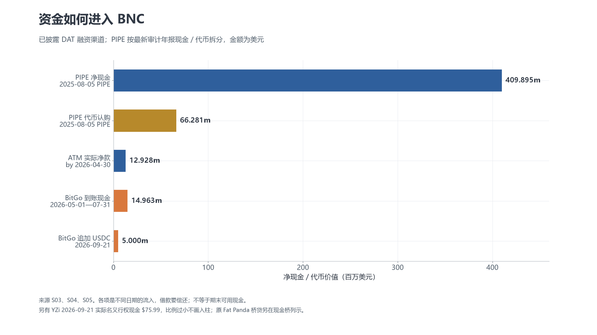
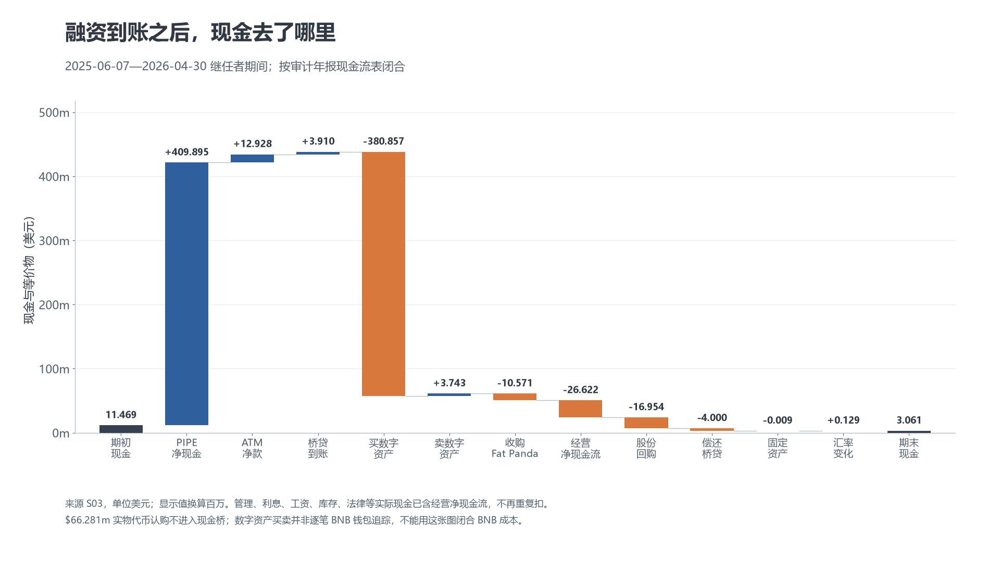
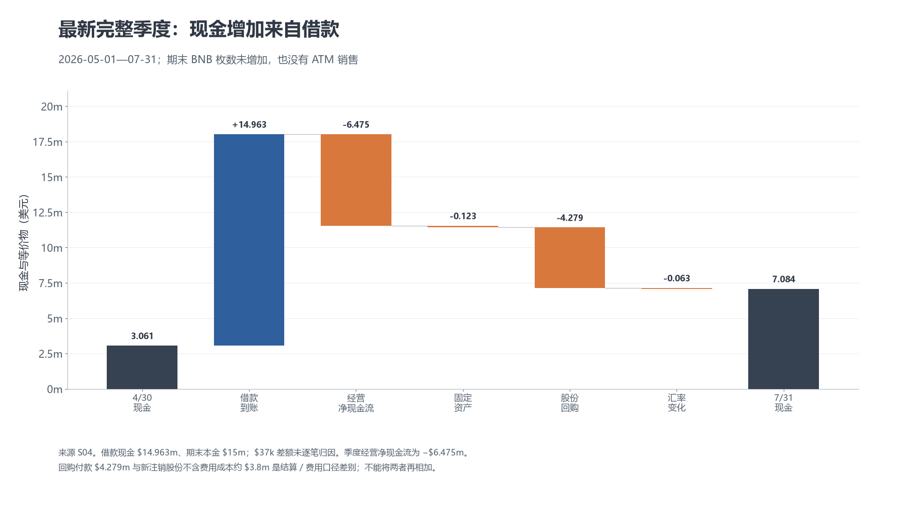
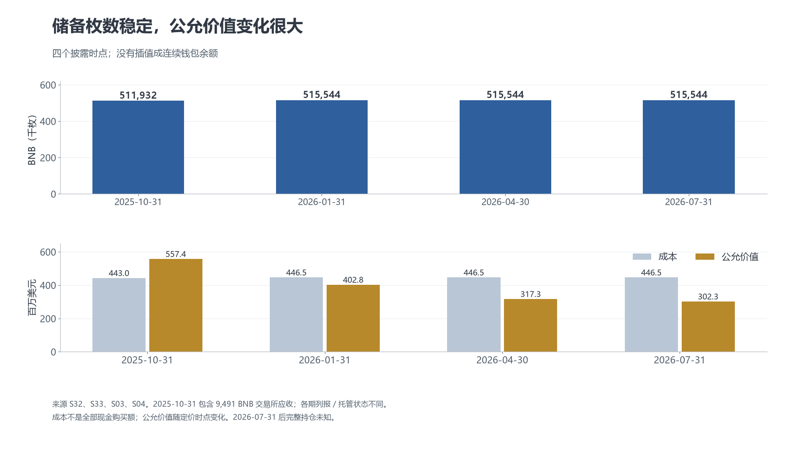
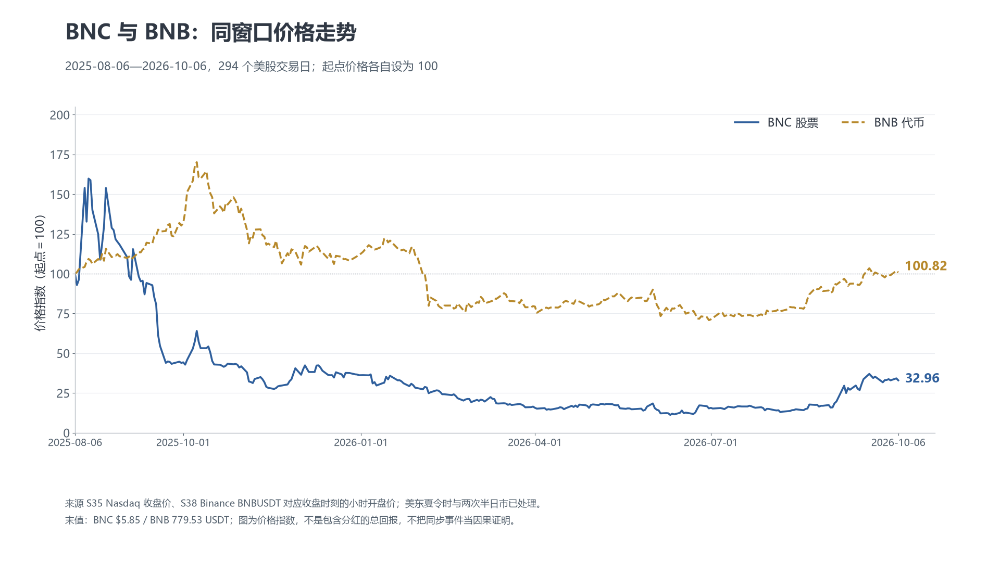
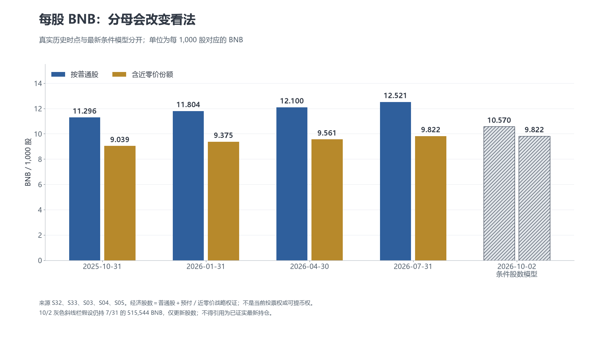
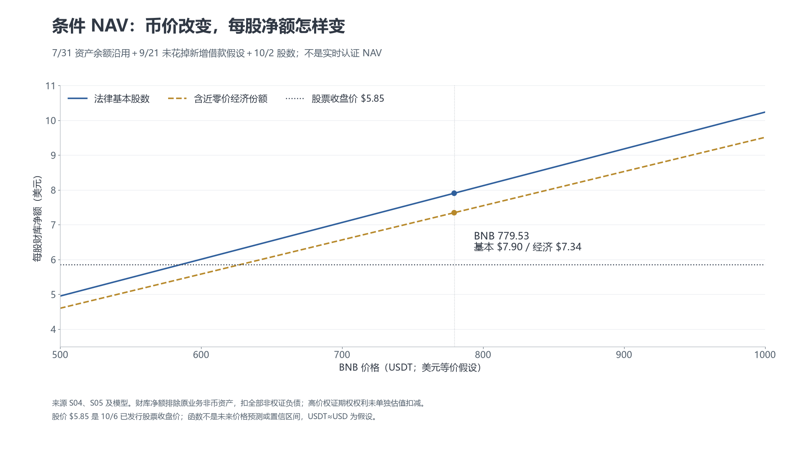
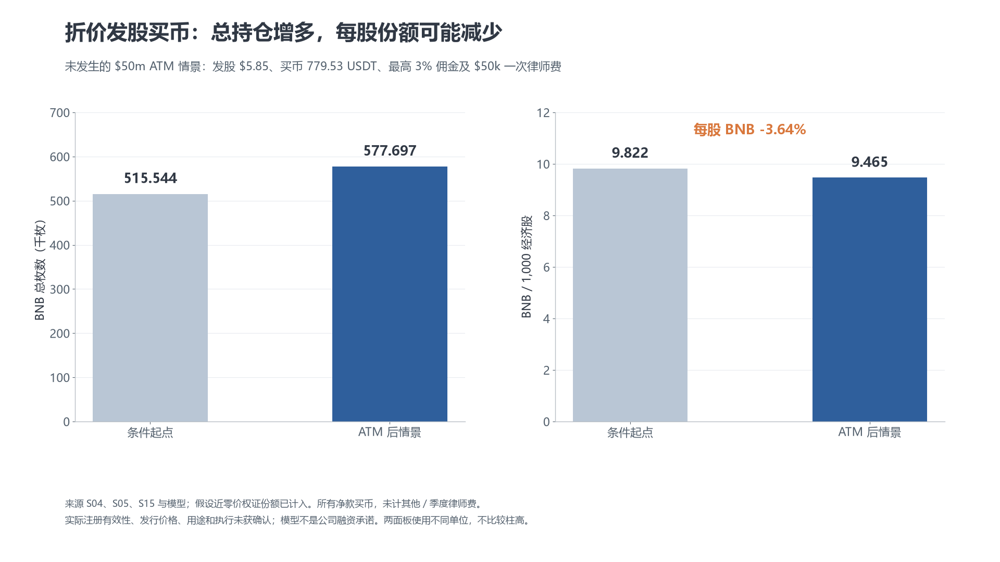

# BNC 的资金账本：融资、BNB 储备与每股价值

历史参考底稿；最新正文和指标以网页当前版本为准。

本文围绕一条资金路径：**投资者的钱进入公司 → 配置 BNB 和支付开支 → 形成储备与负债 → 按股权分摊 → 股票市场为这份权益定价**。引用资料为公司/股东公开披露、合同和行情；模型另标假设。文中 **m 表示百万美元**，例如 $409.895m＝4.09895 亿美元。来源编号与限制见《02_来源与核查台账_v2.md》，原始数据、程序与图表见 数据_v2/、图表_v2/。

## 1. 一家公司，两类运营：卖产品与管理财库

**BNB Standard Corporation** 是 Nasdaq 普通股 BNC 的发行人。它于 2026 年 9 月 29 日由 CEA Industries 更名；历史财报沿用旧名。BNC、BNCWW、BNCWZ 分别是普通股、旧公众权证和配套权证代码。它并非 Binance 上市主体，也不是发行 BNB 的协议。[更名 8-K，S02](https://www.sec.gov/Archives/edgar/data/1482541/000148254126000056/bnc-20260929.htm)

这家公司的原业务包括农业受控环境的工业温控系统，以及 2025 年 6 月收购的加拿大 Fat Panda 电子烟零售/分销。原业务向实体客户销售产品和服务，获得销售收入，支付库存、员工、门店、物流等成本。2025 年 8 月，公司完成私人融资，另设 BNB 财库业务；由投资者提供资金，在公司资产负债表里持有和管理 BNB，股东通过证券账户获得这层资产的间接敞口。[S03、S04]

今天分析 BNC 应先看资金与资产：截至 2026 年 7 月 31 日，BNB 公允价值约占总资产 **92.4%**，全部数字资产约占 **93.1%**。零售/工业业务依然经营，但财库价格波动、费用与股数决定公司大部分资产价值。利润表上的 BNB 涨跌不等于向客户卖出了更多产品。[S04；占比为计算]

这套运营不是由某一个名字包办：

| 角色 | 实际职责和资金关系 | 股东需要理解的区别 |
|---|---|---|
| 上市公司与董事会 | 决定战略、融资/回购、资本配置，披露合并财务；原业务继续经营 | 公司拥有资产、承担债务和费用；股票是其剩余权益 |
| 财库实体 | 公司通过 CEA BRS LLC 及其间接持有的 BNC BNB Cayman 承接/持有财库资产 | 子公司架构不会赋予普通股股东直接提取某枚币的权利 [S03] |
| 10X Capital Partners | AMA 管理人，提供数字资产管理等服务，收费用并曾获管理人权证 | 管理人是收费服务方，不等同托管人或所有投资者 [S03、S14] |
| Ceffu／BitGo | Ceffu 托管未抵押 BNB；BitGo 持有借款抵押币并提供贷款 | 托管、借贷和投资决策是不同职能；披露的隔离/MPC 不等于本研究已审计钱包 [S04] |
| PIPE 投资者、YZi 与市场股东 | 提供股权资金或购买已有股份，获得股份/权证和相应权利 | 二级市场买股的钱通常给卖方；公司只有新发行/行权/借款等才新增资金 |

普通股持有人没有日常按股赎回 BNB 的权利，也没有承诺普通股股息。直接持币可以自行转移或使用；持 BNC 还要承担公司费用、融资、治理及价格折溢价。因此，它的客户定位可理解为使用证券账户、愿意承担公司结构而获取 BNB 敞口的投资者，不能把一股当成可随时提出的固定数量 BNB。[S07；适用人群为研究推断]

## 2. 先数进入公司的钱：到账、借款和额度分开

### 2.1 起点是一次约 5 亿美元 PIPE，而非已经拿到 12.5 亿

2025 年 7 月 28 日的融资公告提出约 $500m PIPE，并提到未来配套权证全部行权可能再带来约 $750m。公告时预计 7 月底交割；**实际交割日是 8 月 5 日**。因此，“最多 12.5 亿美元”从一开始就由已完成认购和未来条件行权两部分组成，不能都记为已到账。[S40、S41、S03]

公告称参与者超过 140 名，举例包括 YZi Labs、Pantera、GSR、Arrington 等机构/投资者。它能说明参与阵容，不能证明这些人今天仍持有同样股份或各自支付了多少。按 YZi 最新 13D/A 记载的原普通股与预付权证认购数量/价格，原认购金额可复算为**约 $100m，约占 PIPE 总额 20%**；另外约 $400m 的逐投资者到账分配未完整穿透。YZi 的战略奖励与配套行权价不再额外当这次认购现金重复相加。[S06、S40；金额为计算]

公司交出了什么？普通股 **41,754,478 股**、预付权证 **7,750,510 份**，并配套 **49,504,988 份、每股 $15.15 行权的 stapled warrants**。普通股组合价 $10.10，预付组合价 $10.09999，加未来名义行权款 $0.00001。投资者买的是附带权证的证券组合，不只是无附加权益的一股普通股。[S03、S08–S11]

从这里便能理解两个常见误读：$10.10 不是所有人的统一持股净成本，也不是股价底；未来 $750m 行权款要求追加出资，不能既当今天已融资现金，又把对应未来股数忘掉。

### 2.2 按最新审计年报整理一次交割的现金与代币

审计年报的现金流表和非现金补充项目给出下列数字，原表以千美元列示：[10-K，S03](https://www.sec.gov/Archives/edgar/data/1482541/000148254126000019/bncww-20260430.htm)

| PIPE 项目 | 金额 | 进入哪一层账本 |
|---|---:|---|
| 现金及等价物毛款 | $433.755m | 现金流融资流入 |
| 现金发行费用 | −$23.860m | 融资现金流扣减；已计入下面净款 |
| **净现金及等价物** | **$409.895m** | 毛款减现金发行费 |
| 实物数字资产认购 | $66.281m | 年报称 USDT/BTC；是非现金贡献，不能再放进美元现金桥 |
| **现金＋代币价值净款** | **约 $476.176m** | 两种形式合计价值；不等于全部银行现金或全部 BNB |

表中毛现金加实物价值约 $500.036m，与公告“$500m”存在小额呈现差异，未逐笔解释；本文用“约 5 亿”而不补造精确结算来源。

**这里有一项必须保留的披露差异。** 2025 年 10 月及 2026 年 1 月的修订季报，将同一次 PIPE 列为约 $226.837m 毛现金与 $273.198m 实物代币；注释写净现金约 $208.3m，现金流表与注释中费用口径也不同。后来的审计年报改列上面约 $433.755m／$66.281m。两套数字属于**同一次交割**，不能从差额推断公司后来又融了两亿多美元，也不能拼成一个一致的钱包现金分配。本轮没有取得逐笔结算或解释全部列报沿革；本版资金桥以最新审计年报为主，旧季报仅在其披露时点使用币数/余额并标明状态。[S32、S33、S03]

### 2.3 后续钱分别从哪里来，代价是什么

| 到账时间/窗口 | 钱从谁来、金额 | 公司付出的代价或条件 |
|---|---|---|
| 2025-06 收购 Fat Panda | CEAD Panda Lender 桥贷本金约 $4m；现金流净到账 $3.910m | 收购融资，计息；12/4 已偿还本金约 $4m，不是今天的 BitGo 债务 [S03、S04] |
| 2025-08-05 PIPE | 约 $409.895m 净现金＋$66.281m 实物价值 | 上述普通股、预付及配套权证；现金发行费 $23.860m [S03] |
| 截至 2026-04-30 的实际 ATM | 通过 Cantor 向市场新售 **856,275 股**；约 $13.1m 毛款，年报现金流净款 **$12.928m** | 增发普通股；佣金等成本。最高销售佣金 3%；$0.2m 为概括成本，不能用圆整数字相减替代现金流净值 [S03、S04] |
| 2026-05-01 至 07-31 | BitGo 借款累计本金 **$15m USDC**；现金流列到账 **$14.963m**。其中 $10m 5/1 收到，其余 $5m 在季度内 | 抵押 BNB；披露年费率 9.5%＋0.3% onboarding；本金与现金流 $37k 差额未逐笔归因 [S04] |
| 2026-09-21 | BitGo 再借 **$5m USDC**，总本金 **$20m** | 公司称未新增 BNB 抵押，靠市值满足约 170%；不能假定该款仍未花掉 [S05] |
| 2026-09-21 实际权证行权 | YZi 为新增 **7,599,264 股**付现金 **约 $75.99** | 认购资金此前已付或权证属于奖励，今天名义款很小；不得把原认购价再次计作新现金 [S05、S06] |

最新 5–7 月季度没有 ATM 销售。旧季度现金流另出现过 $24 权证行权现金，最新年报将部分战略行权列为 cashless；本研究未把这 $24 可靠归因至具体权证批次，不用它补造一个精准累计行权现金总数。9 月 $75.99 由明确现金行权数量和价格独立核对。[S32、S33、S03、S05]

截至已核实记录，主要股权渠道 PIPE 净价值＋历史 ATM 净款约 **$489.1m**（含实物贡献，不是当前现金）；另有当前 BitGo 本金 **$20m**，须偿还。原桥贷已还。把股权、借款和未来额度分开，比“公司总共拿了多少亿”一项混合数字更有用。

2026 年 10 月的 **$1bn shelf 注册框架、最多 $50m ATM 招股书**以及 **$250m 回购授权**都不是新到账。最新 POS AM 标有待完成，未核实后续有效注册/实际新发股；也不据此断言所有历史注册已失效。回购授权是允许支出的上限，既不是融资款，也不是公司必须用完的余额。[S05、S15、S04]

## 3. 钱进入之后：买币、原业务、回购与费用

### 3.1 能闭合的是公司现金流，不能自动闭合每一笔 BNB 交易

以审计年报继任者期间 **2025-06-07—2026-04-30** 为边界，现金与等价物的桥可以按披露精度闭合：

| 现金桥项目 | 金额（$m） | 注意 |
|---|---:|---|
| 期初余额 | 11.469 | 公司已有现金，是存量而非这次新增融资 |
| PIPE 净现金 | +409.895 | 已扣 $23.860m 发行现金费 |
| ATM 实际净款 | +12.928 | 增发而来，不是经营收入 |
| 原收购桥贷净到账 | +3.910 | 下面另扣还款，不当净资产利润 |
| 数字资产现金购买 | −380.857 | 全部数字资产口径，不能全部归为已逐笔证明的 BNB 买单 |
| 数字资产现金出售 | +3.743 | 全部数字资产；不直接推断卖出了多少 BNB |
| Fat Panda 收购现金 | −10.571 | 公司原业务资本配置 |
| 经营净现金流 | −26.622 | 已包含经营收款及实际管理、员工、库存、法律、保险、利息等现金支出 |
| 股份回购现金 | −16.954 | 不等于按当期注销股数计算的不含费金额；结算日期/费用另有差异 |
| 偿还原桥贷本金 | −4.000 | 已还借款，与 BitGo 新贷款分开 |
| 固定资产现金支出 | −0.009 | 不能同经营成本重复扣 |
| 汇率影响 | +0.129 | 报表换算影响 |
| **期末余额** | **3.061** | 算术闭合到年报余额 [S03] |

实物代币贡献 $66.281m 不在这张现金桥里；原本收到的 USDT/BTC、后续币币兑换、空投收到与出售、交易费和成本确认，使“现金买币 $380.857m”不能直接等同最终 BNB 成本 $446.454m。公司没有向本研究提供完整钱包、兑换流水或逐笔执行单。资金桥闭合证明的是所用报表分类相加相减一致，不是所有资产移动已经逐笔审计。

### 3.2 最近完整季度：新增现金依靠借款，币数没有净增加

**2026-05-01—07-31** 的现金桥更直接：

`3.061 + 14.963 − 6.475 − 0.123 − 4.279 − 0.063 = 7.084（$m）`

即期初现金＋借款到账−经营净现金流出−固定资产−回购付款−汇率影响。期末 BNB 仍为 515,544 枚，ATM 未卖，数字资产现金购买未在季度现金流表列新增项目。这里能够判断的是披露期末净币数稳定，不能独立证明期间所有钱包都没有币币交易。[S04]

季度回购注销 1,434,112 股，注释给出不含费成本约 $3.8m、均价 $2.63；现金流回购付款 $4.279m 会包含结算/费用时点差别；Item 2 含券商佣金均价为 $2.65。这几种口径不能相加成第二次或第三次回购。截至七月底，累计实际注销 **4,676,322 股**，不含交易费金额约 **$21.1m**，剩余授权约 $228.86m。[S04]

因此，“公司仍然持有价值很高的 BNB”和“现金够支付经营/回购/到期借款”是两件事。币可能抵押、出售受决策约束，运营现金还要继续消耗。借款可以暂时补足流动性，却新增了利息、抵押和到期风险。

### 3.3 谁在赚钱，哪些费用已经付，哪些只是确认

| 指标（$m） | 2025-06-07—2026-04-30 继任者期间 | 2026-05-01—07-31 三个月 | 如何解释 |
|---|---:|---:|---|
| 零售/工业营业收入 | 26.407 | 7.165 | 原业务向客户销售；两列期间长短不同，不直接比较增速 |
| 毛利润 | 7.871 | 1.964 | 还没有扣公司其他经营开支 |
| 空投收入 | 7.863 | 0.284 | 收到币时按价值确认的非经营收入，不等同美元现金 |
| 管理费费用 | 5.010 | 1.103 | 计提费用，实际支付与应付款另看 |
| SG&A | 25.618 | 5.427 | 公司经营、人员、专业服务等；不能全部叫财库管理费 |
| 股东咨询费用 | 4.644 | 1.391 | 治理争议消耗资源，费用确认不等于当期现金支付 |
| 两类利息费用合计 | 0.840 | 0.340 | 包括相关票据等，不能仅从 BitGo 本金估计全部利息 |
| 数字资产未实现损失 | 130.315 | 15.294 | 公允价值重估，未必出售变现 |
| 权证重估收益 | 282.920 | 9.982 | 负债估值下降产生账面收益，并非管理人经营赚回现金 |
| 净利润/亏损 | **+115.245** | **−11.400** | 年度会计利润可很大，同时经营现金仍流出 |
| 经营净现金流 | **−26.622** | **−6.475** | 更直接反映公司本期间经营对现金的消耗 [S03、S04] |

年报 MD&A 说明实际支付约 $4.6m 管理费，以及约 $7.6m 薪酬、$5.1m 广告、$3.9m 股东咨询现金、其他专业费/法律/保险等。最新季度亦有约 $3.3m 其他专业费、$2.0m 薪酬、$1.7m 其他法律费等现金支出。这些是已包含在经营净现金流中的组成，不能看见费用明细后再从现金余额各扣一次。摘要金额有圆整和应收应付变化，不强求用 MD&A 所有概括数闭合明细成本桥。[S03、S04]

战略顾问奖励权证当时估值约 $105.6m，管理人奖励权证约 $15m，是**非现金权益成本**；它们对股份分摊重要，却不是同额现金从银行流出。发行费用 $23.860m 中约 $14.551m 分配给负债类配套权证并在利润表费用化；现金桥已经扣全额发行现金费，不能将利润表这一项再扣一遍。[S03]

## 4. BNB 怎样成为储备：购买、兑换、托管与抵押

融资后公司在 2025 年 8 月 11 日公告购买 200,000 BNB，标题金额约 $160m；8 月 14 日公告再买 88,888 BNB，按这两次公告相加为 288,888 枚。这是早期执行记录线索，属于公司购买公告，缺少本研究独立执行单；“年底达到总供应 1%”属于当时目标，不能当已实现持仓。[S42、S43]

此后以财务披露建立离散时点，不用公告间隔插值成连续真实余额：

| 日期 | BNB 数量 | 成本（$m） | 公允价值（$m） | 平均成本/枚 | 受限/托管状态 |
|---|---:|---:|---:|---:|---|
| 2025-10-31 | 511,932 | 442.960 | 557.443 | $865.27 | 502,441 作为直接数字资产，**9,491 为交易所应收**；抵押枚数未单列 [S32] |
| 2026-01-31 | 515,544 | 446.454 | 402.836 | $865.99 | 已无交易所数字资产应收，披露非美国 Binance 生态托管；抵押枚数未单列 [S33] |
| 2026-04-30 | 515,544 | 446.454 | 317.256 | $865.99 | 27,588 受限，487,956 未受限；BitGo 协议当日签署，首笔现金次日收到 [S03、S04] |
| 2026-07-31 | 515,544 | 446.454 | 302.297 | $865.99 | **44,198 抵押，471,346 未抵押** [S04] |
| 2026-09-21 后/10-07 | 完整最新余额未知 | 未知 | 不能填实际值 | — | 追加借款未新增抵押；不是重新披露所有钱包持仓 [S05] |

10 月到次年七月枚数只净增 **3,612 枚，约 0.71%**，而公允价值波动大得多。这里“成本”是财务成本口径，包含不同资金形式和确认时点；平均成本 $865.99 不证明每一枚都以同价现金买入。

十月交易所应收与后来直接数字资产，属于重要列报/控制状态变化。十月文件称交易所资产混池、公司不能充分控制，作为应收；一月称已无此应收。后来的年/季报明确 Ceffu 为未抵押币托管平台、使用 MPC 和隔离账户，BitGo 在公司名义隔离账户持有抵押币。这说明如何公开呈现储备，不能替代钱包签名、托管资产证明或破产隔离有效性审计。[S32、S33、S03、S04]

2026 年一月文件还明确提到把部分数字资产（如空投）换成稳定币和 BNB。四月底其他币为约 27 BTC、310,383 USDT；七月底为约 27 BTC、519,520 USDT。USDC 已计入现金与等价物，不重复算一次币资产。没有完整币币兑换明细，不能断言全部历史 USDT/BTC 认购价值最终一美元不差进入 BNB。[S33、S03、S04]

BNB 自身承担网络 gas、验证/委托及生态活动用途，季度 Auto-Burn 与 BEP-95 实时 gas 销毁是不同机制。它不是 Binance 股权分红。供应销毁影响币的经济背景，传导给公司仍须经过币价、公司资产及股数，而不会直接给公司现金。研究中最后核实的官方已执行公告为七月第 36 次，不能把估计的第 37 次当已执行，也不把七月供应数字当今天供应。[S24、S25、S26]

**实际财库收益与计划必须分开。** 公司通过 Binance 生态 Launchpool/HODLer 等收到空投，上表是实际确认值；不承诺稳定支付，也不保证已卖成美元。最新季报说明活动规模显著下降。**截至 2026-07-31，公司尚未 staking 任何 BNB**；验证、staking、借贷、DeFi 和衍生品收益属于可能未来策略，未找到可核实的当前经常性收益流。[S04]

## 5. 储备留给谁：管理费、治理和借款在这里进入资金分配

### 5.1 长期管理费先从财库经济价值中分走一部分

最新季报按 DAT 公允价值 **年化 1.4%** 计费，季度确认 $1.103m，无论公司赚亏都计提。旧年报风险段写 1.75%，原扫描协议 §6 指向 Schedule C，但本轮所见扫描包没有完整费率附件。不能用两段不同表述宣布合同已经谈判成功；本版用最新经营披露 1.4%，另保留旧率敏感性。[S03、S04、S14]

按本稿最后集中计算中 $401.882m BNB 市值静态演示，1.4% 约 $5.626m/年，1.75% 约 $7.033m/年；实际 DAT 基数还有其他资产并随日期变化。这是费用尺度，不是未来发票或完整净收益预测。

AMA 约定至 2045 年，原 §13(a) 涉及终止/特定违约时余期费用并按月支付。公司于 5 月 22 日起诉请求协议自始无效、返还管理费，或认定终止条款不可执行；10X 7 月 28 日提出驳回动议，公司 8 月 14 日反对。最新季报称动议未决，尚未终止 AMA，无当前 §13(a) 到期款，未确认该条款赔付负债，潜在损失无法可靠估计。[S04、S14]

与此同时，自 4 月 10 日后公司没付管理费发票，继续计提，七月底相关应付款约 $1.4m；拖欠可能构成违约。它不是“公司已成功取消收费”，也不是“法院已判立即一次付清二十年费用”。没计提潜在赔付不代表经济风险归零；本研究没有付费法院实时案卷。[S04]

这解释了治理为什么影响每股账本：原股东与董事争议、协议重新安排、法律咨询和是否能停止未来费用，会改变留给股东的现金和战略自由度。2025 年底至 2026 年初双方对换链/持仓透明度的公开指控属于各方主张。**2026 年 6 月 23 日公司与 YZi 已达合作，撤回征集并安排三名董事**，不能继续把早期公司与 YZi 对抗写成今日完整格局。[S16–S21、S04]

六月后的六人董事会中三人为 YZi 安排，第七共同人选最新季报未确认就任。Namdar CEO 任期 7 月 22 日结束；最新十月签署人 Miller 为临时 Principal Executive Officer 兼 CFO，Alex Odagiu 为临时总裁。YZi 9 月转股后普通股升至 **19.99%**；余下近零价权证若计入，条件经济份额约 **25.65%**，但 blocker/程序约束依旧，不能当现有投票权或独自控制公司。YZi 与 Zhao 披露同一批共同受益股份，不重复加总。[S02、S04–S06]

十月还更新另一 Gomez 案：magistrate 建议可修改起诉的驳回，须 district judge 采纳才生效，不是 AMA 胜诉；Naja/Exinity 的请求/律师函也不等于已判债务。旧年会违规事项已于 8 月恢复合规。这些状态会影响法律成本与不确定性，却不能取代现金流数据。[S05、S22]

### 5.2 借款不是净资产增长，却带来利息与时间约束

最新 BitGo 本金 $20m。在“仍抵押 44,198 BNB、无额外费用/余额变动”条件下，170% 初始覆盖、150% 补保证金、120% 可能清算抵押物的币价参照约为 **$769.27、$678.76、$543.01**。这是借款/抵押比值的演算，不是实时清算价；有追加抵押、还款、费用或 lender 判断就会变。清算风险针对抵押物，不意味着全部财库自动清算。[S04、S05；模型]

原两笔固定贷款到期日为 **2026-10-30、2027-01-21**，没有合同上的任意提前还款权，BitGo 也无义务续贷。9 月新增 $5m 的准确到期日/全部经济条款未另核实。此外有 Fat Panda 相关票据，其中约 $0.7m 普通票据于 2026 年 11 月到期、约 $0.7m 可转票据于 2027 年 6 月到期，披露利息 7%。[S04、S05]

公司有 $25m 最低净权益、总资产/净权益不超过 2 倍等借款约束，权证负债按协议定义另作调整。回购减少净权益，币价下跌削弱抵押与其他币资产；不能因为总币资产大于贷款就忽略现金、到期和约束。当时七月底公司称满足条款，不是未来一直满足的保证。[S04]

## 6. 股票价格与 BNB 价格：同一窗口，结果不相同

本版取得 Nasdaq API **2025-08-06—2026-10-06 共 294 个交易日**的收盘价，并从 Binance BNBUSDT 历史小时 K 线取同一收盘时刻的开盘价。通常为美东 16:00，冬夏时自动转 UTC；2025-11-28、12-24 半日市按 13:00。没有拿币的 UTC 日收盘去配股票本地收盘，也没有填补证券休市日的股价。[S35、S38、S39]

| 观察窗口 | BNC 收盘价 | 对应 BNBUSDT | 价格变化 |
|---|---|---|---|
| 2025-08-06 → 2026-10-06 | $17.75 → **$5.85** | 773.20 → **779.53** | 股票 **−67.04%**，BNB **＋0.82%** |
| 2026-07-31 → 2026-10-06 | $2.66 → **$5.85** | 588.17 → **779.53** | 股票 **＋119.92%**，BNB **＋32.53%** |

同一条资金故事，从不同起点观察会出现截然不同的价格结果。全窗口 BNC 最高日收盘为 2025 年 8 月 13 日 $28.37，最低为 2026 年 6 月 10 日 $1.99；它们是本窗口**日收盘**极值，不是盘中历史最高/最低。BNB 也经历明显波动，不能只读窗口两个端点就说全年毫无风险。[数据计算]

图把两个资产起点各设为 100，展示价格分叉；不等于总回报、基金追踪误差、相关性因果研究。折溢价、公司费用、每股份额、治理和市场交易可能共同影响股价，但本轮没有事件研究或完整投资者行为数据，不能把某一天上涨全部归因于一个股东行权或一条新闻。

### 每股储备的历史变化，应该用各自日期的分母

| 时点 | 普通股数 | 含近零价经济股数 | BNB／1,000 普通股 | BNB／1,000 经济股 |
|---|---:|---:|---:|---:|
| 2025-10-31 | 45,321,002 | 56,635,874 | 11.296 | 9.039 |
| 2026-01-31 | 43,673,955 | 54,988,827 | 11.804 | 9.375 |
| 2026-04-30 | 42,607,962 | 53,922,834 | 12.100 | 9.561 |
| 2026-07-31 | 41,173,850 | 52,488,722 | 12.521 | 9.822 |
| 2026-10-02 股数、假设沿用七月币数 | 48,773,114 | 52,488,722 | **10.570（条件）** | **9.822（条件）** |

旧两个季报战略/管理人奖励表合计减去已行权战略 2,376,236，得到未行权战略 3,564,362；与后年报、季报对上。表中经济股数加预付及近零价战略，不加高价、未归属证券，不用 EPS 加权平均数。历史数字来自披露，没有把十月数量倒填到早期。[S32、S33、S03–S05]

十月到七月 BNB 数量仅增约 0.71%，普通股数下降约 9.15%，含近零价分母的每股份额却增约 **8.66%**。回购注销与其他股本变化一起影响分母；不能把全部增幅都说成质押收益。九月名义转股扩大普通股法律分母，但在已经纳入权证的经济分母里只是把未行权份额改成普通股，并未再增加一次。当前投票权/可交易股份变化仍然有意义。[计算]

## 7. 最后集中测算：一股分到多少，怎样比较价格

### 7.1 先列证券，再定义 NAV

以 2026 年 10 月 2 日披露为准：[POS AM，S05](https://www.sec.gov/Archives/edgar/data/1482541/000149315226045633/formposam.htm)

| 证券 | 可对应普通股数 | 行权/兑现代价与主要条件 |
|---|---:|---|
| 已发行普通股 | **48,773,114** | 当前法律股数，不是 EPS 加权数 |
| 预付权证 | 2,331,877 | $0.00001；持股比例 blocker/程序，不保证立即全部转完 |
| 战略顾问权证 | 1,383,731 | $0.00001，发行即归属无服务条件；公司到期 2030-08；YZi 自有数比公司总数少 3 股 |
| 配套权证 BNCWZ | 49,504,988 | $15.15，通常现金行权，需注册/招股书条件；公司写 2028-08，股东写 2028-06-28，未解决 |
| 管理人权证 | 990,099 | $10.23，已归属，到 2030-08 |
| 旧公众权证 BNCWW | 409,117 | 原 4,909,408 份每份对应 1/12 股，$60，到 2027-02-10；特定情形可 cashless |
| 2022 承销商权证 | 85,931 | 已换算标的股数，圆整加权 $60.51，不再次除以 12 |
| 员工期权 | 16,265 | 圆整加权 $73.09，还需行权/归属/存续条件 |
| 未归属 RSU | 384,966 | 无现金款，但归属未完成 |
| 可转票据 | 42,426 | 约 $19 转股价；转股减少相关债务，不产生新增现金 |
| **所有已披露潜在证券机械合计** | **103,922,514** | 假设全部兑现，不含未来 ATM/新授予/未可行权 rights |

近零价经济股数为 **48,773,114＋2,331,877＋1,383,731＝52,488,722**。以 $5.85 看，多数高价权证正常现金行权不具经济性，却仍有期权权利。配套强制行权须每日 VWAP 超 $20.20 达 20/30 个交易日等条件；强制通知后的特殊处置不等于持有人随时可以 cashless。低价也不自动等于即刻卖压。[S05、S07、S10、S11]

七月底 GAAP 股东权益 **$289.429m**＝总资产 $327.152m−总负债 $37.723m。总负债含权证估值 $12.049m；非权证负债为 **$25.674m**。[S04]

另设便于跟踪财库的指标：

`财库净额（高价期权权利扣减前）＝BNB 市值＋现金＋其他币−全部非权证负债`

这个指标排除原业务非币资产，却承担全部非权证负债；高价权证的期权权利还未单独估值扣减。它不是 GAAP 股东权益、现金余额、完整普通股公平价值或价格底。潜在 AMA、税务、后续经营变化也不能因未计入而忽略。

七月底按账面 BNB $302.297m、现金 $7.084m、其他币 $2.210m，财库净额为 **$285.917m**。GAAP 权益按普通股为 $7.03/股，财库净额 $6.94/股；含近零价股数时分别约 $5.51/$5.45。账面估值时刻与交易所股收盘不保证同毫秒，不把这些账面值称交易可执行净值。

### 7.2 最新价格只能条件重估，不能认证实时余额

以下固定：七月币数/其他余额；十月二日股数；十月六日股收盘 **$5.85** 与配对币价 **779.53 USDT**；USDT≈美元为模型假设。假设九月借款 $5m 全未花掉，现金/非权证负债同时加 $5m，加实际行权 $75.99；后续费用、回购、买卖、其他币价格未填造。资产时点相隔两个月，条件限制不可省略。

由此 BNB 市值约 **$401.882m**，财库净额约 **$385.502m**。借款增加现金和债务，不创造净资产。

| 条件情景 | 分母 | 每股 BNB | 财库净额/股 | 与 $5.85 的比较方式 |
|---|---:|---:|---:|---|
| 法律基本股数 | 48,773,114 | 0.010570 | **$7.90** | 市值 $285.323m／条件净额≈**0.740** |
| 含近零价经济份额 | 52,488,722 | 0.009822 | **$7.34**（加剩余行权款约 $37.16） | 按同股价补齐份额的资本化金额／条件净额≈**0.797**；不是实际流通市值 |
| 全潜在证券兑现，现金留存 | 103,922,514 | 0.004961 | **约 $11.33** | 追加约 $791.065m 行权现金、票据转股减债；不当当前 mNAV 或目标价 |

全潜在现金款分解约为：配套 $750.001m、管理人 $10.129m、公众 $24.547m、承销商 $5.200m、员工期权 $1.189m、近零价名义 $37.16，合计约 **$791.065m**。RSU 无款；可转票据按七月毛账面 $0.734m 作近似减债，当前精确消灭金额未知，且加权行权价/标的数圆整使总款不是精确结算。

这说明“全部行权把股数翻倍”只讲了一半。股数变大，现金也进入公司；此情景已不再扣一次旧权证负债，避免同一权利双计。若全新款再按同币价买币，理论持仓约 153.03 万枚、每股约 0.01473 BNB；若留现金，币数不增但总净资产增加。两种均未发生；股价低于大部分行权价，无法将反事实新款当今日可用现金或股价必涨理由。

**mNAV 的分子分母必须写出。** 本文 0.740 是普通股市值/条件财库净额，0.797 是含近零价份额的机械同价比较。EV 通常还加有息债务等并扣现金，适合与未扣债经营/总资产对比。仅计 BitGo 的简化 EV 约 $293.239m，除 BNB 总值约 0.730；还缺相关票据等完整调整，不能称标准 EV，不能和市值/权益净额混用。EV 再除已经扣债的权益 NAV 会重复引入债务影响。

两段历史利润表也说明标准 PE 不适合作本期主估值：最新季度亏损，年度账面利润大受非现金权证重估驱动；将它年化当稳定可分配净利润会误导。这里参考 UNI 文章的证据/集中测算组织方式，核心分母仍是公司每股资产与资金成本，没有套代币释放或协议回购模型。

币价为 $600/$779.53/$900，其他条件不变时，近零价股数净额约 **$5.58/$7.34/$8.53**。另有未建模资产消耗 $5m/$10m/$20m，会使每股少约 $0.095/$0.191/$0.381。这是情景变量，不是损失预测、统计置信区间或真实 NAV 边界。没有新的持币/现金/应付及法院数据，无法保证真实折价存在或可兑现。

### 7.3 发股或回购是否增厚，要看筹资价与每股份额

一个基本例子：100 枚币、100 股，每币 $100，每股一枚。以每股 $80 增发 10 股，$800 买 8 枚币，变成 108/110＝0.982 枚/股，总币增长但每股下降；发行费还会进一步减少新币。用 $800 从已有资产回购注销 10 股，则剩余净资产 $9,200／90 股＝$102.22。借款回购还要负担利息/抵押风险，不能把这种示例直接套成公司所有回购都必然获利。

用本期条件模型做**未发生的 ATM 情景**：$5.85 发满 $50m，约新增 854.70 万股，扣最高 3% 佣金及一次律师费 $50k 后 $48.45m 全买 BNB，新增约 62,153 枚。总持仓由 515,544 变约 577,697；含近零价经济份额却由 0.009822 降至 **0.009465 BNB/股，约下降 3.64%**，每股财库净额 $7.34→$7.11。其他/季度律师费未计，注册和执行未知。[S04、S05、S15；模型]

公司可能在溢价条件下发行增厚，也可能在折价下发股伤害每股权益；回购可在部分条件下反向改善，却支付真现金并受借款约束。因此，今后的“又买了多少 BNB”要同时搭配“新增多少股份、用谁的钱、扣了多少费用”。

## 8. 这套账本最终回答什么

BNC 的运营逻辑已经可以串成完整路径：先向私人投资者及公开市场拿股权资金，再把现金与代币配置成 BNB 储备，支付发行、管理、公司运营和回购现金；原业务产生收入但公司经营净现金仍流出，借款补流动性并增加抵押和到期约束；最后公司股权在股份与权证之间分摊，股票市场为这份剩余权益定价。任何一个环节变化，都可能让股票表现偏离币价。

能够核实的是公开记录与上述离散财务时点，不能核实的是今天完整钱包与现金、每笔兑换去向、费率附件路径、法院实时进展和新 ATM 实际执行。年报现金流能闭合，BNB 逐笔资金桥仍不能闭合；不是因为画出了漂亮资金图，就证明当前真实净值或托管安全。

后续最有用的观察顺序仍沿资金走：**新钱是否实际到账 → 是股权还是借款 → 买了多少币并付了多少成本 → 有多少可用现金/抵押/到期款 → 新分母下每股得到多少**。同样的买币公告，可能使每股资产增厚，也可能只使公司总规模变大。这个区别，比一句“它持有很多 BNB”更接近股票投资者真正拥有的东西。

