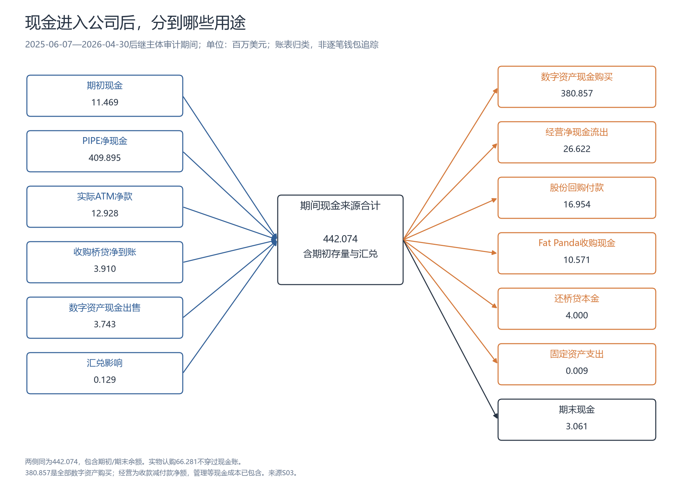

# BNC：BNB 财库与每股资产

按本报告历史条件，每1美元股票对应约1.31美元BNB毛价值。每股含币量的改善主要来自总份数减少；最近完整季度的空投收入未覆盖管理费。**资产折价、发股与回购、持续费用及管理合同义务，共同影响普通股的价值。**

## 1. 公司架构与YZi角色

BNB Standard（股票代码BNC）由原CEA Industries转型而来，保留温控与胖熊猫电子烟业务。[股票代码沿革](https://www.sec.gov/Archives/edgar/data/1482541/000148254126000051/R10.htm)、[公司更名](https://www.sec.gov/Archives/edgar/data/1482541/000149315226045633/formposam.htm)。

<time>原上市主体</time><strong>CEA Industries · CEAD</strong>Surna温控设备及服务

<time>2025-06-06</time><strong>收购Fat Panda</strong>取得100%股权；收购价约1,270万美元

<time>2025-06-13</time><strong>代码CEAD → VAPE</strong>配合胖熊猫电子烟业务

<time>2025-08-05／06</time><strong>完成募资并建立BNB财库</strong>约5亿美元现金与币；股票代码由VAPE改为BNC

<time>2026-06—07</time><strong>YZi治理合作</strong>达成合作协议；六人董事会中三人为YZi安排

<time>2026-09-29</time><strong>更名BNB Standard</strong>上市主体延续；BNC股票代码保留

胖熊猫由上市母公司通过加拿大子公司全资持有。**YZi Labs（原Binance Labs）持有母公司股份，参与后来的BNB融资、顾问安排与治理。** 已核收购文件未列YZi为胖熊猫原股东或卖方。[收购完成](https://www.sec.gov/Archives/edgar/data/1482541/000164117225014377/form8-k.htm)、[YZi背景](https://www.yzilabs.com/blog/from-binance-labs-incubator-to-easy-residency-seven-years-of-backing-long-term-builders)。

胖熊猫原股东、收购主体与关系核查

收购协议列出的卖方为Randy Lamont、Darcy Backman、Mignonne Lamont、Jordan Vedoya以及Fat Panda Ltd.；协议说明卖方合计拥有相关公司全部已发行股份。Randy以President身份为经营公司签署。已查材料没有完整列出各自然人的持股比例，未据此认定其中某人独自控股，也未将公司实体和自然人的份额重复相加。 收购于2025年6月6日完成，原经营团队继续运营；款项包括现金、股票和卖方票据。

买方是CEA全资加拿大子公司16728502 CANADA INC.，收购四家经营公司的全部股权；收购后母公司取得100%投票权益，原卖方没有因此取得CEA的控制权。上述原股东姓名及角色均对应收购时点。文件未列YZi为卖方，未核实上述原股东与YZi另有私人或业务联系；公开股权关系仅呈现已经披露的部分。

[原协议与签署人](https://www.sec.gov/Archives/edgar/data/1482541/000149315225006050/ex10-1.htm)、[完成公告](https://www.sec.gov/Archives/edgar/data/1482541/000164117225014377/form8-k.htm)、[年报收购会计说明](https://www.sec.gov/Archives/edgar/data/1482541/000148254126000019/bncww-20260430.htm)。

<figure class="bnc-main-chart bnc-company-map">
<strong>公司、出资者与服务方</strong>股权归属／资金／服务分开连线

<svg viewBox="0 0 1000 710" role="img" aria-label="投资者出资给上市母公司；母公司经营温控、全资持有Fat Panda及财库实体；10X提供管理，Ceffu和BitGo提供托管及借贷"><defs><marker id="bnc-arrow-ownership" viewBox="0 0 10 10" refX="9" refY="5" markerWidth="6" markerHeight="6" orient="auto"><path d="M0 0 L10 5 L0 10 Z" class="bnc-marker-ownership"></path></marker><marker id="bnc-arrow-money" viewBox="0 0 10 10" refX="9" refY="5" markerWidth="6" markerHeight="6" orient="auto"><path d="M0 0 L10 5 L0 10 Z" class="bnc-marker-money"></path></marker><marker id="bnc-arrow-service" viewBox="0 0 10 10" refX="9" refY="5" markerWidth="6" markerHeight="6" orient="auto"><path d="M0 0 L10 5 L0 10 Z" class="bnc-marker-service"></path></marker></defs><rect x="25" y="28" width="285" height="137" rx="5" class="bnc-map-node bnc-map-investor"></rect><text x="43" y="59" text-anchor="start" class="bnc-map-title">YZi Labs</text><text x="43" y="89" text-anchor="start" class="bnc-map-small">约1亿美元认购（复算）</text><text x="43" y="114" text-anchor="start" class="bnc-map-small">普通股持仓19.99%</text><text x="43" y="139" text-anchor="start" class="bnc-map-small">2025顾问安排；2026董事安排</text><rect x="370" y="28" width="280" height="112" rx="5" class="bnc-map-node "></rect><text x="388" y="59" text-anchor="start" class="bnc-map-title">其他PIPE投资者</text><text x="388" y="89" text-anchor="start" class="bnc-map-small">原轮总额剩余约4亿美元</text><text x="388" y="114" text-anchor="start" class="bnc-map-small">公告举例：Pantera、GSR等</text><rect x="370" y="230" width="280" height="98" rx="5" class="bnc-map-node bnc-map-parent"></rect><text x="388" y="261" text-anchor="start" class="bnc-map-title">BNB Standard</text><text x="388" y="291" text-anchor="start" class="bnc-map-small">上市母公司 · 原CEA Industries</text><text x="388" y="316" text-anchor="start" class="bnc-map-small">股票代码BNC</text><rect x="710" y="230" width="265" height="98" rx="5" class="bnc-map-node "></rect><text x="728" y="261" text-anchor="start" class="bnc-map-title">10X资产管理人</text><text x="728" y="291" text-anchor="start" class="bnc-map-small">按协议管理数字资产</text><text x="728" y="316" text-anchor="start" class="bnc-map-small">管理费最新披露年化1.4%</text><rect x="25" y="440" width="260" height="110" rx="5" class="bnc-map-node "></rect><text x="43" y="471" text-anchor="start" class="bnc-map-title">温控业务</text><text x="43" y="501" text-anchor="start" class="bnc-map-small">Surna温控设备及服务</text><text x="43" y="526" text-anchor="start" class="bnc-map-small">销售温控产品及服务</text><rect x="355" y="440" width="270" height="110" rx="5" class="bnc-map-node "></rect><text x="373" y="471" text-anchor="start" class="bnc-map-title">Fat Panda（胖熊猫）</text><text x="373" y="501" text-anchor="start" class="bnc-map-small">加拿大电子烟零售与制造</text><text x="373" y="526" text-anchor="start" class="bnc-map-small">经加拿大子公司持有100%</text><rect x="710" y="440" width="265" height="140" rx="5" class="bnc-map-node "></rect><text x="728" y="471" text-anchor="start" class="bnc-map-title">BNB财库实体</text><text x="728" y="501" text-anchor="start" class="bnc-map-small">CEA BRS LLC（全资）</text><text x="728" y="526" text-anchor="start" class="bnc-map-small">↓ 全资持有</text><text x="728" y="551" text-anchor="start" class="bnc-map-small">BNC BNB Cayman持币</text><rect x="710" y="625" width="265" height="66" rx="5" class="bnc-map-node "></rect><text x="728" y="656" text-anchor="start" class="bnc-map-title">Ceffu／BitGo</text><text x="728" y="686" text-anchor="start" class="bnc-map-small">托管；BitGo另提供抵押借款</text><path d="M310 105 H340 V260 H370" class="bnc-map-edge bnc-edge-money" marker-end="url(#bnc-arrow-money)"></path><text x="25" y="203" text-anchor="start" class="bnc-edge-label bnc-label-money">认购资金；取得证券</text><path d="M510 140 V230" class="bnc-map-edge bnc-edge-money" marker-end="url(#bnc-arrow-money)"></path><text x="530" y="192" text-anchor="start" class="bnc-edge-label bnc-label-money">现金／币认购</text><path d="M310 150 H320 V295 H370" class="bnc-map-edge bnc-edge-service" marker-end="url(#bnc-arrow-service)"></path><text x="40" y="285" text-anchor="start" class="bnc-edge-label bnc-label-service">持股与治理</text><path d="M650 252 H710" class="bnc-map-edge bnc-edge-money" marker-end="url(#bnc-arrow-money)"></path><text x="653" y="239" text-anchor="start" class="bnc-edge-label bnc-label-money">支付费用</text><path d="M842 328 V440" class="bnc-map-edge bnc-edge-service" marker-end="url(#bnc-arrow-service)"></path><text x="854" y="389" text-anchor="start" class="bnc-edge-label bnc-label-service">资产管理服务</text><path d="M435 328 V375 H155 V440" class="bnc-map-edge bnc-edge-ownership" marker-end="url(#bnc-arrow-ownership)"></path><text x="55" y="396" text-anchor="start" class="bnc-edge-label bnc-label-ownership">经营业务</text><path d="M510 328 V440" class="bnc-map-edge bnc-edge-ownership" marker-end="url(#bnc-arrow-ownership)"></path><text x="526" y="396" text-anchor="start" class="bnc-edge-label bnc-label-ownership">全资子公司</text><path d="M585 328 V375 H760 V440" class="bnc-map-edge bnc-edge-ownership" marker-end="url(#bnc-arrow-ownership)"></path><text x="628" y="361" text-anchor="start" class="bnc-edge-label bnc-label-ownership">全资持有链条</text><path d="M842 625 V580" class="bnc-map-edge bnc-edge-service" marker-end="url(#bnc-arrow-service)"></path><text x="855" y="610" text-anchor="start" class="bnc-edge-label bnc-label-service">托管／贷款服务</text></svg>
<figcaption>实线为经营归属及全资链条；粉色为认购资金或费用；虚线为治理及服务关系。YZi出资额按原认购数量、价格复算；投资者名单为2025年公告，当前持仓仅对YZi单独核查。</figcaption></figure>

股份分布、出资与治理安排

按原认购数量与价格复算，YZi出资约1亿美元，占约5亿美元募资的20%；顾问服务另对应战略权证。2026年6月合作协议及随后董事安排，使其参与公司治理。[出资与持股](https://www.sec.gov/Archives/edgar/data/1482541/000092189526002598/xslSCHEDULE_13D_X02/primary_doc.xml)、[治理合作](https://www.sec.gov/Archives/edgar/data/1482541/000149315226029966/ex99-1.htm)。

原募资公告列超过140名投资者，包括YZi、Pantera、GSR、Arrington等，各家到账额及后续持仓未完整穿透。[募资公告](https://www.globenewswire.com/news-release/2025/07/28/3122430/0/en/CEA-Industries-and-10X-Capital-with-the-support-of-YZi-Labs-announce-500-Million-Private-Placement-to-Establish-Largest-Publicly-Listed-BNB-Treasury-Company-in-the-World-NASDAQ-VAP.html)。

<strong>YZi普通股</strong>9,749,745股；19.99%

＋

<strong>其他普通股</strong>39,023,369股；80.01%

＝

<strong>10月2日普通股总数</strong>48,773,114股

YZi还持有预付及战略权证。与公司同类近零价权证一起计入时，潜在占比约25.65%；当前投票权按已发行股份计算。YZi与Zhao披露同一批共同受益股份，份额计一次。[股东文件](https://www.sec.gov/Archives/edgar/data/1482541/000092189526002598/xslSCHEDULE_13D_X02/primary_doc.xml)。

10月2日文件列William B. Miller为临时主要执行官兼CFO，Alex Odagiu为临时总裁兼董事。[公司签署人](https://www.sec.gov/Archives/edgar/data/1482541/000149315226045633/formposam.htm)。

YZi潜在占比用其披露的9,749,745普通股、2,331,877预付权证及1,383,728战略权证计算。公司战略权证总数较股东披露多3份，差额未归入YZi；持股上限继续约束行权。

## 2. 每美元资产与每股含币量

每美元BNB价值＝**每股含币量 × BNB价格 ÷ 股价**。主口径计入普通股及剩余近零价权证；权证换股时，两者此增彼减，合计只计一次。

<figure class="bnc-main-chart bnc-dollar-value">
<strong>每投入1美元股票，对应的资产</strong>主口径：剩余近零价权证全部换股

买股票的支出<strong>1.00<small>美元</small></strong>

<i style="width:66.66666667%"></i>

对应BNB毛价值<strong>1.31<small>美元</small></strong>

<i style="width:87.25402030%"></i>

条件财库净额<strong>1.26<small>美元</small></strong>

<i style="width:83.69770885%"></i>

00.51.01.5美元
<figcaption>价格取2026-10-06，资产与股数取各自披露日。条件净额未扣高行权价权证负债及未确认或有赔偿，未计原业务非币资产；股票无按此金额兑币的权利。</figcaption></figure>

条件财库净额、股数与测算日期

<figure class="bnc-main-chart ">
<strong>从BNB毛价值到条件财库净额</strong>单位：万美元 · 未含原业务非币资产

BNB按估值日价格重估<strong>40,188.20</strong>

＋假设现金<strong>1,208.40</strong>

＋其他币账面价值<strong>221.00</strong>

−非权证负债<strong>3,067.40</strong>

＝条件财库净额<strong>38,550.20</strong>

<figcaption>假设九月新增500万美元借款未花，现金和债务同时增加。模型扣非权证负债，主动排除高行权价配套权证负债；该批权证未计入主股数。未确认的AMA终止赔偿亦未计入。</figcaption></figure>

| 股数口径 | 每1美元股票对应BNB毛价值 | 每1美元股票对应条件财库净额 |
|---|---:|---:|
| 已发行普通股：48,773,114股 | 1.409美元 | 1.351美元 |
| 普通股＋剩余近零价权证：52,488,722份 | 1.309美元 | 1.255美元 |

**输入时点：**7月底持币与其他资产、10月2日股数、10月6日股价5.85美元及BNB价格779.53美元；九月新增借款假设未使用。七月后完整资产余额未知，以上均为跨期条件测算。[资产](https://www.sec.gov/Archives/edgar/data/1482541/000148254126000051/bncww-20260731.htm)、[股数与九月借款](https://www.sec.gov/Archives/edgar/data/1482541/000149315226045633/formposam.htm)。

**权证敏感性：**被排除的1,204.9万美元负债对应行权价15.15美元的配套权证，与计入主股数的近零价权证分别归类。其余假设不变、另扣该七月底账面值，每美元股票对应约1.216美元条件净额；这仅是模型对照，仍不代表十月实际净值。[权证分类与计量](https://www.sec.gov/Archives/edgar/data/1482541/000148254126000051/bncww-20260731.htm)。

股票／资产倍数为上述比值的倒数：主口径毛值约0.764倍、条件净额约0.797倍。公司官网mNAV仅计已发行普通股，定义对照见第4章。

### 每美元股票对应BNB价值的历史

<figure class="bnc-main-chart bnc-dollar-history">
<strong>每1美元股票对应的BNB价值</strong>币的美元价值 ÷ 买股票的美元支出

<svg viewBox="0 0 900 410" role="img" aria-label="每1美元股票对应多少美元BNB：2025年10月31日至2026年10月6日，按分段沿用财报数量估算；末值1.31美元"><text x="18" y="27" class="bnc-axis-unit">美元BNB价值／1美元股票</text><line x1="86" x2="770" y1="310.00" y2="310.00" class="bnc-grid-line"/><text x="68" y="315.00" text-anchor="end" class="bnc-axis-label">0</text><line x1="86" x2="770" y1="268.33" y2="268.33" class="bnc-grid-line"/><text x="68" y="273.33" text-anchor="end" class="bnc-axis-label">0.5</text><line x1="86" x2="770" y1="226.67" y2="226.67" class="bnc-grid-line"/><text x="68" y="231.67" text-anchor="end" class="bnc-axis-label">1</text><line x1="86" x2="770" y1="185.00" y2="185.00" class="bnc-grid-line"/><text x="68" y="190.00" text-anchor="end" class="bnc-axis-label">1.5</text><line x1="86" x2="770" y1="143.33" y2="143.33" class="bnc-grid-line"/><text x="68" y="148.33" text-anchor="end" class="bnc-axis-label">2</text><line x1="86" x2="770" y1="101.67" y2="101.67" class="bnc-grid-line"/><text x="68" y="106.67" text-anchor="end" class="bnc-axis-label">2.5</text><line x1="86" x2="770" y1="60.00" y2="60.00" class="bnc-grid-line"/><text x="68" y="65.00" text-anchor="end" class="bnc-axis-label">3</text><line x1="86" x2="770" y1="226.67" y2="226.67" style="stroke:var(--ink);stroke-width:1.4;stroke-dasharray:3 5"/><text x="787" y="231.67" class="bnc-axis-label">1∶1</text><path d="M86.00 199.35 L92.04 199.79 L94.05 188.73 L96.06 182.60 L98.07 181.33 L100.08 185.98 L106.12 190.00 L108.13 189.04 L110.14 182.67 L112.15 175.49 L114.16 171.75 L120.20 171.02 L122.21 168.77 L124.22 180.99 L126.24 184.28 L128.25 192.30 L134.28 187.95 L136.29 197.59 L138.31 197.43 L142.33 217.82 L148.36 214.85 L150.38 216.56 L152.39 219.05 L154.40 214.90 L156.41 212.19 L162.45 209.91 L164.46 218.76 L166.47 219.96 L168.48 218.90 L170.49 214.66 L176.53 211.17 L178.54 207.87 L180.55 211.32 L182.56 209.64 L184.58 213.98 L190.61 211.15 L192.62 207.04 L194.64 214.74 L198.66 215.54 L204.69 211.48 L206.71 210.49 L208.72 208.69 L212.74 206.99 L218.78 202.80 L220.79 205.22 L222.80 187.40 L224.81 191.25 L226.82 182.34 L232.86 186.48 L234.87 182.89 L236.88 196.16 L238.89 193.04 L240.91 199.33 L248.95 194.63 L250.96 195.80 L252.98 193.33 L254.99 188.43 L261.02 183.57 L263.04 186.26 L265.05 181.94 L267.06 180.54 L269.07 180.25 L275.11 186.01 L277.12 192.04 L279.13 199.74 L281.14 200.78 L283.15 196.41 L289.19 204.13 L291.20 207.50 L293.21 205.27 L295.22 200.09 L297.24 197.65 L305.28 194.92 L307.29 200.06 L309.31 194.56 L311.32 182.39 L317.35 180.45 L319.36 186.07 L321.38 179.09 L323.39 181.10 L325.40 170.40 L331.44 174.88 L333.45 171.37 L335.46 170.13 L337.47 170.31 L339.48 168.74 L345.52 184.72 L347.53 177.70 L349.54 174.28 L351.55 154.93 L353.56 152.48 L359.60 148.86 L361.61 148.94 L363.62 147.71 L365.64 153.24 L367.65 148.64 L373.68 153.34 L375.69 156.59 L377.71 149.77 L379.72 149.20 L381.73 142.14 L387.76 143.20 L389.78 145.24 L391.79 137.51 L393.80 140.53 L401.85 137.64 L403.86 125.04 L405.87 130.49 L407.88 126.36 L409.89 128.21 L415.93 137.10 L417.94 141.69 L419.95 135.50 L421.96 120.90 L423.98 127.12 L430.01 145.78 L432.02 140.02 L434.04 144.47 L436.05 136.89 L438.06 151.19 L444.09 151.83 L446.11 147.99 L448.12 137.63 L450.13 151.57 L452.14 153.87 L458.18 148.87 L460.19 153.69 L462.20 148.56 L464.21 147.19 L466.22 149.64 L472.26 144.33 L474.27 139.58 L476.28 135.21 L478.29 134.61 L480.31 113.29 L486.34 117.59 L488.35 122.54 L490.36 118.74 L492.38 109.94 L494.39 112.34 L502.44 115.35 L504.45 99.24 L506.46 110.90 L508.47 134.98 L514.51 140.39 L516.52 118.69 L518.53 116.93 L520.54 116.76 L522.55 100.75 L528.59 88.93 L530.60 90.90 L532.61 74.56 L534.62 83.91 L536.64 75.47 L542.67 87.16 L544.68 114.97 L546.69 91.23 L548.71 105.02 L556.75 84.75 L558.76 107.76 L560.78 145.45 L562.79 165.21 L564.80 161.70 L570.84 158.79 L572.85 149.66 L574.86 152.01 L576.87 145.30 L584.92 141.08 L586.93 138.51 L588.94 138.90 L590.95 145.98 L592.96 152.30 L599.00 149.44 L601.01 149.92 L603.02 154.02 L605.04 154.49 L607.05 155.53 L613.08 154.65 L615.09 158.90 L617.11 156.01 L619.12 152.15 L621.13 148.61 L627.16 149.08 L629.18 145.78 L631.19 128.81 L633.20 132.56 L635.21 129.02 L641.25 117.90 L643.26 114.82 L645.27 114.43 L647.28 99.82 L649.29 103.33 L655.33 105.99 L657.34 103.96 L659.35 111.94 L661.36 113.50 L663.38 120.55 L669.41 114.96 L671.42 114.14 L673.44 119.56 L675.45 112.81 L677.46 135.14 L683.49 125.22 L685.51 126.86 L687.52 113.91 L689.53 116.95 L691.54 122.69 L697.58 126.79 L699.59 111.96 L701.60 111.42 L703.61 129.73 L705.62 141.12 L713.67 193.25 L715.68 173.78 L717.69 192.82 L719.71 186.36 L725.74 197.34 L727.75 190.05 L729.76 186.31 L731.78 199.37 L733.79 205.09 L739.82 210.35 L741.84 208.48 L743.85 207.11 L745.86 208.05 L747.87 206.16 L753.91 199.13 L755.92 204.68 L757.93 203.64 L759.94 204.67 L761.95 202.79 L767.99 203.82 L770.00 200.93" class="bnc-history-line bnc-history-near" style="stroke-dasharray:4 3"/><circle cx="86.00" cy="199.35" r="5" style="stroke:var(--pink);stroke-width:2;fill:var(--pink)"><title>2025-10-31：每1美元股票对应1.3278美元BNB；股票7.42美元，BNB 1090.00 USDT</title></circle><text x="86.00" y="169.35" text-anchor="start" class="bnc-history-value bnc-history-near">1.33</text><circle cx="275.11" cy="186.01" r="5" style="stroke:var(--pink);stroke-width:2;fill:var(--panel)"><title>2026-02-02：每1美元股票对应1.4878美元BNB；股票4.85美元，BNB 769.67 USDT</title></circle><circle cx="452.14" cy="153.87" r="5" style="stroke:var(--pink);stroke-width:2;fill:var(--panel)"><title>2026-05-01：每1美元股票对应1.8735美元BNB；股票3.16美元，BNB 619.24 USDT</title></circle><circle cx="635.21" cy="129.02" r="5" style="stroke:var(--pink);stroke-width:2;fill:var(--pink)"><title>2026-07-31：每1美元股票对应2.1718美元BNB；股票2.66美元，BNB 588.17 USDT</title></circle><circle cx="770.00" cy="200.93" r="5" style="stroke:var(--pink);stroke-width:2;fill:var(--panel)"><title>2026-10-06：每1美元股票对应1.3088美元BNB；股票5.85美元，BNB 779.53 USDT</title></circle><text x="770.00" y="185.93" text-anchor="end" class="bnc-history-value bnc-history-near">1.31</text><text x="86.00" y="341" text-anchor="middle" class="bnc-axis-label">2025-10-31</text><text x="271.08" y="341" text-anchor="middle" class="bnc-axis-label">2026-01</text><text x="450.13" y="341" text-anchor="middle" class="bnc-axis-label">2026-04</text><text x="635.21" y="341" text-anchor="middle" class="bnc-axis-label">2026-07</text><text x="770.00" y="341" text-anchor="middle" class="bnc-axis-label">2026-10-06</text><circle cx="97" cy="377" r="4" style="fill:var(--pink)"/><text x="109" y="382" class="bnc-axis-label">实心：币数与股数同日财报值</text><circle cx="432" cy="377" r="4" style="fill:var(--panel);stroke:var(--pink);stroke-width:2"/><text x="444" y="382" class="bnc-axis-label">空心与虚线：沿用数量的估算</text></svg>
<figcaption>2025-10-31—2026-10-06，共233个交易日。按同期价格计算，财报间币数与股数分段沿用（虚线／空心点），属于条件回溯；BNB/USDT按美元近似。</figcaption></figure>

1∶1横线表示毛值平价；高于横线时，股票价格低于该模型的BNB毛值。现金与债务另算。

历史比值的数据、日期与计算条件

**股数始终使用同一规则：普通股＋剩余预付权证＋剩余近零价战略顾问权证。** 已经换成股票的权证只计入普通股一次，高行权价权证未纳入。完整CSV另列仅普通股的对照比值。

| 行情日期 | 股票价格（美元／股） | BNB价格（USDT／枚） | 1美元股票对应BNB价值（美元） | 数量依据 |
|---|---:|---:|---:|---|
| 2025-10-31 | 7.42 | 1090.00 | 1.328 | 2025-10-31财报 |
| 2026-02-02 | 4.85 | 769.67 | 1.488 | 2026-01-31财报 |
| 2026-05-01 | 3.16 | 619.24 | 1.874 | 2026-04-30财报 |
| 2026-07-31 | 2.66 | 588.17 | 2.172 | 2026-07-31财报 |
| 2026-10-06 | 5.85 | 779.53 | 1.309 | 7月底币数＋10月2日股数 |

**历史覆盖。** 价格底稿从2025-08-06开始；完整可核对的币数和上述三项证券数量从2025-10-31开始，因此此前未画比值。币数及股数采用2025-10-31、2026-01-31、04-30、07-31财报日与10月2日股数，两个财报日之间沿用上一个时点。数量的真实逐日变化未完整披露；虚线不能当作每日实际净资产，也不能当作当时已公开的信息进行回测。财报修订数据按余额日期回溯。

**价格对齐。** 股票为NASDAQ当日收盘价，BNB为同一UTC时刻的Binance BNB/USDT小时开盘价。纽约夏令时、冬令时和提前收市采用底稿记录的收盘时间；周末无美股价格时不补点。2026-01-31为周末，表中用2月2日行情配1月31日数量；4月30日新数量从当日适用，表选下一交易日展示。USDT与美元按1∶1近似，未逐日校正汇率。

原始依据：[修订10月季报](https://www.sec.gov/Archives/edgar/data/1482541/000149315226029788/form10-qa.htm)、[修订1月季报](https://www.sec.gov/Archives/edgar/data/1482541/000149315226029789/form10-qa.htm)、[4月年报](https://www.sec.gov/Archives/edgar/data/1482541/000148254126000019/bncww-20260430.htm)、[7月季报](https://www.sec.gov/Archives/edgar/data/1482541/000148254126000051/bncww-20260731.htm)、[10月2日证券数量](https://www.sec.gov/Archives/edgar/data/1482541/000149315226045633/formposam.htm)。价格沿用2026-10-07保存的NASDAQ／Binance底稿，行情截止10月6日。

下载：[每美元BNB历史日序列CSV](3e95f6a5-每美元股票对应BNB_历史日序列.csv)、[计算说明](b8c492cb-计算说明.md)。

### 每股含币量与融资影响

每千股含币量衡量数量变化，剔除币价和股价影响。

<figure class="bnc-main-chart bnc-share-history">
<strong>每千股对应的BNB</strong>粉色：含未换股的领股凭证 · 灰色：已发行普通股

<svg viewBox="0 0 900 390" role="img" aria-label="每千股BNB：计近零价权证从9.039增至9.822；九月权证转股时，此口径基本不变"><text x="20" y="28" text-anchor="start" class="bnc-axis-unit">枚BNB／每1,000股</text><line x1="100" x2="765" y1="310.0" y2="310.0" class="bnc-grid-line"></line><text x="80" y="315.0" text-anchor="end" class="bnc-axis-label">0</text><line x1="100" x2="765" y1="238.57142857142856" y2="238.57142857142856" class="bnc-grid-line"></line><text x="80" y="243.57142857142856" text-anchor="end" class="bnc-axis-label">4</text><line x1="100" x2="765" y1="167.14285714285714" y2="167.14285714285714" class="bnc-grid-line"></line><text x="80" y="172.14285714285714" text-anchor="end" class="bnc-axis-label">8</text><line x1="100" x2="765" y1="95.71428571428572" y2="95.71428571428572" class="bnc-grid-line"></line><text x="80" y="100.71428571428572" text-anchor="end" class="bnc-axis-label">12</text><line x1="100" x2="765" y1="60.0" y2="60.0" class="bnc-grid-line"></line><text x="80" y="65.0" text-anchor="end" class="bnc-axis-label">14</text><path d="M100.0000 108.2912 L282.0833 99.2075" class="bnc-history-line bnc-history-basic"></path><path d="M282.0833 99.2075 L458.2292 93.9337" class="bnc-history-line bnc-history-basic"></path><path d="M458.2292 93.9337 L640.3125 86.4080" class="bnc-history-line bnc-history-basic"></path><path d="M640.3125 86.4080 L765.0000 121.2455" class="bnc-history-line bnc-history-basic bnc-history-conditional"></path><circle cx="100.0000" cy="108.2912" r="4" class="bnc-history-basic"><title>2025-10-31：11.295690枚BNB／每千股</title></circle><text x="110" y="94.2912" text-anchor="start" class="bnc-history-value bnc-history-basic">11.296</text><circle cx="282.0833" cy="99.2075" r="4" class="bnc-history-basic"><title>2026-01-31：11.804381枚BNB／每千股</title></circle><text x="282.0833" y="85.2075" text-anchor="middle" class="bnc-history-value bnc-history-basic">11.804</text><circle cx="458.2292" cy="93.9337" r="4" class="bnc-history-basic"><title>2026-04-30：12.099710枚BNB／每千股</title></circle><text x="458.2292" y="79.9337" text-anchor="middle" class="bnc-history-value bnc-history-basic">12.100</text><circle cx="640.3125" cy="86.4080" r="4" class="bnc-history-basic"><title>2026-07-31：12.521151枚BNB／每千股</title></circle><text x="640.3125" y="72.408" text-anchor="middle" class="bnc-history-value bnc-history-basic">12.521</text><circle cx="765.0000" cy="121.2455" r="4" class="bnc-history-basic"><title>2026-10-02：10.570250枚BNB／每千股</title></circle><text x="765.0" y="107.2455" text-anchor="middle" class="bnc-history-value bnc-history-basic">10.570</text><path d="M100.0000 148.5892 L282.0833 142.5816" class="bnc-history-line bnc-history-near"></path><path d="M282.0833 142.5816 L458.2292 139.2719" class="bnc-history-line bnc-history-near"></path><path d="M458.2292 139.2719 L640.3125 134.6072" class="bnc-history-line bnc-history-near"></path><path d="M640.3125 134.6072 L765.0000 134.6072" class="bnc-history-line bnc-history-near bnc-history-conditional"></path><circle cx="100.0000" cy="148.5892" r="4" class="bnc-history-near"><title>2025-10-31：9.039006枚BNB／每千股</title></circle><text x="110" y="172.5892" text-anchor="start" class="bnc-history-value bnc-history-near">9.039</text><circle cx="282.0833" cy="142.5816" r="4" class="bnc-history-near"><title>2026-01-31：9.375432枚BNB／每千股</title></circle><text x="282.0833" y="166.5816" text-anchor="middle" class="bnc-history-value bnc-history-near">9.375</text><circle cx="458.2292" cy="139.2719" r="4" class="bnc-history-near"><title>2026-04-30：9.560773枚BNB／每千股</title></circle><text x="458.2292" y="163.2719" text-anchor="middle" class="bnc-history-value bnc-history-near">9.561</text><circle cx="640.3125" cy="134.6072" r="4" class="bnc-history-near"><title>2026-07-31：9.821996枚BNB／每千股</title></circle><text x="640.3125" y="158.6072" text-anchor="middle" class="bnc-history-value bnc-history-near">9.822</text><circle cx="765.0000" cy="134.6072" r="4" class="bnc-history-near"><title>2026-10-02：9.821996枚BNB／每千股</title></circle><text x="765.0" y="158.6072" text-anchor="middle" class="bnc-history-value bnc-history-near">9.822</text><text x="100.0" y="339" text-anchor="middle" class="bnc-axis-label">2025-10-31</text><text x="282.0833" y="339" text-anchor="middle" class="bnc-axis-label">2026-01-31</text><text x="458.2292" y="339" text-anchor="middle" class="bnc-axis-label">2026-04-30</text><text x="640.3125" y="339" text-anchor="middle" class="bnc-axis-label">2026-07-31</text><text x="765.0" y="339" text-anchor="middle" class="bnc-axis-label">2026-10-02</text><text x="765" y="367" text-anchor="middle" class="bnc-axis-label">条件沿用7月底持币</text></svg>
<figcaption>前四个点采用各期披露的币数和证券数量，近零价权证按全部换股计算。虚线终点采用10月2日股数与7月底币数，七月后完整持币变化未知；曲线连接披露时点。</figcaption></figure>

2025年10月底至2026年7月底，每千股含币量增加约8.7%，**主要来自总份数减少约7.3%；BNB总量仅增约0.7%。** 九月权证换股使普通股与剩余权证此增彼减，合计份数基本不变。[历史数量](1366070a-每股BNB历史.csv)、[换股披露](https://www.sec.gov/Archives/edgar/data/1482541/000149315226045633/formposam.htm)。

**发股能否增厚，取决于扣费后买入BNB的增速能否超过股数增速。** 原价格情景下，5,000万美元ATM全部执行使每千股BNB下降约3.64%；新额度实际执行未确认。

预付权证与股数口径

预付权证就是股票钱基本已经交了，凭证按条件领取股票。例：100万份，每股只需补0.00001美元，补10美元后领取100万股；原认购款已计入原PIPE融资。

战略顾问权证来自顾问服务安排。领取股票时同样增加股数，其来历与预付认购款分别列明。

| 10月2日证券数量 | 对应股数 |
|---|---:|
| 已发行普通股 | 48,773,114 |
| 剩余预付权证 | 2,331,877 |
| 剩余战略顾问权证 | 1,383,731 |
| 三项全部计入 | 52,488,722 |

近零价凭证按全部现金换股新增约37美元。已换股的数量计入普通股一次；行权价15.15美元的配套权证、10.23美元的管理人权证及其他较高行权价工具单列，行权会同时影响股数和资产，未机械加入主口径。[预付权证合同](https://www.sec.gov/Archives/edgar/data/1482541/000164117225021130/ex4-1.htm)、[公司证券](https://www.sec.gov/Archives/edgar/data/1482541/000149315226045633/formposam.htm)。

发行价格与ATM额度测算

<figure class="bnc-main-chart bnc-issuance-example">
<strong>发行价格影响每股含币量</strong>假设例子 · BNB价格固定100美元 · 忽略费用

初始：100枚BNB／100股＝每股1枚BNB；两种情况都新增100股。

每股卖200美元
收到20,000美元 → 买200枚BNB
<strong>300枚 ÷ 200股 ＝每股1.50枚</strong><b>每股含币量＋50%</b>

每股卖50美元
收到5,000美元 → 买50枚BNB
<strong>150枚 ÷ 200股 ＝每股0.75枚</strong><b>每股含币量−25%</b>

<figcaption>募集款全部买币、币价不变。实际发行还要扣佣金、法律费用等；借款和优先股融资另增加优先偿还或付息义务。</figcaption></figure>

<figure class="bnc-main-chart bnc-atm-effect">
<strong>BNC新ATM额度的条件测算</strong>5,000万美元额度 · 执行到账未确认

币数这一边
扣3%佣金及5万美元律师费
<strong>净款4,845万美元 买约62,153枚BNB</strong><small>总持币约577,697枚</small>

股数这一边
按每股5.85美元发行
<strong>新增约8,547,009股</strong><small>计近零权证后的总份数约61,035,731</small>

每千股对应BNB<strong>9.822 → 9.465枚</strong><b>-3.64%</b>
<figcaption>币价779.53美元、发行价5.85美元均为原报告历史条件。未计其他发行费用，未推定计划已执行；公司币数增加，但这个情景下股数增长更快。</figcaption></figure>

PIPE资金交付与发行费用

PIPE为定向证券融资，投资者用现金或约定数字资产认购。

<figure class="bnc-pipe-exchange" aria-label="定向募资：投资者交钱或币，BNC交新股票及权证">

<strong>投资者与公司交换</strong>2025-08-05 · PIPE募资完成

<strong>投资者</strong>购买公司新证券

<strong>BNC</strong>取得用于经营和买币的资金

现金，或双方接受的数字货币 →<i aria-hidden="true"></i>

← 新股票／领股凭证＋配套权证<i aria-hidden="true"></i><small>领股凭证即预付权证，按约定条件换成普通股</small>

<strong>用现金付款</strong>现金总款扣除发行费用，剩余款项归公司使用

<strong>下方金额单位：万美元（1万＝10,000美元）</strong>

投资者交的总款<strong>43,375.5</strong>
<b>−</b>
发行费用<strong>2,386.0</strong>
<b>＝</b>
公司留下的净款<strong>40,989.5</strong>

<strong>用币付款</strong>55枚BTC＋59,829,438枚USDT；收到时合计记账价值6,628.1万美元

<figcaption>数字资产另列。发行费用包括募资中介、法律等支出，逐家收款金额未完整披露。金额采用最终年报口径。</figcaption>
</figure>

<figure class="bnc-capital-routes" aria-label="现金买BNB；收到的其他币兑换BNB，剩余币继续列在资产中">

<strong>认购款进入BNB储备的路径</strong>年报披露的资金与币流

现金净款<i aria-hidden="true">→</i>公司买BNB<i aria-hidden="true">→</i><strong>BNB储备</strong>

收到BTC／USDT等币<i aria-hidden="true">→</i>公司兑换成BNB<i aria-hidden="true">→</i><strong>BNB储备</strong>

<figcaption>年报列出79,261枚BNB来自其他币兑换，合计包含PIPE收到的币和空投币；两项未逐笔拆分。2026年7月底仍持有27枚BTC和519,520枚USDT。</figcaption>
</figure>

[现金与数字资产交付依据](https://www.sec.gov/Archives/edgar/data/1482541/000148254126000019/bncww-20260430.htm)。

原PIPE采用最终审计现金与币的拆分，旧季报列报差异未完全调节。现有股东在二级市场卖股票，买家的钱进入卖方；公司发行新股时才取得这笔股权融资。

股价、币价与市场定价的关系

<figure class="bnc-main-chart bnc-return-chart">
<strong>股票价格的三个因子</strong>同一股数口径下的计算关系

每枚BNB价格<strong>币的行情</strong>
<i>×</i>
每股BNB枚数<strong>买币与股数变化</strong>
<i>×</i>
股票／BNB毛值倍数<strong>市场折价或溢价</strong>

三项相乘＝股票价格。债务、其他业务和未来增长预期，会影响市场愿意付出的倍数。
<figcaption>此关系按BNB毛值倍数定义成立；净资产倍数另按净资产计算。折叠内为独立假设例子，未预测实际股票回报。</figcaption></figure>

| 假设情景 | BNB价格变化 | 每股BNB变化 | 股票／BNB毛值倍数变化 | 对应股价变化 |
|---|---:|---:|---:|---:|
| 只有币价上涨 | ＋20% | 不变 | 不变 | ＋20% |
| 币价不变，每股币数增加 | 不变 | ＋10% | 不变 | ＋10% |
| 币价上涨，市场倍数下降 | ＋20% | 不变 | −30% | −16% |

第三行计算为1.20×1.00×0.70＝0.84。市场倍数随预期、费用、债务及供需变化；主图的资产折价也可能持续存在。

BNC官方指标与本文测算口径

官网的每股NAV与mNAV采用已发行普通股，完整定义如下。

| 官方指标 | 含义／计算方法 | 包含范围 |
|---|---|---|
| Total BNB Holdings | 公司持有多少枚BNB | 最近公开披露的枚数 |
| Est. Holdings Value | BNB枚数×BNB价格，持币值多少钱 | BNB毛市值 |
| Avg. Cost Basis | 每枚BNB平均取得成本 | 官网估计口径 |
| NAV per Share | BNB市值÷已发行普通股股数，每股对应多少美元BNB | 股数采用公开披露普通股；债务、现金等调整未纳入公式 |
| mNAV | 普通股市值÷BNB市值，股票相对持币价值的倍数 | 普通股未稀释市值；债务及其他资产负债未纳入 |
| Airdrop Metrics | 收到空投的估计价值，以及兑换所得BNB数量 | 公司最近公布的空投数据 |

[BNC官方仪表盘与脚注8、9、11](https://www.ceaindustries.com/dashboard.html)。

官网未单列Net BNB per Share指标。以币数表达时，可用BNB总枚数÷普通股股数，债务另算。

## 3. 费用、债务与现金

**最近完整季度的空投收入未覆盖管理费。** 截至2026年7月底，公司尚未质押BNB，空投收益随活动变化。[季度披露](https://www.sec.gov/Archives/edgar/data/1482541/000148254126000051/bncww-20260731.htm)。

<figure class="bnc-running-costs" aria-label="2026年5至7月：空投收入确认28.4万美元，管理费确认110.3万美元">

<strong>持币收入与管理费用</strong>2026年5—7月 · 万美元

空投收入 · Binance生态<strong>28.4</strong>

<i style="width:25.747960109%"></i>

管理费用 · 10X<strong>110.3</strong>

<i style="width:100%"></i>

<figcaption>2026年5—7月账面确认额；管理费与现金付款分开记录。</figcaption>
</figure>

**10X管理协议按财库资产年化1.4%计费，合同期限至2045年。** 按七月季报披露，公司自4月10日起停付但继续计提，已就协议及终止赔偿条款起诉；条款效力与可能赔偿仍待裁定。[合同与诉讼](https://www.sec.gov/Archives/edgar/data/1482541/000148254126000051/bncww-20260731.htm)。

报告快照内，BitGo借款本金已增至2,000万美元；原两笔中首笔于2026年10月30日到期。抵押币下跌可能触发补押或处置，九月新增一笔的独立条款待核。[借款披露](https://www.sec.gov/Archives/edgar/data/1482541/000149315226045633/formposam.htm)。

<figure class="bnc-cash-history">

<strong>已披露的现金余额</strong>四个财报时点 · 单位：万美元

<svg viewBox="0 0 800 330" role="img" aria-label="现金余额折线：2025年10月底3253.53万美元，2026年1月底1132.30万美元，4月底306.10万美元，7月底708.40万美元；一月至四月口径调整"><text x="20" y="24" class="bnc-axis-unit">万美元</text><line x1="90" x2="700" y1="270.000" y2="270.000" class="bnc-grid-line"></line><text x="73" y="275.000" text-anchor="end" class="bnc-axis-label">0</text><line x1="90" x2="700" y1="210.000" y2="210.000" class="bnc-grid-line"></line><text x="73" y="215.000" text-anchor="end" class="bnc-axis-label">1,000</text><line x1="90" x2="700" y1="150.000" y2="150.000" class="bnc-grid-line"></line><text x="73" y="155.000" text-anchor="end" class="bnc-axis-label">2,000</text><line x1="90" x2="700" y1="90.000" y2="90.000" class="bnc-grid-line"></line><text x="73" y="95.000" text-anchor="end" class="bnc-axis-label">3,000</text><path d="M 90.000 74.788 L 295.568 202.062" class="bnc-cash-line"></path><path d="M 295.568 202.062 L 494.432 251.634" class="bnc-cash-line bnc-accounting-break"></path><path d="M 494.432 251.634 L 700.000 227.496" class="bnc-cash-line"></path><circle cx="90.000" cy="74.788" r="5" class="bnc-cash-point"><title>2025-10-31：32,535,255美元</title></circle><text x="90.000" y="58.788" text-anchor="middle" class="bnc-point-value">3,253.53</text><text x="90.000" y="299" text-anchor="middle" class="bnc-axis-label">2025-10-31</text><circle cx="295.568" cy="202.062" r="5" class="bnc-cash-point"><title>2026-01-31：11,323,024美元</title></circle><text x="295.568" y="186.062" text-anchor="middle" class="bnc-point-value">1,132.30</text><text x="295.568" y="299" text-anchor="middle" class="bnc-axis-label">2026-01-31</text><circle cx="494.432" cy="251.634" r="5" class="bnc-cash-point"><title>2026-04-30：3,061,000美元</title></circle><text x="494.432" y="235.634" text-anchor="middle" class="bnc-point-value">306.10</text><text x="494.432" y="299" text-anchor="middle" class="bnc-axis-label">2026-04-30</text><circle cx="700.000" cy="227.496" r="5" class="bnc-cash-point"><title>2026-07-31：7,084,000美元</title></circle><text x="700.000" y="211.496" text-anchor="middle" class="bnc-point-value">708.40</text><text x="700.000" y="299" text-anchor="middle" class="bnc-axis-label">2026-07-31</text></svg>

<figcaption>各点为财报现金及现金等价物，连线不代表期间每日余额。虚线跨越2026年4月USDC分类调整，早期余额未按新口径重列。</figcaption>
</figure>

**现金回升由借款补充，经营活动与回购仍在消耗现金。** 七月后完整现金余额尚未披露。

融资明细与管理协议

**10X管理协议。** 七月底已计提未付管理费约140万美元。公司于2026年5月22日起诉；合同尚未终止，终止赔偿尚未计提、金额无法估计。协议条款约定的余期费用按月支付，其可执行性待裁定。[季报Note 10、11](https://www.sec.gov/Archives/edgar/data/1482541/000148254126000051/bncww-20260731.htm)。

**已披露的融资金额与成本。**金额单位：万美元。到账金额、借款本金和计划额度分别列示。

| 方式／提供资金的人 | 金额与披露期间 | 利息与现金费用 | 股份或抵押成本 |
|---|---|---|---|
| PIPE定向认购投资者 | 截至2026-04-30：现金总款43,375.5，净款40,989.5；另交付价值6,628.1的数字资产 | 现金发行费用2,386.0；无贷款利息 | 发出股票及权证，增加现有与潜在股数 |
| 已执行ATM／市场股票买家，Cantor代理 | 截至2026-04-30：净现金1,292.8 | 无贷款利息；历史发行费用未逐项核实 | 新增856,275股普通股 |
| 原两笔抵押贷款／BitGo Prime | 2026年5月借1,000，7月再借500；7月底本金1,500，融资现金流净额1,496.3 | 年利率9.5%；一次费用0.3%；季度借款沿用前述条款 | 7月底押出44,198枚BNB；原两笔到期日2026-10-30、2027-01-21 |
| 九月追加借款／BitGo Prime | 2026-09-21再借500万USDC；本金合计2,000 | 新增一笔利率、费用和期限未单独核实 | 公司披露原押币升值，覆盖仍约170%，无需追加押币 |
| 新ATM计划／将来的市场股票买家，Cantor代理 | 2026-10-02文件：上限5,000；新计划到账金额未确认 | 佣金最高3%；另一次律师费5，其他费用另计 | 执行后增加普通股，数量取决于实际发行价 |

PIPE现金与数字资产来自同一轮认购。BitGo借款本金与净到账差额3.7万美元的逐项组成未披露。新ATM仅按计划额度列示。[年报现金流](https://www.sec.gov/Archives/edgar/data/1482541/000148254126000019/bncww-20260430.htm)、[季报债务与现金流](https://www.sec.gov/Archives/edgar/data/1482541/000148254126000051/bncww-20260731.htm)、[九月借款与新ATM](https://www.sec.gov/Archives/edgar/data/1482541/000149315226045633/formposam.htm)。

**原业务收购的借款和欠款。**以下用于收购Fat Panda，金额单位：万美元。卖方票据以加元计价，表中为2026-07-31美元折算本金。

| 债权人／方式 | 金额与状态 | 利息与费用 | 偿还安排 |
|---|---|---|---|
| CEAD Panda Lender／收购桥贷 | 原本金400，净到账391 | 发行折价9；年报披露整笔相关利息费用约70；历史月息条款存在披露差异 | 2025-12-04已全额偿还 |
| Fat Panda总裁／卖方普通票据 | 本金73.4 | 年利率7%，按月付息 | 2026年11月到期 |
| Fat Panda总裁／卖方可转股票据 | 本金73.4 | 年利率7%；持有人可按19美元转换价选择转股 | 2027年6月到期；未转股时还本付息，转股时增加股份 |
| 原Fat Panda股东／税务补偿票据 | 本金35.7 | 无息 | 按加拿大税务确认结果付款或减少，无固定到期日 |

公司在2026年5—7月合计支付利息21.1万美元，季报现金流未逐笔分配到各项贷款。桥贷已偿还，原始月息文件的差异保留在来源说明。[年报债务附注](https://www.sec.gov/Archives/edgar/data/1482541/000148254126000019/bncww-20260430.htm)、[季报债务附注](https://www.sec.gov/Archives/edgar/data/1482541/000148254126000051/R28.htm)。

BitGo贷款、托管位置与补押条件

<figure class="bnc-main-chart ">
<strong>借款到账时的资产与债务</strong>借100美元的示例 · 忽略即时费用

公司现金<strong>＋100美元</strong>

公司债务<strong>＋100美元</strong>

到账时净资产基本不变；之后的利息和费用减少留给股东的资产。
<figcaption>抵押币仍属于公司资产，同时受到贷款合同约束。若借款再买BNB，币价涨跌将影响资产，债务本息仍须偿还。</figcaption></figure>

BitGo提供机构托管、交易及借贷服务。BNC押出BNB，借到跟踪美元价值的USDC，按合同还本付息。

<figure class="bnc-transfers" aria-label="BNC向BitGo抵押BNB；BitGo向BNC借出USDC；BNC向BitGo还本付息">

<strong>抵押、放款与偿还</strong>箭头表示交付方向

<strong>BNC</strong>借款公司

<strong>BitGo Prime</strong>贷款方 · 抵押托管

BNB作抵押<i aria-hidden="true"></i><small>保留公司资产归属</small>

借出USDC<i aria-hidden="true"></i><small>7月底本金1500万；9月增至2000万美元</small>

偿还本金、利息及费用<i aria-hidden="true"></i><small>原两笔年利率9.5%，一次费用0.3%</small>

<figcaption>原两笔2026-10-30、2027-01-21到期；九月新增一笔的利率、费用和期限未单独核实。</figcaption>
</figure>

<figure class="bnc-collateral" aria-label="借100美元时：最初押170美元BNB，低于150美元需补押，低于120美元可卖币抵债">

<strong>抵押条件</strong>借100美元的缩小示例

最初押币价值<strong>170<small>美元</small></strong>
提供BNB抵押物

押币价值低于<strong>150<small>美元</small></strong>
可要求立刻补押

押币价值低于<strong>120<small>美元</small></strong>
可卖出押币抵债

<figcaption>按押币价值／借款余额计算。原两笔无自由提前还款权，续贷须贷方同意。</figcaption>
</figure>

<figure class="bnc-custody" aria-label="BNB托管分布：Ceffu未抵押471346枚，BitGo已抵押44198枚">

<strong>BNB托管分布</strong>2026-07-31 · 合计515,544枚

<svg class="bnc-custody-pie" viewBox="0 0 220 220" role="img" aria-label="未抵押91.43%，已抵押8.57%"><circle cx="110" cy="110" r="100" fill="var(--accent)"></circle><path d="M110 110 L58.701165 24.160443 A100 100 0 0 1 110 10 Z" fill="var(--pink)" stroke="var(--panel)" stroke-width="2"></path></svg>

Ceffu · 未抵押 · 91.43%<strong>471,346<small>枚</small></strong>
公司储备

BitGo · 已抵押 · 8.57%<strong>44,198<small>枚</small></strong>
贷款抵押物

<figcaption>抵押币存于BNC名下独立托管账户；BitGo不得用于担保其他贷款或账户。</figcaption>
</figure>

原两笔年利率9.5%，一次费用0.3%；首笔1,000万美元若全年不变，年利息95万美元、一次费用3万美元，实际期限约半年。9月加借一笔的单独利率与期限未核实。[债务及抵押条款](https://www.sec.gov/Archives/edgar/data/1482541/000148254126000051/bncww-20260731.htm)。

现金余额、季度变动与年度用途

**现金储备：财报公布的现金及现金等价物余额。** BNB、BTC和USDT单列为数字资产。公司自2026年4月调整USDC分类，将其列入现金等价物；前两个时点保留各自季报原披露值，未取得按年报新口径重列的历史余额。

| 财报日期 | 现金及现金等价物（万美元） | 原始披露与分类 |
|---|---:|---|
| 2025-10-31 | 3,253.53 | [10-Q/A；当期披露口径](https://www.sec.gov/Archives/edgar/data/1482541/000149315226029788/form10-qa.htm) |
| 2026-01-31 | 1,132.30 | [10-Q/A；当期披露口径](https://www.sec.gov/Archives/edgar/data/1482541/000149315226029789/form10-qa.htm) |
| 2026-04-30 | 306.10 | [10-K；USDC列入现金等价物](https://www.sec.gov/Archives/edgar/data/1482541/000148254126000019/bncww-20260430.htm) |
| 2026-07-31 | 708.40 | [10-Q；沿用年报分类](https://www.sec.gov/Archives/edgar/data/1482541/000148254126000051/bncww-20260731.htm) |

2026年5—7月现金增加402.3万美元：借款净流入1,496.3万，经营支出净流出647.5万，股票回购427.9万，购置设备12.3万，汇率影响减少6.3万。九月新增借款的金额单列在融资表；最新完整现金余额仍截至七月底。[季报现金流量表](https://www.sec.gov/Archives/edgar/data/1482541/000148254126000051/bncww-20260731.htm)。

经营现金流已包含实际支付的管理费、人员、法律、库存及利息等开支，费用行不再次扣入现金桥。

## 4. BNC与MSTR：资产、融资与mNAV

### 规模与资产构成

<figure id="bnc-asset-comparison" class="bnc-main-chart bnc-assets-comparison">
<strong>持币占总资产均超过九成</strong>金额：美元 · 资产占比：各自总资产
<table><caption class="bnc-asset-caption">BNC与MSTR公司规模及资产构成</caption><thead><tr><th scope="col">资产项目</th><th scope="col">BNC<small>2026-07-31</small></th><th scope="col">MSTR<small>2026-06-30</small></th></tr></thead><tbody><tr class="bnc-asset-total"><th scope="row">总资产</th><td data-company="BNC" data-key="total" data-amount-usd="327152000">
<strong title="327,152,000 美元">327.15M</strong>
</td><td data-company="MSTR" data-key="total" data-amount-usd="52562592000">
<strong title="52,562,592,000 美元">52.56B</strong>
</td></tr><tr class="bnc-asset-crypto"><th scope="row">主要持币</th><td data-company="BNC" data-key="coin" data-amount-usd="302297000">
<strong title="302,297,000 美元">302.30M</strong>92.40%
<small>515,544 枚 BNB</small></td><td data-company="MSTR" data-key="coin" data-amount-usd="49672080000">
<strong title="49,672,080,000 美元">49.67B</strong>94.50%
<small>约 846,000 枚 BTC</small></td></tr><tr><th scope="row">现金及现金等价物</th><td data-company="BNC" data-key="cash" data-amount-usd="7084000">
<strong title="7,084,000 美元">7.08M</strong>2.17%
</td><td data-company="MSTR" data-key="cash" data-amount-usd="1711837000">
<strong title="1,711,837,000 美元">1.71B</strong>3.26%
</td></tr><tr><th scope="row">短期投资</th><td data-company="BNC" data-key="short" data-status="not-separately-disclosed">未单列</td><td data-company="MSTR" data-key="short" data-amount-usd="736145000">
<strong title="736,145,000 美元">736.15M</strong>1.40%
</td></tr><tr><th scope="row">其他资产</th><td data-company="BNC" data-key="other_asset" data-amount-usd="17771000">
<strong title="17,771,000 美元">17.77M</strong>5.43%
</td><td data-company="MSTR" data-key="other_asset" data-amount-usd="442530000">
<strong title="442,530,000 美元">442.53M</strong>0.84%
</td></tr><tr class="bnc-asset-business"><th scope="row">原有业务</th><td>胖熊猫零售</td><td>企业软件</td></tr><tr class="bnc-asset-supply"><th scope="row">持币占全网供应量<small>按币的数量</small></th><td data-company="BNC" data-key="supply-share" data-coin-count="515544" data-coin-supply="133166127.91" data-supply-date="2026-07-15T10:35:00Z">
<strong title="515,544 ÷ 133,166,127.91 × 100%">约0.39%</strong>
<small>BNB总量 133.17M</small></td><td data-company="MSTR" data-key="supply-share" data-coin-count="846000" data-coin-supply="20050440.625" data-supply-date="2026-06-30T23:58:45.000Z">
<strong title="846,000 ÷ 20,050,440.625 × 100%">约4.22%</strong>
<small>BTC已发行 20.05M</small></td></tr></tbody></table><figcaption>M＝百万，B＝十亿。资产金额为各期账面值。财报：<a href="https://www.sec.gov/Archives/edgar/data/1482541/000148254126000051/bncww-20260731.htm" target="_blank" rel="noreferrer">BNC财报</a>、<a href="https://www.sec.gov/Archives/edgar/data/1050446/000105044626000044/mstr-20260630.htm" target="_blank" rel="noreferrer">MSTR财报</a>。 供应量：<a href="https://www.bnbchain.org/en/blog/36th-bnb-burn" target="_blank" rel="noreferrer">BNB取7月15日快照估算</a>；<a href="https://www.blockchain.com/explorer/charts/total-bitcoins" target="_blank" rel="noreferrer">BTC取6月30日已发行量</a>。</figcaption></figure>

### 官方mNAV的口径差异

两家公司均使用mNAV，但股数、资产扣项及观察日期不同。

| 公司 | 官网公式 | 本文展示值与日期 | 这个数对应的资产 |
|---|---|---|---|
| BNC | 已发行普通股市值 ÷ BNB毛价值 | **0.710倍**；按官网公式、报告历史条件重算，价格为2026-10-06 | 每1美元BNB毛价值对应约0.71美元普通股市值；未扣债务，未计未换股权证 |
| MSTR | 股价 ÷ 官方Net BPS美元值 | **1.06倍**；公司公布的2026-08-10历史快照 | 每1美元模型净BTC价值对应约1.06美元股价；已按官方规则处理指定债务、优先股、美元资产及潜在转股 |

**两项mNAV的公式和日期不同，不能直接按高低判断谁便宜。** [BNC定义](https://www.ceaindustries.com/dashboard.html)、[MSTR定义](https://www.strategy.com/notes)、[MSTR历史快照](https://www.sec.gov/Archives/edgar/data/1050446/000119312526352145/d169243dfwp.htm)。

资产与供应量口径、mNAV输入

BNC其他资产含其他币、存货、商誉等；MSTR其他资产含受限现金、应收款及软件业务资产。MSTR的Net BPS范围与财报普通股权益不同。

**持币占全网供应量＝公司持币数量÷对应币的已发行供应量。** 沿用表头财报持仓日期；供应量日期另列，不代表10月最新持仓占比。

- **BNC约0.39%**：7月31日持有515,544枚BNB，除以[BNB Chain在7月15日10:35 UTC公布](https://www.bnbchain.org/en/blog/36th-bnb-burn)的133,166,127.91枚剩余供应量。此处用较早供应快照估算，未补算7月15日至31日的实时销毁。
- **MSTR约4.22%**：6月30日持有约846,000枚BTC，除以[Blockchain.com历史供应序列](https://www.blockchain.com/explorer/charts/total-bitcoins)中当日23:58:45 UTC的20,050,440.625枚。该序列按区块理论奖励统计已发行量，未扣丢失或无法花费的BTC；两币均不按可交易自由流通量计算。
- 若改用BTC最终发行上限**21M**，同一持仓对应**4.03%**；这是另一种分母，未混入上表的已发行供应量比例。[BTC发行上限](https://bitcoin.org/en/faq#how-are-bitcoins-created)。

[持币占比计算与来源JSON](321a26ed-持币供应占比_计算.json) · [BTC历史供应量原始数据](1a9c30c5-BTC供应量_原始接口.json)。

BNC重算输入：10月6日股价5.85美元，10月2日披露普通股48,773,114股，7月31日持币515,544枚，10月6日BNB价格779.53美元（沿用报告USDT美元近似）；普通股市值$285.323M÷BNB价值$401.882M＝0.710。这是按官网公式的历史条件测算，未称为公司当日公布值。第2章计未换股近零价权证的0.764倍采用另一股数，两个口径分别保留。

MSTR快照股价97.33美元，官方Net BPS为92.11美元，公告展示mNAV1.06倍。定义自2026-07-23变更，较早数值不能直接接成同口径历史；本文没有用6月资产负债表冒充8月或10月mNAV。

下载：[资产负债构成CSV](549fce1e-资产负债构成.csv)、[精确金额与mNAV输入JSON](22053d0d-资产负债与指标.json)。

融资资金流向、每股币数与资产放大例子

<figure class="bnc-main-chart bnc-comparison-map">
<strong>融资进入资产，义务与剩余权益分开</strong>两家上市公司的资金与索取权

<svg viewBox="0 0 920 430" role="img" aria-label="BNC以PIPE、ATM及押BNB借USDC融资；MSTR以普通股、可转债和优先股融资。资金进入资产，债务及优先股索取权在普通股前。"><defs><marker id="bnc-comp-arrow" viewBox="0 0 10 10" refX="9" refY="5" markerWidth="6" markerHeight="6" orient="auto"><path d="M0 0 L10 5 L0 10 Z" fill="var(--muted)"/></marker></defs><text x="22" y="35" class="bnc-comp-title">资金进入公司</text><text x="371" y="35" class="bnc-comp-title">持币与现金</text><text x="649" y="35" class="bnc-comp-title">普通股承担剩余权益</text><line x1="22" x2="889" y1="207" y2="207" class="bnc-grid-line"/><text x="22" y="77" class="bnc-comp-title" style="fill:var(--pink)">BNC</text><text x="22" y="114" class="bnc-axis-label">PIPE／ATM → 发股票与权证</text><text x="22" y="150" class="bnc-axis-label">BitGo → 押BNB借USDC</text><path d="M290 110 H315 V130 M290 147 H315 V130" class="bnc-comp-flow" style="marker-end:none"/><path d="M315 130 H350" class="bnc-comp-flow"/><rect x="366" y="90" width="210" height="94" rx="4" class="bnc-comp-reserve"/><text x="471" y="126" text-anchor="middle" class="bnc-comp-title">BNB／现金</text><text x="471" y="156" text-anchor="middle" class="bnc-axis-label">另有Fat Panda业务</text><path d="M591 134 H629" class="bnc-comp-flow"/><text x="649" y="112" class="bnc-axis-label">资产先支撑贷款及其他义务</text><text x="649" y="147" class="bnc-comp-title" style="fill:var(--pink)">剩余净值对应普通股</text><text x="22" y="251" class="bnc-comp-title" style="fill:var(--accent)">MSTR</text><text x="22" y="286" class="bnc-axis-label">普通股ATM → 增加股份</text><text x="22" y="321" class="bnc-axis-label">可转债 → 还本／按条件转股</text><text x="22" y="356" class="bnc-axis-label">优先股 → 股息与优先清偿权</text><path d="M290 282 H315 V321 M290 318 H315 M290 352 H315 V321" class="bnc-comp-flow" style="marker-end:none"/><path d="M315 321 H350" class="bnc-comp-flow"/><rect x="366" y="274" width="210" height="94" rx="4" class="bnc-comp-reserve"/><text x="471" y="310" text-anchor="middle" class="bnc-comp-title">BTC／美元资产</text><text x="471" y="340" text-anchor="middle" class="bnc-axis-label">另有企业软件业务</text><path d="M591 321 H629" class="bnc-comp-flow"/><text x="649" y="299" class="bnc-axis-label">债务、优先股先于普通股</text><text x="649" y="334" class="bnc-comp-title" style="fill:var(--accent)">普通股承接剩余涨跌</text><text x="22" y="410" class="bnc-axis-label">融资资金可用于买币、现金储备与其他用途；付息、股息和清偿顺序依各证券条款执行。</text></svg>
<figcaption>BNC的BitGo贷款以BNB抵押；MSTR在普通股外还使用可转债与多类优先股。箭头表示资金来源与权益结构，未表示募集款全部即时买币。具体清偿顺序、转股和付款条件依合同。手机可横向滑动。</figcaption></figure>

**借来的钱增加持币，债务本金却不会随币价同比涨跌。** 资产的变化因此落在较小的普通股净值上。下面只展示这个机制：股东出100美元、公司借100美元，全部买200美元BTC；暂不计利息、税费、转股及其他资产。

| 假设情景 | BTC资产（美元） | 扣100美元债务后股东净值（美元） | 股东净值变化 |
|---|---:|---:|---:|
| 起始 | 200 | 100 | — |
| BTC上涨10% | 220 | 120 | ＋20% |
| BTC下跌10% | 180 | 80 | −20% |

这是资产净值的放大例子，股价还受市场定价影响。Strategy官方Amplification按BTC毛价值÷其规则下的Net Reserve计算；2026年8月10日快照列约1.47倍，随币价和资金结构变化。[定义及历史快照](https://www.sec.gov/Archives/edgar/data/1050446/000119312526352145/d169243dfwp.htm)。BNC也有借款形成的杠杆成分；每1美元股票对应1.31美元BNB毛价值，描述资产与买入价格的对应关系，不能直接当作1.31倍股价涨跌。

股票以有利价格发行、募集款扣费后买币，可能增加每股含币量；发行价低、费用高或新增股份增长更快时，结果会相反。MSTR官方说明在指定净BTC规则、价格不变及转股等假设下，mNAV大于1时，发普通股买BTC通常增加每股净BTC。[官方融资影响与指标定义](https://www.strategy.com/notes)。BNC新ATM的条件测算与完整融资表分别在第2、3章，实际执行需用实际发行价与到账费用更新。

毛口径每股含币量增加时，仍需核对新增债务和优先股。BNC官网NAV per Share表示每股BNB毛价值；MSTR的BPS与Net BPS分别记录毛币数和按规则调整后的净币数。MSTR的BTC Yield衡量指定每股币数的期间变化，股票回报还取决于买入价格与折溢价。[MSTR定义](https://www.strategy.com/notes)。BNC曾披露持币空投收益，该收益率与MSTR的BTC Yield计算范围分别列明。[BNC公告](https://www.nasdaq.com/press-release/cea-industries-bnc-launches-comprehensive-treasury-dashboard-and-provides-corporate)。

股价跟随币价的历史验证与方法

<figure class="bnc-main-chart bnc-beta-comparison">
<strong>股价跟随币价的历史敏感度</strong>BNC对应BNB · MSTR对应BTC · 相同交易日与UTC时刻

<svg viewBox="0 0 900 425" role="img" aria-label="同窗口历史日收益敏感度：较长窗口BNC对BNB约1.01倍，MSTR对BTC约1.56倍；横线为95%估计区间"><text x="16" y="26" class="bnc-axis-unit">对币价日涨跌的反应（β，倍）</text><line x1="270.00" x2="270.00" y1="55" y2="335" class="bnc-grid-line"/><text x="270.00" y="358" text-anchor="middle" class="bnc-axis-label">0</text><line x1="372.35" x2="372.35" y1="55" y2="335" class="bnc-grid-line"/><text x="372.35" y="358" text-anchor="middle" class="bnc-axis-label">1</text><line x1="474.71" x2="474.71" y1="55" y2="335" class="bnc-grid-line"/><text x="474.71" y="358" text-anchor="middle" class="bnc-axis-label">2</text><line x1="577.06" x2="577.06" y1="55" y2="335" class="bnc-grid-line"/><text x="577.06" y="358" text-anchor="middle" class="bnc-axis-label">3</text><line x1="679.41" x2="679.41" y1="55" y2="335" class="bnc-grid-line"/><text x="679.41" y="358" text-anchor="middle" class="bnc-axis-label">4</text><line x1="372.35" x2="372.35" y1="55" y2="335" style="stroke:var(--ink);stroke-dasharray:4 5"/><text x="758" y="49" text-anchor="middle" class="bnc-axis-label">估计倍数</text><text x="847" y="49" text-anchor="middle" class="bnc-axis-label">相关性</text><text x="16" y="74" class="bnc-axis-label">2025-10-31—2026-10-06</text><text x="16" y="105" style="fill:var(--pink);font-size:18px;font-weight:650">BNC／BNB</text><line x1="337.13" x2="410.31" y1="100" y2="100" style="stroke:var(--pink);stroke-width:7;opacity:.3"/><circle cx="373.72" cy="100" r="5.5" style="fill:var(--pink)"><title>BNC／BNB：β 1.0134；95%估计区间0.6558—1.3709；相关性0.4232；232组日收益</title></circle><text x="758" y="106" text-anchor="middle" style="fill:var(--pink);font-size:20px;font-weight:650">1.01</text><text x="847" y="106" text-anchor="middle" class="bnc-axis-label">0.42</text><text x="16" y="150" style="fill:var(--accent);font-size:18px;font-weight:650">MSTR／BTC</text><line x1="413.46" x2="445.78" y1="145" y2="145" style="stroke:var(--accent);stroke-width:7;opacity:.3"/><circle cx="429.62" cy="145" r="5.5" style="fill:var(--accent)"><title>MSTR／BTC：β 1.5595；95%估计区间1.4016—1.7174；相关性0.8518；232组日收益</title></circle><text x="758" y="151" text-anchor="middle" style="fill:var(--accent);font-size:20px;font-weight:650">1.56</text><text x="847" y="151" text-anchor="middle" class="bnc-axis-label">0.85</text><text x="16" y="229" class="bnc-axis-label">2026-07-31—2026-10-06</text><text x="16" y="260" style="fill:var(--pink);font-size:18px;font-weight:650">BNC／BNB</text><line x1="363.55" x2="659.08" y1="255" y2="255" style="stroke:var(--pink);stroke-width:7;opacity:.3"/><circle cx="511.32" cy="255" r="5.5" style="fill:var(--pink)"><title>BNC／BNB：β 2.3577；95%估计区间0.9140—3.8014；相关性0.5098；46组日收益</title></circle><text x="758" y="261" text-anchor="middle" style="fill:var(--pink);font-size:20px;font-weight:650">2.36</text><text x="847" y="261" text-anchor="middle" class="bnc-axis-label">0.51</text><text x="16" y="305" style="fill:var(--accent);font-size:18px;font-weight:650">MSTR／BTC</text><line x1="426.40" x2="518.58" y1="300" y2="300" style="stroke:var(--accent);stroke-width:7;opacity:.3"/><circle cx="472.49" cy="300" r="5.5" style="fill:var(--accent)"><title>MSTR／BTC：β 1.9784；95%估计区间1.5281—2.4287；相关性0.8736；46组日收益</title></circle><text x="758" y="306" text-anchor="middle" style="fill:var(--accent);font-size:20px;font-weight:650">1.98</text><text x="847" y="306" text-anchor="middle" class="bnc-axis-label">0.87</text><text x="270" y="397" class="bnc-axis-label">点：历史估计值　横线：95%估计区间　虚线：1倍</text></svg>
<figcaption>较长窗口232组、短窗口46组日收益，均截至2026-10-06。β衡量与币价日收益相关的股价反应；区间越宽，估计越不确定。相关性越接近1，日涨跌越同步。这些是历史统计量；放大程度会随窗口和公司变化。手机可横向滑动。</figcaption></figure>

较长窗口里，MSTR与BTC的日涨跌关联更紧，反应也更强；BNC的单体波动更大，但与BNB同步的部分较少。短窗口中BNC的反应倍数上升，同时估计区间明显变宽。该历史样本支持MSTR具有放大的BTC股票敞口，未建立任何固定倍数的跟踪关系。

| 窗口，截止2026-10-06 | 配对关系 | 日收益组数 | 跟随币价倍数β | 95%估计区间 | 相关性 | 股票波动／币波动 |
|---|---|---:|---:|---|---:|---:|
| 2025-10-31起 | BNC／BNB | 232 | 1.01 | 0.66—1.37 | 0.42 | 2.39 |
| 2025-10-31起 | MSTR／BTC | 232 | 1.56 | 1.40—1.72 | 0.85 | 1.83 |
| 2026-07-31起 | BNC／BNB | 46 | 2.36 | 0.91—3.80 | 0.51 | 4.62 |
| 2026-07-31起 | MSTR／BTC | 46 | 1.98 | 1.53—2.43 | 0.87 | 2.26 |

回归式：股票日收益＝截距＋β×币日收益＋其他变化；使用普通最小二乘估计。波动为日收益样本标准差，区间采用Newey-West五阶修正与正态近似。相关性反映同步程度，回归关联未确定因果。

四条行情使用相同美股交易日、相同UTC收盘端点；周末不补股票价格。BNB/BTC采用Binance USDT小时开盘价，USDT近似美元。美股采用NASDAQ收盘价。BNC/BNB沿用10月7日保存底稿，MSTR/BTC于10月9日补采同一历史窗口；未将行情截止日推到10月9日。计算的是收盘价格收益，分红与公司行动的投资者总回报未另行审计。

对数收益检查也保留在结果中。原BNC检查显示，剔除2026年9月8日的大涨日后，短窗口β约1.63；这是一项敏感性检查，主图仍保留全部观测。尚未完成滚动窗口、市场因子控制或因果识别，未据此预测未来倍数。

下载：[四资产同刻价格CSV](c9dd8237-四资产同刻价格.csv)、[历史敏感度测算JSON](d703d958-历史敏感度对比.json)、[来源与章节核查](c9a2eb32-核查说明.md)。

两家公司融资成本与MSTR指标口径

| 工具与披露时点 | 金额或条款 | 普通股承担的成本与风险 |
|---|---|---|
| BNC原两笔BitGo贷款，2026-07-31季报 | 本金合计1,500万USDC；年利率9.5%；一次费用0.3% | 支付利息、押BNB、补押及可能卖币；九月再借500万的单独条款未知 |
| MSTR 2030可转债，2025-02-24公告 | 已发行本金20亿美元；0%常规票息；高级无担保债券；2030-03-01到期 | 有发行费用和转股权；转股影响普通股，未转股须处理本金，持有人可于2028-03-01要求回购 |
| MSTR STRC优先股，2026-07-30公告 | 2026年7月年化股息率12%；利率可调整 | 支付股息并承担优先股索取权；该费率只属于这个工具与月份，不能代表所有MSTR融资成本 |

[BNC条款](https://www.sec.gov/Archives/edgar/data/1482541/000148254126000051/bncww-20260731.htm)、[MSTR可转债发行](https://www.strategy.com/press/strategy-completes-2-billion-offering-of-convertible-senior-notes-due-2030_02-24-2025)、[STRC费率与融资披露](https://www.sec.gov/Archives/edgar/data/1050446/000105044626000036/mstr-20260730x8kxex991.htm)。0%票息仍有本金、发行及潜在稀释成本；优先股具有不同的股息、转换和清偿安排。

MSTR毛BPS的股数按假设转换多类潜在证券计算；Net BPS按价格条件，把指定可转证券计入股数或从资产扣除，优先股及美元资产同样按官方规则处理。其Net Reserve未纳入全部公司资产负债，Amplification是补充模型指标；7月23日前后mNAV与Amplification定义发生变化，历史数值不能直接串成同一口径。

其他口径与未核实事项

PIPE现金与数字资产采用最终年报口径，旧季报差异未完全调节；币币兑换和托管流水未逐笔认证。配套权证到期日期存在文件差异，须以合同及后续更正核对。

全部潜在证券103,922,514份为机械兑现情景，须同时加入约7.91065亿美元行权款，并随票据转股减债；该数不代表当前EPS分母或可用现金。七月后的完整余额、新ATM执行及诉讼后续状态未在本文更新。

来源与详细计算：[v2来源台账](0a369749-02_来源与核查台账_v2.md)、[详细研究](21db92ff-01_研究报告_v2.md)、[测算与来源说明](54c3a697-核查说明.md)、[每股BNB历史数据](1366070a-每股BNB历史.csv)。
