# 期权入门：看懂 Put、Call 与卖方的选择

期权是一项有期限的买卖约定：**买方付钱获得选择权，卖方收钱承担履约义务。**看懂这一区别，再看双币赢、末日期权和段永平的操作，就容易理解了。

## 四种操作：谁有权利，谁承担义务？

**Call 是按约定价格买入的权利，Put 是按约定价格卖出的权利。**“买、卖”则表示你付钱获得这项权利，还是收钱把权利交给别人。

| 名称 | 含义 |
| --- | --- |
| 标的 | 合约对应的资产，如 BTC、ETH、苹果股票 |
| 行权价 | 合约约定的买卖价格，选定后不会跟着现货报价变化 |
| 到期日 | 这项权利的期限；能否提前行权，取决于合约规则 |
| 权利金 | 买方为这项权利支付的价格，不是行权价，也不是保证金 |

| 操作 | 买卖的是什么？ | 单个仓位的方向 |
| --- | --- | --- |
| 买 Put | 获得按约定价格卖出的权利 | 偏看空 |
| 卖 Put | 承担按约定价格买入的义务 | 偏看多 |
| 买 Call | 获得按约定价格买入的权利 | 偏看多 |
| 卖 Call | 承担按约定价格卖出的义务 | 偏看空 |

现金结算的期权用差额实现这些经济结果，不一定交付币或股票。组合持仓的方向，要把现货和期权一起看。

下面四张图统一假设：**1 单位资产、行权价 100 U、权利金 5 U**，不计费用。横轴是到期资产价格，纵轴是计入权利金后的净盈亏。**绿色盈利，红色亏损。**

### 买 Put：花钱获得卖出保障

到期跌到 80，按 100 卖出的权利值 20，扣去权利金后赚 15；到期在 100 或以上，亏掉 5。盈亏平衡点是 95。

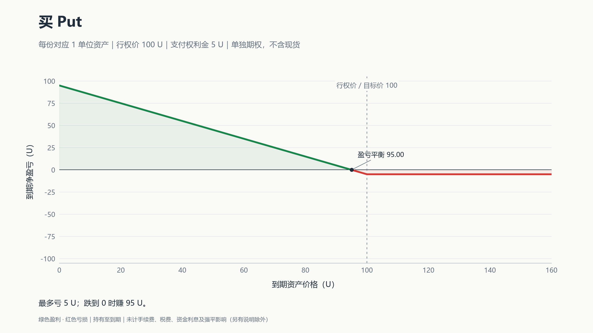

### 卖 Put：收钱，承担接货或赔付义务

同样到期跌到 80，履约差额为 20，减去先收到的 5，净亏 15；到期在 100 或以上，最多赚 5。标的跌到零时，本例最多亏 95。

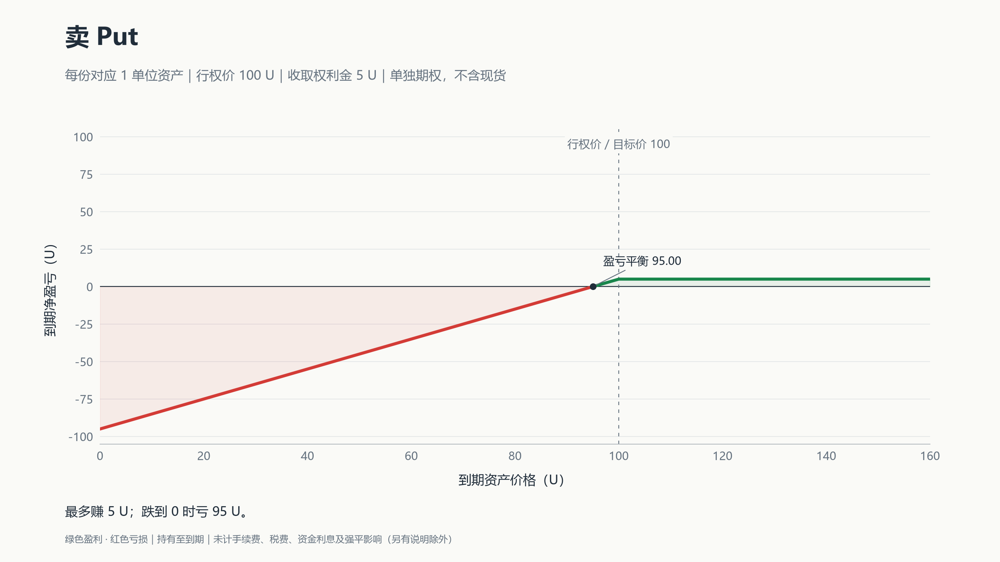

### 买 Call：花钱获得买入权利

到期涨到 103，权利值 3，但花了 5，仍亏 2；涨到 120，净赚 15。**超过行权价，不代表已经回本**；本例要涨过 105 才盈利。

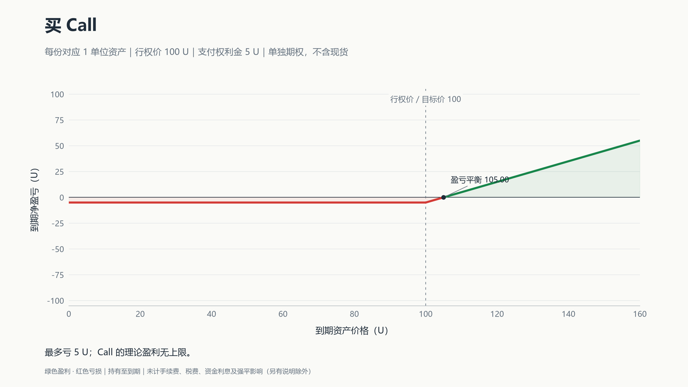

### 卖 Call：收钱，承担卖出或赔付义务

到期涨到 120，要支付 20 的差额，扣去收到的 5，净亏 15。裸卖 Call 的理论亏损没有上限；若同时持有现货，还要加上现货的盈亏。

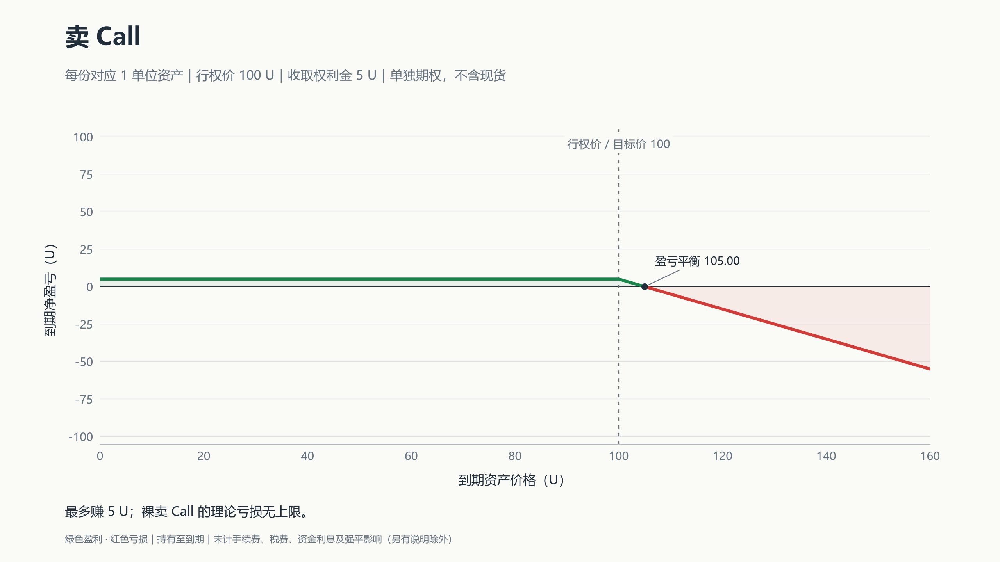

计算到期盈亏时，先算权利值：Call 看高于行权价多少，Put 看低于行权价多少，没有则为零。**买方＝权利值−权利金；卖方＝权利金−权利值。**

## 看懂盘口、IV 和 Delta

交易界面通常是一张“期权链”：选定到期日后，每一行对应一个行权价，左右分别是 Call 和 Put。

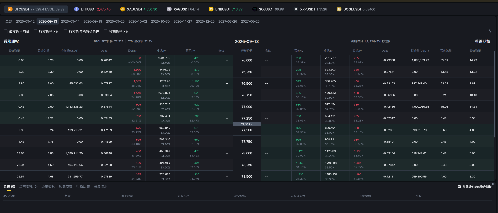

*图中为历史报价，用于读懂界面；点击图片可放大查看。*

| 项目 | 读法 |
| --- | --- |
| 标的、到期日、行权价、Call／Put | 一起确定你交易的是哪份合约 |
| 买价 Bid／卖价 Ask | 别人愿意买／卖的价格；主动买看 Ask，主动卖看 Bid |
| 报价数量 | 该报价附近的可成交数量；大单可能成交在更差的价格 |
| 标记价格 Mark | 平台用于估值和风控的参考价，不保证能以此成交 |
| 买价 IV／卖价 IV／标记 IV | 分别由买价、卖价、标记价格反推的波动率 |
| Delta | 标的小幅变动时，期权价格大约变多少 |
| 持仓量／仓位 | 前者是市场数据，后者是自己的持仓；注意显示单位 |

例如截图中行权价 **77,500** 的 Call：买价约 **670**，卖价约 **675**。若以 675 买入，立即以 670 卖回，即使 BTC 没动，也损失 5 个报价单位，另加费用。总金额还要乘上数量与合约乘数。

盘口显示 0 或没有有效报价，通常表示这一侧缺少可成交挂单；不代表期权免费。标记价也不能代替实际成交价。

### IV：从期权价格倒推的波动率

IV 是隐含波动率。定价模型假设一个波动率，算出期权价格；不断调整这个假设，直到价格与市场报价匹配，就得到 IV。[OIC 说明](https://www.optionseducation.org/referencelibrary/faq/technical-information)

**历史波动率看过去怎么涨跌，IV 看现在的期权报价包含了多少波动预期。**其他条件相同，普通期权报价越高，反推的 IV 通常越高。

标记 IV 就是用标记价格反推的结果。屏幕上的 40% 通常是年化口径，不表示未来一定涨 40%，也不区分涨跌方向。

### Delta：金额变化，不是收益率

假设 Call 的 Delta 是 **0.47**。其他条件不变，标的小幅上涨 1 U，期权价格大约上涨 0.47 U；买方受益，卖方相反。Put 的 Delta 若为 **−0.6**，标的上涨 1 U，期权价格则大约减少 0.6 U。[OIC 说明](https://www.optionseducation.org/advancedconcepts/delta)

普通线性期权按每单位标的计算：

| 持仓 | Delta 通常范围 |
| --- | --- |
| 买 Call | 0 到 +1 |
| 卖 Call | −1 到 0 |
| 买 Put | −1 到 0 |
| 卖 Put | 0 到 +1 |

**Delta 会变。**同一份合约中，标的上涨，Call 买方的 Delta 通常更靠近 +1，Put 买方的 Delta 更靠近 0；下跌则相反。越接近到期，明显价内的 Call／Put 分别趋近 +1／−1，明显价外的趋近 0；平值附近变化最快。[CME 说明](https://www.cmegroup.com/education/courses/option-greeks/options-delta-the-greeks)

“价内”指 Call 的现价高于行权价，或 Put 的现价低于行权价；两者接近是平值，相反是价外。价内只说明有行权价值，不代表扣除权利金后赚钱。

两个容易混淆的地方：

- **期权链里纵向变化的是行权价。**同一时刻，Put 行权价越高，通常越价内，买方 Delta 越靠近 −1，绝对值越大。
- **总持仓 Delta 可以大于 1。**每份对应 1 单位资产，三份 Delta 为 0.6 的 Call，总 Delta 就是约 1.8。币本位计价或特殊合约要另看平台口径。

因此，不能拿固定 Delta 推算整段大行情，也不能把 Delta 0.5 理解成“期权涨了 50%”。

## 从开仓到到期：需要手动做什么？

开仓前确认：**合约、每张对应数量、权利金与结算币种、费用、卖方保证金。**美股标准期权常见一张 100 股，不能把这个倍数套给所有合约。

| 持仓 | 开仓时 | 提前结束 |
| --- | --- | --- |
| 买方 | 支付权利金 | 卖出同一合约平仓 |
| 卖方 | 收权利金，满足保证金要求 | 买回同一合约平仓 |

卖掉已有的期权多头是平仓，与新建卖方仓位不同。欧式期权一般只能到期行权，但仍可在有对手盘时提前交易平仓；美式期权可能提前行权，卖方也可能提前被指派。

### 现金结算：通常到期自动处理

例如 Deribit 的期权到期自动处理，无需手动点行权。其 USDC 期权会先生成对应期货，再立即以 USDC 结算，最终经济效果是支付差额，账户不会因此自动获得 BTC 现货。[合约规则](https://support.deribit.com/hc/en-us/articles/31424932728093-Linear-USDC-Options)

假设你卖出对应 **1 ETH、行权价 2,800 U** 的现金结算 Put，开仓收取 **100 U**，忽略费用：

| 到期结算价 | 到期处理 | 卖方整笔净盈亏 |
| --- | --- | --- |
| 3,000 U | 期权失效，无差额赔付 | +100 U |
| 2,750 U | 向买方支付 50 U | +50 U |
| 2,500 U | 向买方支付 300 U | −200 U |

**到期收到或支付的钱，不等于整笔交易的净利润。**权利金已经在开仓时收付，到期不会再扣一遍。

### 实物交割：可能真的买入或交出股票

卖 Put 被指派，要按行权价付款接股；卖 Call 被指派，要按行权价交股并收款。很多券商有到期自动行权安排，具体门槛、资金与股票要求按券商规则执行。[OIC 行权说明](https://www.optionseducation.org/referencelibrary/faq/options-assignment)

不想接受到期结果，就在到期前主动平仓。前面四张收益图画的是“持有到期”，不能直接用来读取今天的平仓价格。

## 卖方保证金：估值加上一层风险缓冲

卖出对应 1 BTC 的 Call，不一定要先押入 1 BTC。交易所允许以部分保证金开仓，但**保证金门槛不代表最大亏损**。

| 金额 | 作用 |
| --- | --- |
| 权利金 | 卖期权收到的钱 |
| 初始保证金 IM | 开仓或增加仓位的资金要求 |
| 维持保证金 MM | 继续持仓的最低资金要求，随市场重新计算 |

以币安普通卖方模式、合约单位为 1 BTC 的期权为例：

**IM＝［V＋max（10% × S，15% × S − D）］× Q**

**MM＝［V＋max（5% × S，7.5% × S − D）］× Q**

S 是 BTC 指数价格，V 是每 1 BTC 对应的期权当前标记价格，Q 是对应 BTC 数量。D 是虚值金额：Call 取 max（行权价−S，0）；Put 取 max（S−行权价，0）。max 表示取较大值。[币安公式](https://www.binance.com/en/support/faq/detail/1ceb77f837344e3085ecf98d9a6a8097)

自然语言就是：**计入期权当前估值，再加与币价、虚值程度有关的缓冲，并设最低要求。**

假设 BTC 为 100,000 USDT，Call 行权价 110,000，标记价 2,000，卖出数量对应 1 BTC，则 D＝10,000：

- IM＝2,000＋max（10,000，15,000−10,000）＝**12,000 USDT**。
- MM＝2,000＋max（5,000，7,500−10,000）＝**7,000 USDT**。

币价向不利方向变化，或 IV 上升推高期权标记价，都可能增加资金压力。实际需追加多少，还取决于账户余额、其他仓位和费用；不足以维持仓位时可能被强平。

[Deribit](https://support.deribit.com/hc/en-us/articles/31424939096093-Inverse-Options) 与 [OKX](https://www.okx.com/help/ii-option-margin) 的系数、计价币种和账户抵扣规则不同，不能直接套用上述币安公式。

## 例子一：双币赢

双币赢，也叫双币投资，可以理解为把期权卖方的收益结构包装成产品：

| 方向 | 投入资产 | 到期结果 | 对应结构 |
| --- | --- | --- | --- |
| 低买 | 稳定币 | 判定价≤目标价，按目标价换币；否则留在稳定币 | 现金担保卖 Put |
| 高卖 | 币 | 判定价≥目标价，按目标价换成稳定币；否则继续持币 | 持币卖备兑 Call |

本金及收益如何换币，按产品规则结算；判断依据是到期判定价，并非期间触及目标价。[币安规则](https://www.binance.com/en/support/faq/detail/09911be9f5754c34806bd3ab4a427e0e)

这类结构可以手动用期权组合。使用现金结算期权时，实际换币还要另做现货交易，并匹配数量、费用与奖励口径。**低买承担接货后的下跌，高卖让出目标价以上的上涨空间。**

下面用对应的期权组合画出到期盈亏，均以 U 计价、计入权利金。图中权利金单独计算；具体双币赢产品若把收益与本金一起换币，金额需按其规则重算。

### 低买：现金担保卖 Put

预留 **100 U**，卖出对应 1 单位币、行权价 **100 U** 的 Put，收 **5 U**。到期在 100 U 以上，最多赚 5 U；跌到 80 U，按 100 U 接货，抵掉权利金后亏 15 U。**盈亏平衡点为 95 U。**

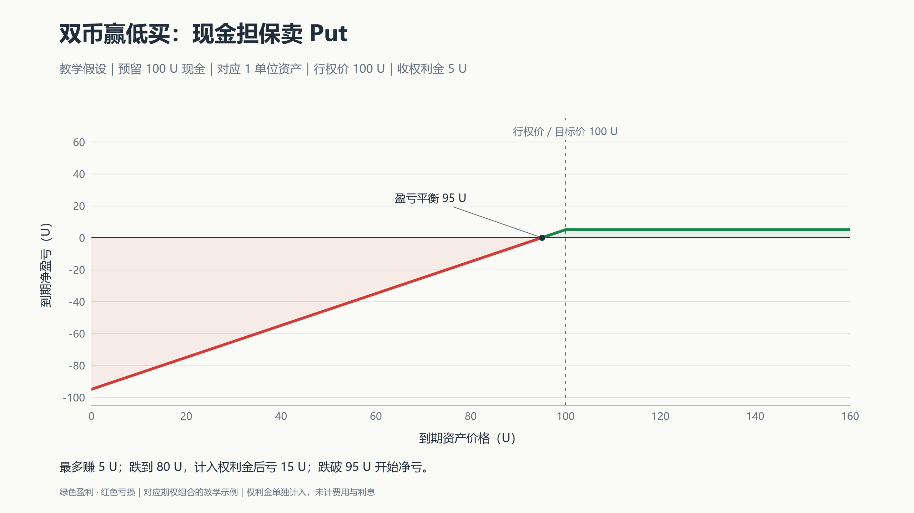

*低买的期权组合示意：[现金担保卖 Put](https://www.optionseducation.org/strategies/all-strategies/cash-secured-put)。*

### 高卖：持币＋卖 Call

持有成本 **100 U** 的 1 单位币，卖出行权价 **110 U** 的 Call，收 **5 U**。到期涨到 110 U 或以上，组合最多赚 **15 U＝10 U 涨幅＋5 U 权利金**；跌到 80 U，组合仍亏 15 U。**盈亏平衡点为 95 U。**

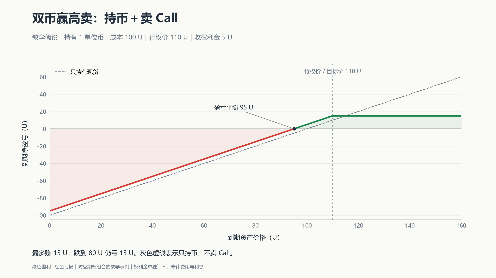

*高卖图包含持币与期权的合计盈亏；灰色虚线为只持币的结果。[备兑 Call](https://www.optionseducation.org/strategies/all-strategies/covered-call-buy-write)。*

## 例子二：末日期权

末日期权，也叫 0DTE，是当天到期的普通 Put 或 Call。有人用它交易当天涨跌或做短时对冲，也有人卖出收取权利金。[Cboe 说明](https://www.cboe.com/tradable-products/0dte)

临近到期且价格靠近行权价时，Delta 可能迅速变化。买方可能很快亏掉全部权利金；卖方收到的钱少，也不代表风险小。

## 例子三：段永平的苹果与泡泡玛特操作

### 苹果：先收权利金，接受按约定价格接货

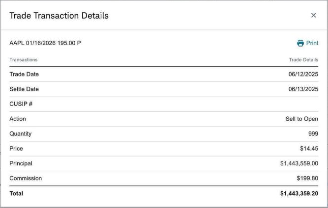

*来源：[2025 年 6 月 15 日本人原帖](https://xueqiu.com/1247347556/338780522)。图中成交日为 6 月 12 日。*

| 日期 | 操作或结果 | 标的价格 | 关键参数 |
| --- | --- | --- | --- |
| 2025-06-12 | 卖出 999 张苹果 Put | 当日未复权收盘 **199.20 美元**；成交瞬间股价未披露 | 行权价 195；2026-01-16 到期；每张 100 股，显示权利金 14.45 美元／股 |
| 2026-01-16 | 到期收盘高于行权价 | 收盘 **255.53 美元** | 若原仓位正常持有到期，Put 失效；按成交单扣开仓佣金的收款，保留约 **144.34 万美元** |

如果被指派，他要按 195 美元买股，扣除约 14.45 美元权利金后，净成本约 **180.55 美元**；没有被指派，就留下权利金。

这里的到期收益是“原仓位持有至正常到期”的测算，未取得他的最终账户结算单。原帖所说约 18% 年化，还计入现金利息，分母采用扣除权利金后的净投入，不能直接当作这笔 Put 已实现的年收益率。

### 泡泡玛特：卖 Put、换股，以及持股卖 Call

| 日期 | 操作或记录 | 标的价格 | 参数或结果 |
| --- | --- | --- | --- |
| 2026-04-09 | 公开表示开始卖 Put，准备建仓 | 披露日收盘 **152.70 港元**；实际开仓价未确认 | 宣布泡泡玛特的“保险公司”开张 |
| 2026-04-14 | 披露卖 Put 数量已满 | 逐笔开仓日及股价未披露 | **225,000 张×200 股＝4,500 万股**对应数量，尚不等于已持有这些股票 |
| 2026-04-29 | 四月 Put 到期 | 收盘 **156.80 港元** | 高于报道所述的 150 港元行权价，该部分正常到期失效，保留权利金 |
| 2026-05-07 | 披露把中国神华换成泡泡玛特 | 换股成交价未披露 | 确认通过买股建立持仓 |
| 2026-07-30 | 港交所记录权益变动 | — | 申报好仓由 7.65% 降至 5.55%；这是权益变动日 |
| 2026-08-05 | 回应后续 Put 到期 | 该批开仓价未披露 | 与四月到期批次分开；具体合约参数未完整公开 |
| 2026-08-05 | 确认部分股票被 Call 走 | 相关持股成本未完整公开 | 由此前卖出的 Call 导致交股，与 Put 到期是两件事 |
| 2026-08-06 | 回顾买股时同步卖 Call | **161 港元**，为本人所述买股价 | 举例卖出一个月、行权价 **162.5 港元**的 Call；实际成交日未公开 |
| 2026-09-01 | 港交所记录新增衍生工具购股义务 | 未确认 | 持股和期权交易仍在延续 |

表中“披露日”与“成交日”分别标注；收盘价不等于下单瞬间价格。150 港元行权价只对应报道所述合约，不能套到全部 225,000 张。

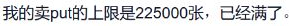

*数量依据：[4 月 14 日本人原帖](https://xueqiu.com/1247347556/383788351)。次日他在讨论中进一步说明，每张对应 200 股。*

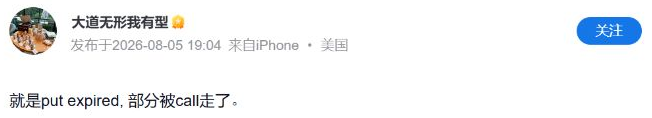

*到期回应：[8 月 5 日本人原帖](https://xueqiu.com/1247347556/403826416)。*

公开记录能确认四月部分 Put 的到期结果，以及后续部分股票交付。**不能据此认定 225,000 张全部被指派接货，也无法算出整组投资的最终总盈亏**；还缺各批权利金、股票成本与后续交易记录。

## 六个追问：为什么不直接买股票？

### 1. 涨了只赚权利金，跌了还可能亏，为什么卖 Put 算建仓？

**它是在安排一个可能发生的买入。**拿苹果这笔交易说，被指派就按 195 美元买股，扣权利金后的净成本约 180.55；未被指派，就只留下权利金。代价是可能没买到，也可能接货后继续跌。[策略说明](https://www.optionseducation.org/strategies/all-strategies/cash-secured-put)

真正接到股票以后，后续上涨仍属于持有人，除非又卖了 Call 限制上涨。“最多赚权利金”说的是那笔 Put，不是此后持股的全部收益。

他原本也已有苹果持仓：H&H 的 2025 年一季度申报早于这笔卖 Put。旧持仓参与上涨，新 Put 安排潜在加仓，两者可以同时存在。[SEC 持仓表](https://www.sec.gov/Archives/edgar/data/1759760/000108514625003301/xslForm13F_X02/infotable.xml)

### 2. 那为什么不直接买股？他本人怎么解释？

直接买股能立即参与全部涨跌；卖 Put 则接受“没买到，只收权利金”的结果。合约做多也能提供上涨敞口，但不等于拥有股票，也不是同一收益结构。

**泡泡玛特这一次，他说自己大部分资金已经投在其他资产中，需要时间决定用哪些持仓来换。**4 月 14 日，他解释先卖 Put，同时考虑换仓；次日又补充了下面这句。[4 月 14 日直接回复](https://xueqiu.com/1952147825/383767713/402751466)

*来源：[4 月 15 日讨论页内 12:15 的本人回复](https://xueqiu.com/1043075279/383954978/402889082)。*

这解释了他的资金安排，但卖 Put 仍要满足保证金和接货付款要求。公开资料没有披露其完整担保方式。

他也不认为卖 Put 总比买股好。2023 年的回复提到，喜欢的公司价格不高不低、手里有闲钱时可以考虑；特别便宜时只卖 Put，可能错过持股的大机会。[2023 年本人回复](https://xueqiu.com/1247347556/244724347/277734128)

### 3. 161 买股，再卖 162.5 的 Call，涨多了不就亏了吗？

**要把股票和 Call 一起算。**假设每股买入价 161，卖 162.5 Call 收 **5 港元**。5 港元是教学假设，不是他的已核实成交价；以下为到期每股盈亏，不计费用。

| 到期股价 | 股票盈亏 | 卖 Call 盈亏 | 合计 |
| --- | --- | --- | --- |
| 150 | −11 | +5 | **−6** |
| 161 | 0 | +5 | **+5** |
| 170 | +9 | −2.5 | **+6.5** |
| 200 | +39 | −32.5 | **+6.5** |

到期股价达到 162.5 后，组合收益封顶于 6.5；跌破 **156＝161−5** 才开始净亏损。涨到 200 时，他比单独持股少赚，但组合本身仍盈利。[备兑 Call 说明](https://www.optionseducation.org/strategies/all-strategies/covered-call-buy-write)

### 4. 为什么“买股＋卖 Call”能替代卖 Put？

段永平在 8 月 6 日说，卖 Put 存在数量约束，所以有时改为买股时同时卖备兑 Call，并举出 161／162.5 的操作。

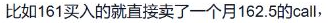

*来源：[8 月 6 日本人原帖](https://xueqiu.com/1247347556/403863283)。该帖是回顾说明，不是已确认的成交日。*

用同一标的、同一到期日、同一行权价 162.5 比较：假设 Call 权利金 5、Put 权利金 6.5，股票现价 161，忽略利息、分红、费用及提前行权。

| 路径 | 净成本 | 到期 150 | 到期 170 |
| --- | --- | --- | --- |
| 备好现金，卖 Put | 162.5−6.5＝156 | 接到股票，亏 6 | Put 失效，赚 6.5 |
| 买股票，卖备兑 Call | 161−5＝156 | 股票留下，亏 6 | 按 162.5 交股，赚 6.5 |

**两条路径都接受：低于行权价留下股票，高于行权价留下现金。**这组假设满足简化的期权平价关系；实际报价、保证金要求与提前行权风险未必相同。[平价关系说明](https://www.optionseducation.org/advancedconcepts/put-call-parity)

### 5. 这是否说明他觉得 161 是底、162.5 是顶？

这些价格说明他接受怎样的买卖条件，不能直接证明他在预测短期顶底。

2026 年 3 月，网友把他的英伟达期权操作解释成短期区间判断，他明确说“我其实完全没有对短期的预期”，并强调长期价值。

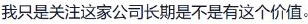

*来源：[3 月 23 日本人原帖](https://xueqiu.com/1247347556/380588002)。这条回复说明一般思路；泡泡玛特的具体原因仍看对应回复。*

接受少赚一部分上涨，与判断它不会涨，是不同的取舍。

### 6. 四月 Put 到期，七月底的权益变化又是什么？

四月已到期的是当时那批 Put；7 月 30 日是港交所记录的权益变动日。8 月 5 日，他说明其中既有后续 Put 到期，也有此前卖出的 Call 导致部分股票交付。

**Put 对应可能接货，Call 对应可能交股。**申报好仓还包含衍生权益，比例下降不能全部换算成卖出了等量现货。后续合约的参数没有完整公开，不能把几个月的交易并成同一笔。

## 原文与数据来源

产品规则和行情资料沿用截至 **2026 年 9 月 20 日**的核查；本次重新查看了所配截图的原帖。截图均为原页面或公开成交单的局部，未改写图中文字。教学价格与已披露交易分别标注。

### 段永平本人回复

| 日期 | 内容 | 原文 |
| --- | --- | --- |
| 2023-03-18 | 卖 Put 的常见情境；特别便宜时可能错过机会 | [回复](https://xueqiu.com/1247347556/244724347/277734128) |
| 2026-03-23 | 英伟达讨论：澄清短期价格预测 | [原帖](https://xueqiu.com/1247347556/380588002) |
| 2026-04-14 | 泡泡玛特：资金已有安排，先考虑换仓 | [直接回复](https://xueqiu.com/1952147825/383767713/402751466) |
| 2026-04-15 | 12:15 解释换股时间；11:38 说明合约数量、乘数与到期日 | [讨论页](https://xueqiu.com/1043075279/383954978/402889082) |
| 2026-08-05 | Put 到期与股票被 Call 走；20:06 有补充 | [原帖](https://xueqiu.com/1247347556/403826416) |
| 2026-08-06 | 数量约束下的买股＋卖 Call；161／162.5 示例 | [原帖](https://xueqiu.com/1247347556/403863283) |

### 交易记录与行情

- **苹果：**[本人原帖与成交图片](https://xueqiu.com/1247347556/338780522)、[开仓日未复权行情](https://chartexchange.com/symbol/nasdaq-aapl/historical/)、[开仓行情交叉核对](https://www.trading212.com/trading-instruments/isa/AAPL.US)、[到期历史行情](https://finance.yahoo.com/quote/AAPL/history/)、[到期行情交叉核对](https://www.financecharts.com/stocks/AAPL/summary/price)。[H&H 申报主体与期间](https://www.sec.gov/Archives/edgar/data/1759760/000108514625003301/0001085146-25-003301-index.html)对应公开机构组合，不代表他的全部个人账户。
- **泡泡玛特四月：**[操作与到期报道](https://www.36kr.com/p/3787628678257920)、[本人披露 225,000 张](https://xueqiu.com/1247347556/383788351)、[港交所每张 200 股规格](https://www.hkex.com.hk/News/News-Release/2025/250930news?sc_lang=en)、[4 月 9 日收盘参考](https://www.hstong.com/news/detail/26040916112691898)、[4 月 29 日到期收盘](https://hk.stockstar.com/RB2026042900066895.shtml)。
- **泡泡玛特后续：**[5 月换股披露](https://stock.caijing.com.cn/20260507/5158158.shtml)、[港交所 7 月 30 日权益事件](https://di.hkex.com.hk/di/NSForm1.aspx?cid=0&ed=07/08/2026&fn=IS20260805E00004&g_lang=zh-HK&lang=ZH&sa2=an&sced=07/08/2026&scsd=07/08/2025&sd=07/08/2025&sid=312028&src=MAIN)、[9 月 1 日权益事件](https://di.hkex.com.hk/di/NSForm1.aspx?ed=07/09/2026&fn=IS20260905E00004&lang=EN&sa1=cl&sa2=ns&sc=09992&sced=07/09/2026&scsd=07/09/2025&sd=07/09/2025&sid=312028&src=Main&tk=ds)。

合约、保证金、IV、Delta 与双币投资的官方资料已在对应段落链接。部分雪球回复需展开评论或登录，正文已保留理解案例所需的关键信息。
