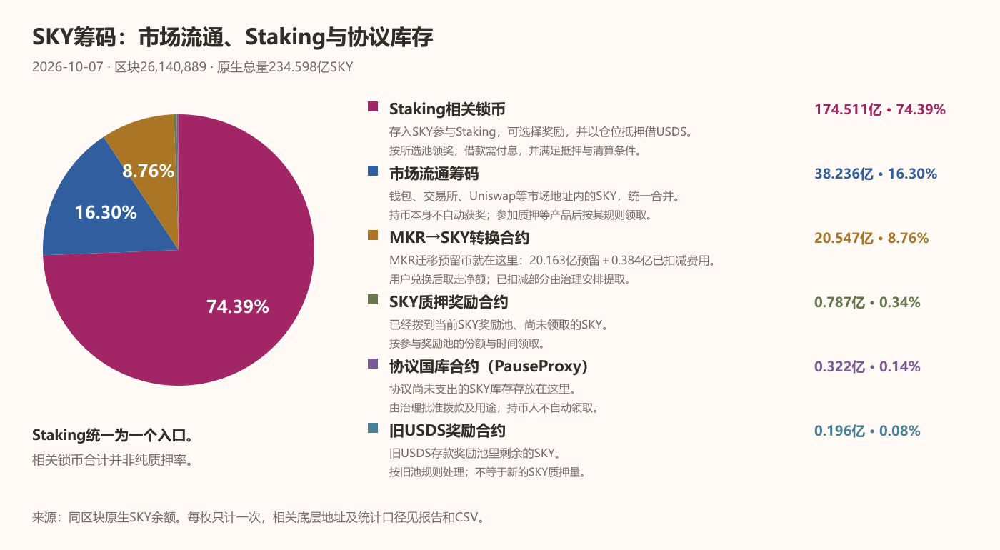
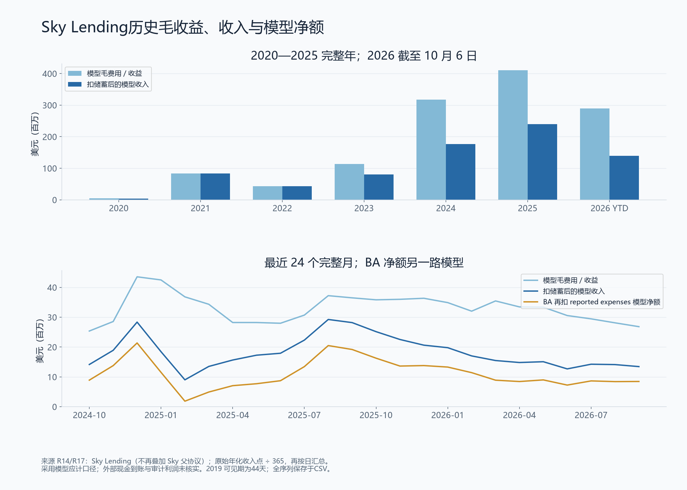

# MKR → SKY：代币经济学与协议资金流

**SKY持有人的收益来自协议把经营盈余用于质押奖励、买币和销毁；亏损严重时，持币人也可能承担增发稀释。**这套模型从MKR延续而来。报告沿着“代币怎样分出去 → 协议怎样赚钱 → 钱怎样回到代币”展开。

## 一、历史背景与代币经济学

### MKR的发行与早期分配

MKR早期总量为**100万枚**。官方披露的2017年余额分布如下：

**早期MKR通过贡献者分配和定向销售进入市场。**创始人Rune在2019年访谈中解释：最早把币分给为项目做科学、工程等工作的贡献者，也直接卖给积极参与项目的早期社区成员；后来转向向专业机构出售。项目没有通过面向大众的一次性公开ICO分发这批代币。[创始人访谈](https://medium.com/epicenterpodcast/ep-298-rune-christensen-makerdao-the-central-bank-of-web-3-0-f436698fdaf1)

| 2017年11月5日官方披露 | MKR数量 | 占当时100万MKR总量 | 用途 |
| --- | ---: | ---: | --- |
| 市场流通 | 53万 | 53% | 已在持有人手中的余额，包含早期分配与销售后的流通筹码 |
| 开发基金剩余 | 47万 | 47% | 支持项目开发的基金库存 |

**53万是当时累计进入市场的余额。**其中贡献者获配、社区购买及后续转手各占多少，完整账目尚未核实；不能把53万全部当作一次融资卖出的数量。当年的开发基金余额也不能代表今天团队持仓。[Maker官方余额披露](https://medium.com/@MakerDAO/what-is-mkr-e6915d5ca1b3)

机构融资与早期价值捕获沿革

后续机构融资：

| 交易日期 | 买方 | 公布的购买份额与金额 |
| --- | --- | --- |
| 2018年9月24日 | a16z | 当时MKR供应的6%，1,500万美元 |
| 2019年12月19日 | Dragonfly与Paradigm | 当时MKR供应约5.5%，2,750万美元 |

这些记录说明谁曾买入及项目如何融资。它们属于不同日期，不能和2017年开发基金余额相加，也没有证明机构今天仍持有同样比例。[2018年购买公告](https://medium.com/@MakerDAO/a16z-crypto-purchases-6-of-mkr-backing-stablecoin-vanguard-makerdao-ff410a692393)、[2019年基金会公告](https://www.prnewswire.com/news-releases/maker-foundation-announces-27-5-million-mkr-sale-to-dragonfly-capital-partners-and-paradigm-300977381.html)

**MKR模型把经营盈余和资本损失都传给代币。**协议赚钱后可以回购销毁，减少代币数量；抵押品处置仍不足以覆盖坏账时，可以增发MKR、卖出筹资补洞，原持有人因此被稀释。2020年实际运行过坏账拍卖。[早期MKR模型](https://medium.com/@MakerDAO/what-is-mkr-e6915d5ca1b3)、[债务拍卖运行记录](https://forum.skyeco.com/t/blocked-flops-debt-auctions-everything-you-need-to-know/1748)

| 阶段 | 收入如何作用于代币 |
| --- | --- |
| 2017年单抵押DAI | 借款费用用MKR支付并进入回收地址，形成MKR需求 |
| 2019年多抵押DAI后 | 费用以DAI结算；先承担储蓄成本、坏账与缓冲，再用可用盈余买MKR并销毁 |
| 2022—2023年 | 一度暂停旧销毁安排、优先留存资本；2023年改为买MKR并配置协议流动性，买入的币进入LP |
| 2024年Sky升级后 | 盈余买币目标转向SKY，随后增加质押奖励；今天按财库规则分别安排奖励和销毁 |

早期100万枚会随销毁和增发变化。用100万乘24,000得到的240亿SKY只是初始数量换算，今天的供应还要结合后续经营销毁、供应调整及迁移库存。

### MKR迁移到SKY

<time>MKR阶段</time><strong>持有MKR，治理Maker</strong>负责风险参数；盈余回购销毁，坏账可能增发。

<time>2024年9月</time><strong>推出SKY，基础比例1∶24,000</strong>最初支持MKR与SKY双向兑换。1枚MKR换成24,000枚SKY，数量单位改变。

<time>2025年5月</time><strong>治理和新质押转用SKY</strong>官方转换器改为MKR→SKY单向，代币交付改用预铸库存。

<time>2025年9月起</time><strong>及时迁移无扣减，延迟迁移逐步扣减</strong>扣减启动前按1∶24,000兑换；启动后从1%开始，随后由治理分阶段提高。

**兑换把原MKR持有人的代币份额接到SKY上。**借贷与资产配置业务沿同一协议延续，收入怎样回到代币的规则则经历了调整。兑换后的24,000倍数量不会让经济份额凭空增加24,000倍。[转换器与治理升级说明](https://developers.skyeco.com/guides/sky/token-governance-upgrade/codebase-change-analysis/)

**迁移扣减只影响在相应扣减生效后才兑换的MKR。**早已换成SKY的人，不会被追扣。

| 兑换所处阶段 | 每1枚MKR领取的SKY |
| --- | ---: |
| 2025年9月22日扣减启动前 | 24,000枚，无延迟扣减 |
| 启动后，初始扣减1% | 23,760枚 |
| 后续阶段 | 治理约每三个月提高1个百分点，适用兑换时的参数 |
| 2026年10月7日快照阶段，已提高至5% | 22,800枚；只适用于该阶段才兑换的人 |

扣减比例可以由治理修改。[官方迁移说明](https://upgrademkrtosky.skyeco.com/)、[2026年9月上调记录](https://vote.sky.money/executive/template-executive-vote-monthly-settlement-cycle-for-august-2026-treasury-management-function-parameter-updates-increase-mkr-sky-delayed-upgrade-penalty-adjust-allocator-vault-dc-iam-parameters-prime-agent-proxy-spells-september-10-2026)

**扣减的SKY先留在MKR→SKY转换合约里，由协议治理控制。**例如本应领取24,000枚、扣减1,200枚，用户拿走22,800枚，余下1,200枚留在转换器，治理以后可以批准提取到指定地址、安排用途。兑换本身不会自动把这部分币转入金库，也不会自动销毁或分给质押者。

10月7日快照中，转换器记录约**3,836.59万SKY待提取扣减余额**，属于转换器20.547亿SKY余额的一部分。这笔扣减和迁移预留仍放在同一个转换合约里，下图直接列出该合约的全部余额。[官方资金去向说明](https://upgrademkrtosky.skyeco.com/)、[转换器合约](https://github.com/sky-ecosystem/sky/blob/one-direction/src/MkrSky.sol)

<h3 id="holdings">当前筹码：市场流通、Staking与协议库存</h3>

**Staking统一展示一个入口：存入SKY，选择奖励，并可用同一仓位抵押借USDS。**借款需支付利息，并有清算风险。[官方产品说明](https://sky.money/blog/what-staking-sky-unlocks)

图中Staking相关锁币合并底层地址余额，尚未单独核出全部Staking仓位数量，74.39%不能直接当作纯质押率。市场流通项继续合并钱包、交易所和Uniswap等市场地址。

**MKR兑换预留放在转换合约里。**20.547亿SKY内含20.163亿迁移预留和3,836.59万已扣减、待提取的币；奖励及国库库存分别列在各自合约。

底层合约地址与统计口径

| 合并项目／具体合约 | SKY余额 | 底层地址 |
| --- | ---: | --- |
| Staking相关锁币 | 174.511亿 | [0xce01…a6a3](https://etherscan.io/address/0xce01c90de7fd1bcfa39e237fe6d8d9f569e8a6a3)、[0x929d…a6f9](https://etherscan.io/address/0x929d9a1435662357f54adcf64dcee4d6b867a6f9) |
| MKR→SKY转换合约 | 20.547亿 | [0xa1ea…3f9a](https://etherscan.io/address/0xa1ea1ba18e88c381c724a75f23a130420c403f9a) |
| SKY质押奖励合约 | 0.787亿 | [0xb44c…40fc](https://etherscan.io/address/0xb44c2fb4181d7cb06bdff34a46fdfe4a259b40fc) |
| 协议国库合约（PauseProxy） | 0.322亿 | [0xbe8e…98fb](https://etherscan.io/address/0xbe8e3e3618f7474f8cb1d074a26affef007e98fb) |
| 旧USDS奖励合约 | 0.196亿 | [0x0650…0275](https://etherscan.io/address/0x0650caf159c5a49f711e8169d4336ecb9b950275) |

合并项由两个原生SKY地址余额相加，每枚只计一次；该数额不代表全部已选择奖励池的仓位，不能推算每枚都领取奖励。市场流通是总供应扣除已列协议地址的差额，含未穿透归属的其他地址。转换器扣减余额留在原地址，lsSKY凭证不另加供应。数据仍为10月7日冻结余额。

下载当前筹码数据 · [原始逐合约底稿](23ae96a7-筹码分布_v14.csv)

### 后续分发与供应变化

- **迁移预留：**转换器扣除已记账的扣减后，剩余20.163亿SKY已在供应中。假设剩余MKR都按10月7日这一阶段的兑换参数迁移，可交付用户约19.155亿SKY，交付时间取决于用户迁移。
- **奖励分发：**快照现行流在9月13日至12月12日UTC安排1.432亿SKY，其中1.050亿尚未应计。资金从库存进入奖励池，再由用户领取。
- **10月8日替换计划：**9,952.5882万SKY／90天，截至10月7日尚未执行，采用替换旧流的安排。
- **销毁与增发：**执行销毁会减少供应；治理代理仍保有铸币权限，极端资本损失也存在增发补资本安排。当前总量并非不可更改的硬上限。

## 二、产品与参与入口

MakerDAO早期主要让用户抵押ETH等资产，开金库生成DAI。2024年8月随Endgame重组更名为Sky，9月推出USDS与SKY，业务逐步扩展到稳定币发行和资金配置。**今天Sky.money的主要入口是稳定币兑换、sUSDS储蓄和SKY Staking；超额抵押金库与清算机制仍由底层协议支持。**[USDS发行与兑换机制](https://sky.money/blog/what-is-usds)、[现有前端入口](https://sky.money/blog/the-new-sky-money-app)

这套分工让业务更容易扩展：Sky协议提供USDS资金和风险规则，Spark等独立Agent分别做抵押借贷、国债、信用等业务，并向Sky支付资金利息。用户抵押借稳定币也可通过Spark参与；协议收入如何支付储蓄收益、奖励SKY持有人及回购销毁，在下一章展开。[官方业务方向](https://sky.money/blog/stablecoins-are-entering-their-institutional-phase)、[Spark借款入口](https://docs.spark.finance/products/sparklend/guides/borrow-stablecoins)

| 产品／参与方 | 做什么 | 用户或资金方得到什么 |
| --- | --- | --- |
| DAI／USDS | 协议发行的美元稳定币；DAI可换成USDS | 用户借出或兑换得到稳定币，之后可交易、储蓄或参与奖励 |
| sUSDS储蓄 | 把USDS存入储蓄合约 | 资产价值按储蓄利率增长，收益由协议承担 |
| Spark及其他资金运营方 | 使用Sky批准的资金额度，配置借贷和投资资产 | 资产收益扣除对Sky的资金利息及自身成本后，按各自规则处理 |
| SKY Staking | 存入SKY，选择奖励；可用同一仓位抵押借USDS | 领取SKY或USDS奖励；借款支付利息，并有清算风险 |

**Staking相当于SKY持有人的参与账户。**存入SKY后，系统记录仓位，按所选奖励池累计奖励；奖励通常需要主动领取。lsSKY是仓位凭证，计算SKY供应时不再加一遍。[质押说明](https://sky.money/stake-sky)、[引擎说明](https://developers.skyeco.com/guides/sky/token-governance-upgrade/codebase-change-analysis/)

USDS还可参加生态代币奖励池，例如领取SPK。SPK是Spark自己的代币，这个入口与SKY质押、sUSDS储蓄分别选择和结算。[生态奖励](https://sky.money/sky-ecosystem-rewards)

## 三、资金流向与持币收益

<nav class="sky-v9-nav" aria-label="资金流向章节"><a href="#sky-funding">资金来源</a><a href="#sky-income">收入与成本</a><a href="#sky-distribution">盈余与持币收益</a><a href="#sky-governance">分配规则与治理</a><a href="#sky-loss">亏损承担</a><a href="#sky-valuation">PE与买币力度</a></nav>

<h3 id="sky-funding">3.1 资金来源与资产去向</h3>

**Sky可以发行稳定币并记录债权，也可以管理兑换储备和经营盈余。**用户抵押借出来的币归用户；给Spark等运营方的资金，则沿另一条治理授权的额度发放。

<figure class="sky-money-map" aria-label="稳定币发行、兑换储备、资金运营方与收入的关系">

<strong>用户抵押发行</strong>
<b>锁入ETH等抵押品 → 生成DAI／USDS交给用户</b>用户欠协议本金并付利息；还款后释放相应抵押品。

<strong>稳定币兑换</strong>
<b>用户交USDC → PSM模块交付USDS</b>真实USDC留作兑换储备；交付可使用预铸库存。反向兑换需要可用储备。

<strong>运营方信用额度</strong>
<b>治理批准额度 → 生成USDS、增加债务 → Spark／Grove等配置资产</b>提取额度时无须另押同额ETH；后续借贷债权、投资资产和风险资本支撑偿还。能否收回取决于这些资产。

<strong>运营方回款 → 对Sky还本付息</strong>本金归还：减少相应稳定币和债务 利息结算：进入Sky收入，扣成本后形成盈余<small>需要换出USDC投资时，受真实储备与流动性限制；发行额度和USDC余额分别管理。</small>

<figcaption>本金、储备、经营盈余分别记账机制核查：2026年10月9日</figcaption>
</figure>

例如Spark提取1亿USDS额度，系统同时增加1亿USDS供应和对应债务，**这1亿本金本身不算收入**。这条路径依赖运营方资产与资本缓冲，资产配置可能包含超额抵押借贷，也包含国债、信用资产等。[资金合约](https://github.com/sky-ecosystem/dss-allocator)、[生成与还款代码](https://github.com/sky-ecosystem/dss-allocator/blob/dev/src/AllocatorVault.sol)、[Spark资金配置](https://docs.spark.finance/products/spark-liquidity-layer)、[PSM储备模块](https://developers.skyeco.com/guides/psm/litepsm/)

| 接收额度的运营方 | 资金主要用途 | 偿还所依赖的资产 |
| --- | --- | --- |
| Spark | 借贷市场、稳定币流动性及金融资产 | 借款人债务、底层抵押品和所投资产 |
| Grove | 机构信用和代币化金融资产 | 国债、信用债权、AAA级CLO等资产回款 |
| Keel | Solana上的借贷、流动性和代币化资产 | 对应市场债权、池内资产和投资回款 |
| Obex | 向机构金融业务配置资金 | 合作机构的融资资产和还款能力 |

这些路径增加了信用、流动性和执行风险。公开计划额度与实际使用资金分别观察；各方的每一笔部署也不一定都来自新铸USDS。[Grove说明](https://docs.grove.finance/faqs)、[Keel资金控制合约](https://github.com/ElodinLTD/keel-evm-alm-controller)、[Obex额度结算治理记录](https://vote.sky.money/executive/template-executive-vote-onboard-allocator-grove-a-vault-update-litepsm-parameters-replace-stusds-mom-monthly-settlement-cycle-for-may-2026-staking-rewards-normalization-update-safe-harbor-agreement-prime-agent-proxy-spell-june-18-2026)

**Sky收取运营方的资金利息。**利息按实际使用资金、使用天数和治理利率逐日计算，基础利率与Sky储蓄利率加利差挂钩。每月把应付利息计入运营方对Sky的债务，Sky确认收入，运营方之后偿还；确认收入与现金到账会有时间差。

假设Spark使用1亿USDS，底层资产一年赚5%，向Sky承担3%的资金利息：500万美元资产收益中，300万美元属于Sky的利息收入，Spark余下200万美元继续承担其他成本。9月模型中Spark承担821.48万USDS资金成本，已包含在Sky整体结算内。[固定结算规则](https://github.com/soterlabs/settlement-cycle/blob/536f1492089ed82fbf6eaabb956f7a194b887d47/docs/RULES.md)

<h3 id="sky-income">3.2 协议收入与成本</h3>

**借款利息和资产收益进入协议，储蓄利息与运营支出从中扣除。**例如sUSDS储户获得的收益，就是Sky需要承担的资金成本；收到的利息不能全部分给SKY持有人。

<strong>借款利息＋资产配置收益</strong>扣：USDS储蓄利息扣：运营、安全、治理等费用<b>形成协议净收益，再按财库规则安排用途</b>

图中2020—2023年属于Maker／MKR阶段，2024—2025年经历Sky升级和代币治理迁移，2026年为Sky阶段。收入历史沿同一协议观察，买币对象和分配规则按各阶段解释。

| 财务期间 | 业务毛收益 | 扣储蓄成本后收入 | BA模型净利润 |
| --- | ---: | ---: | ---: |
| 2025全年 | 4.107亿美元 | 2.399亿美元 | 1.385亿美元 |
| 2026年1月1日至10月6日，279天 | 2.896亿美元 | 1.393亿美元 | 8,557.81万美元 |
| 近30日，9月7日至10月6日 | 2,694.27万美元 | 1,348.11万美元 | **867.63万美元** |

近30日毛收益约一半用于承担储蓄成本，模型净利润还扣了其他费用。近30日净利润比前30日增长约8.1%。以上采用公开收入数据与Block Analitica（BA）净额模型，属于应计估算；成本项目约2.45万美元尚未完全对齐，未取得审计利润。

<h3 id="sky-distribution">3.3 盈余分配与代币收益</h3>

**经营盈余有三类去向：保障系统、给参与者奖励、买币销毁。**财库管理规则（TMF）按9月运营结算净额1,463.59万USDS计算下一期预算，分支如下；截至10月7日快照均待执行。

<figure class="sky-v9-distribution" aria-label="同一运营净额分出的五个预算去向与持币收益">

9月运营结算净额 · 下一期预算基数<strong>1,463.59万USDS</strong><small>20%＋40%＋18%＋18%＋4%＝100% · 待执行</small>

<section class="sky-v9-branch"><h4>系统保障与留存 · 60%</h4>
<b>20% 安全维护</b><strong>292.72万USDS</strong>

<b>40% 储备留存</b><strong>585.44万USDS</strong>

承担安全、后续支出及资本缓冲
</section>
<section class="sky-v9-branch sky-v9-rewards"><h4>参与者奖励 · 36%</h4>
<b>18% USDS奖励</b><strong>263.45万USDS</strong>

<b>18% 买SKY发奖励</b><strong>263.45万USDS</strong>

按奖励池规则分给质押参与者 买来发放的SKY仍在供应中
</section>
<section class="sky-v9-branch sky-v9-burn"><h4>买币销毁 · 4%</h4>
<b>4% 买SKY并销毁</b><strong>58.54万USDS</strong>

永久减少供应 持有人受供给变化影响，钱包不因此收到现金
</section>

<figcaption>五项比例使用同一总额；运营结算净额与下文PE采用的BA净利润口径不同。<a href="https://forum.skyeco.com/t/treasury-management-function-tmf-configurations/28153/8">TMF配置</a></figcaption>
</figure>

| 持有／参与方式 | 收益怎样传到你手上 |
| --- | --- |
| 普通钱包持有SKY | 回购产生市场需求，销毁减少供应；钱包没有自动领取全部利润的权利 |
| 质押SKY并参加奖励池 | 按池规则累计、领取所选SKY或USDS奖励；奖励率和预算会变 |
| 持有sUSDS | 获得储蓄收益，属于协议的资金成本；与SKY持币收益分开 |

**买币发奖励和买币销毁都有市场买入动作，供应结果不同。**奖励币可以被领取和卖出，销毁币退出供应。参与者最终收到多少，取决于拨款、池内质押量和领取情况。

| 已发生的资金与代币动作| 结果 |
| --- | --- |
| 9月花279.18万USDS买SKY | 买到4,054.76万SKY，其中3,317.53万用于奖励，737.23万计划10月8日销毁；截至快照尚未执行 |
| 9月向USDS奖励池投入228.42万USDS | 为池内参与者提供奖励，入金与用户领取有时间差 |
| 9月13日已销毁286.09万SKY | 对应8月另一批买入，已经减少供应 |

9月运营结算净额尚有后续安全、治理与资本支出，不能直接当作可分给持币人的净利润。上面的下一期预算与9月实际发生额分别列示。

<h3 id="sky-governance">3.4 分配规则与当前治理</h3>

**治理合约托管的是参与者的SKY；参与者可以自己投票，也可以把票权交给投票代表。**Chief合约汇总支持，获通过的执行方案经治理延时后生效。谁拥有币、谁代为投票，分别观察。

| 可识别的治理参与者 | 在治理中的角色 | 对币的权利 |
| --- | --- | --- |
| [Tango](https://vote.sky.money/address/0x550e5ec00b9d26a3517ce772ddfe73e8ed1672ad)、[cloaky](https://vote.sky.money/address/0x0f23de72e1581857eacd6308aebb69cf3a49cc86)、[BLUE](https://vote.sky.money/address/0x173a1c04b79ed9266721c1154daa29addc0b9558)、[Bonapublica](https://vote.sky.money/address/0xfc48fbca739079aab08216c4d5e506b96593753d)等公开代表 | 持币人把票权委托给他们，由他们选择支持的方案 | 受托票权不等于代表自有持币量；代表不能任意取走委托人的币 |
| 委托人及质押仓位持有人 | 提供底层SKY，选择或更换投票代表 | 保留仓位权益，按合约规则解除委托／取回资产；借款仓位另受抵押约束 |
| 直接投票地址及未实名代表 | 自己投票，或通过非公开身份的代表投票 | 链上能识别地址，现实持有人身份可能未知 |

以上名字来自官方治理名录，身份核查于10月9日；本轮没有取得同一冻结区块的完整代表份额和最终持有人清单，无法把71.565亿SKY全部分配到具体个人或机构。报告余额继续采用10月7日快照。[官方代表名录](https://vote.sky.money/delegates)、[委托与提款权限](https://github.com/sky-ecosystem/vote-delegate/blob/v3/src/VoteDelegate.sol)

| 目前治理控制的事项 | 对业务和持币人的影响 |
| --- | --- |
| USDS储蓄利率、借款利率与资金使用条件 | 决定融资成本、利差及需求 |
| 抵押率、债务上限、风险参数与资产配置 | 决定可放出多少资金及承担什么风险 |
| 财库预算、奖励池拨款、回购与销毁配置 | 决定利润留多少、参与者分多少、减少多少供应 |
| 协议升级、执行权限与生态支出 | 决定业务和治理结构如何变化 |

当前治理和质押已使用SKY。代表负责汇集票权和持续投票，Sky.money提供参与界面，合约参数由治理控制。[治理升级说明](https://developers.skyeco.com/guides/sky/token-governance-upgrade/protocol-participants/)、[治理执行模块](https://developers.skyeco.com/protocol/governance/)

**治理权按代币权重分配，大仓位拥有更大影响力。**筹码图只显示合约里的币，不能给出实际控制票权的主体排名。公开代表可识别，但该区块完整票权份额及最终受益人尚未完整核实，不能据74.39%的合约托管比例认定治理已充分分散。快照中治理代理仍有SKY铸币权限，预算和供应都受治理影响。

财库比例、奖励额度、资产授权和铸币权限都能经治理调整。历史上从MKR盈余销毁转向协议流动性、再转向SKY奖励与销毁，说明持有人应把当前分配规则一并纳入估值。

<h3 id="sky-loss">3.5 坏账承担与增发稀释</h3>

**资产亏损要先消耗风险资本，超过系统缓冲后才会传到SKY和USDS。**2026年公布的安全框架给出以下顺序：[Spark安全框架](https://paragraph.com/@spark-11/spark-security-framework)

<figure class="sky-v9-loss" aria-label="极端损失依次穿透资本、协议缓冲、SKY与USDS">

<i>1</i><strong>运营方风险资本</strong>内部第一损失资本 → 其他初级资本 → 高级风险资本；srUSDS属于计划中的工具。

<i>2</i><strong>Sky盈余缓冲</strong>用协议留存收入和缓冲承担进一步亏损。

<i>3</i><strong>Genesis资本后备</strong>符合条件时，调用参与运营方超出规定需求的Genesis资本。

<i>4</i><strong>SKY增发补资本</strong>在治理控制下发行额外SKY筹资；原持有人份额被稀释。

<i>5</i><strong>最终损失处理</strong>补资本仍不足时，可下调USDS目标价格；受影响持有人获SKY分配，但补偿价值可能不足。

<figcaption>上一层不足时损失继续向后传递。框架包含现有安排和拟设工具；本轮未逐项核实所有设施已上线、可调用金额及触发参数。</figcaption>
</figure>

这解释了SKY的两面：经营良好时有奖励和买币支持，资本损失严重时可能增发稀释。USDS也依赖资产质量、缓冲规模和补资本能力，极端情况下可能承受损失。

旧Maker的紧急关闭机制不能直接当作今天的兜底保证。当前开发者文档把Global Settlement及ESM列为停用／弃用；2026年一篇官网介绍仍提紧急关闭，与该文档存在冲突。本报告采用开发者文档的停用描述。[当前安全机制文档](https://developers.skyeco.com/security/security-measures/security-mechanisms/)、[官网介绍](https://www.skyeco.com/blog/what-is-sky-ecosystem)

<h3 id="sky-valuation">3.6 PE与买币力度</h3>

**按近30日模型净利润年化，SKY的参考PE为17.64倍。**采用2026年10月7日价格0.079495美元、流通市值18.624亿美元。

盈利历史从Maker接到Sky，当前估值使用SKY计价。尚未迁移的MKR由SKY转换库存承接；直接把两种代币市值相加，会与已计入SKY供应的迁移库存发生重复计算。

市值18.624亿美元<b>÷</b>近30日净利润867.63万美元 × 365 ÷ 30<strong>＝ 17.64倍</strong>

| 净利润取样 | 年化净利润 | 同一市值下的PE |
| --- | ---: | ---: |
| 近30日 | 1.0556亿美元 | **17.64倍** |
| 近90日 | 1.0218亿美元 | 18.23倍 |
| 2025完整年度 | 1.3855亿美元 | 13.44倍 |

近期30日和90日结果接近。相较2025全年，近期年化盈利较低，所以用当前市值计算的PE较高。这里用的是协议模型净利润，持币人实际得到多少，还取决于奖励与销毁分配。

以9月实际买SKY花费279.18万USDS年化，**市值／年化买币支出为54.83倍**，可用于衡量当前买币力度。它的分母是买币支出，与上面的利润PE分开使用。

新增资金路径与亏损处理核查台账 · 迁移时间与质押治理关系核查 · 扣减去向、治理参与者及流通分类核查 · 筹码状态重做核查 · Staking展示与产品方向核查

来源、计算与核查范围

时间与分母：行情2026年10月7日北京时间21:38:40；链上区块26,140,889，21:44:35。流通市值1,862,436,508美元；原生totalSupply 23,459,804,203.605966560979671451 SKY。筹码分类采用totalSupply，PE采用行情流通市值。

早期分配采用Maker官方文章正文2017-11-05快照：53万市场流通、47万开发基金剩余。文章页头日期更早，不将其作为创世完整分配表。2018与2019机构购买为不同日期交易，不与旧基金余额拼成今天的分布。

新增发行路径证据：Epicenter第298期创始人Rune访谈文字稿（发布2019-07-31），明确早期贡献者直接分配、早期社区定向销售、后来机构销售；未取得53万余额按各路径分解的完整台账。公开ICO发行量不能从53万余额推算。

新增资金机制证据：dss-allocator README说明治理授权的AllocatorVault draw生成USDS至Buffer、wipe还款；源码draw增加Vat债务并usdsJoin.exit，wipe收USDS并减少债务。该系统的Allocator记账安排与个人ETH抵押仓位不同，不把其形式抵押参数当作新增ETH实物抵押。投资资产、债权、兑换储备及风险资本分别观察；本轮解释机制，没有变更10月7日冻结资金余额和财务。

MKR至SKY沿革以价值捕获时间线_v3.csv及v3来源台账为依据。2017费用进入pit回收地址与后续ERC20 burn分开；2019净盈余拍卖与坏账增发分开；2023协议LP买入没有直接减少总供应。2024初始转换双向，2025新转换器单向且使用库存交付。迁移扣减启动前为0%，启动后从1%分阶段提高；官方迁移页标2025-09-22前无扣减，旧时间线的09-18属于预告，执行方案最早09-22生效。5%仅使用10月7日链上快照，1 MKR × 24,000 × 95% = 22,800 SKY；不把快照费率宣称为永久比例。

当前筹码图展示六项，Staking相关底层锁币合并为一项；两底层地址合计不等于纯Staking仓位数量。原始地址余额、转换器费用、奖励与国库仍保留在底稿，每枚SKY只计一次。余额、收入、行情和估值继续采用10月7日冻结快照。产品方向说明于10月10日核查官方2026年5月至9月文章，未将网页动态利率或行情替换进原快照。

迁移条件值：剩余84,011.952891481595478093 MKR × 24,000 × 95% = 1,915,472,525.9257803769005204 SKY。奖励现行流143,208,393 SKY = 分发器已提取33,224,347.176 + 应计未提取5,033,509.813222 + 未应计104,950,536.010778。分发器提取与用户领取分开统计。

财务：历史收入采用Sky Lending子协议，不叠加Sky父协议。BA净利润为模型应计估算，日度年化观测除以365后求和。近30日费用拆项约2.45万美元尚未完全对齐，不人为补平；2026年截至10月6日279天与完整年度分别展示。

PE复算：30日净额8,676,333.069975美元 × 365 ÷ 30 = 105,562,052.351364美元；市值除以上述年化净额 = 17.643049倍。90日净额25,194,220.963759美元；2025净额138,549,769.175880美元。30日净利润较前30日8,027,606.231841美元增长约8.1%。

Spark利息规则采用固定提交的RULES.md修订Rule 1：基础APR为SSR换算后的名义APR加利差，按实际使用资金逐日计算；月度计入债务。部分闲置和直接归Sky的资产收益排除重复计息，补贴按配置处理。该文件后文仍有旧公式，本文采用前部已修订规则。Spark结算预览11,627,438 − 4,218,121 = 7,409,317 USDS净贡献，已在Sky总净额内；资金成本8,214,792.08 USDS也是组成项，不再加一次。

TMF取整基数14,635,947 USDS，20／40／18／18／4合计100%；全为下一期预算。运营净额尚有后续支出；2026年7月由支付月改为赚取月，不与上半年强拼同口径TTM。

9月买币40,547,581.67 SKY = 奖励33,175,294.09 + 待销毁7,372,287.58。9月13日已销毁2,860,943.76 SKY来自8月另一批。2025年6月30日4.263亿SKY销毁是供应纠正，未算经营销毁。9月完整额来自运营报告；公开逐笔CSV仅至9月14日，未完成之后全日志回放。

基础数据与公式：<a href="#sources-v2">数据与估值台账</a>、<a href="#sources-v3">历史机制与Spark台账</a>；完整历史机制时间线可通过文章顶部CSV链接下载，原始文件保存在evidence/v2及evidence/v3。

原始结算：<a href="https://github.com/soterlabs/settlement-cycle/blob/536f1492089ed82fbf6eaabb956f7a194b887d47/settlements/spark/2026-09/summary.md">Spark固定9月结算</a>；<a href="https://github.com/soterlabs/settlement-cycle/blob/536f1492089ed82fbf6eaabb956f7a194b887d47/settlements/sky_total/2026-09/summary.md">Sky固定总净额</a>；<a href="https://docs.spark.finance/products/spark-savings">资本风险安排</a>；<a href="https://developers.skyeco.com/guides/sky/token-governance-upgrade/timeline/">治理迁移时间线</a>。

