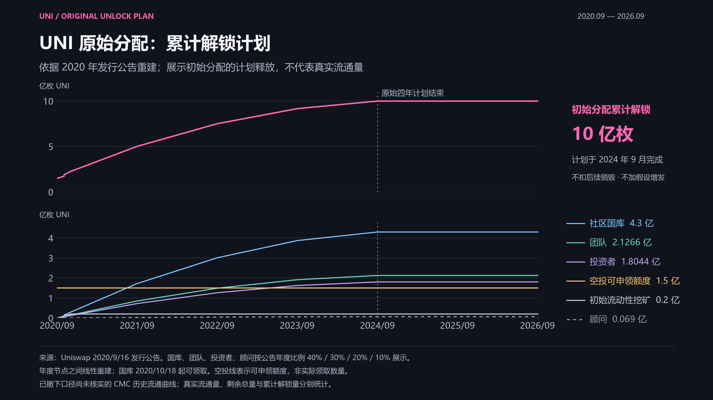
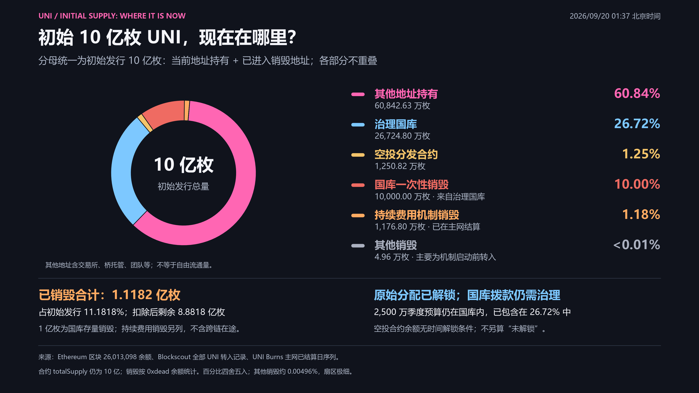
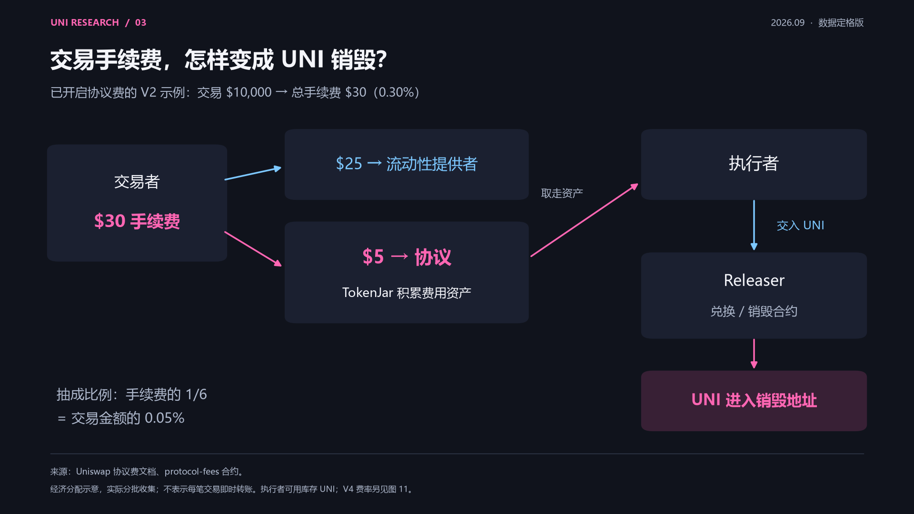
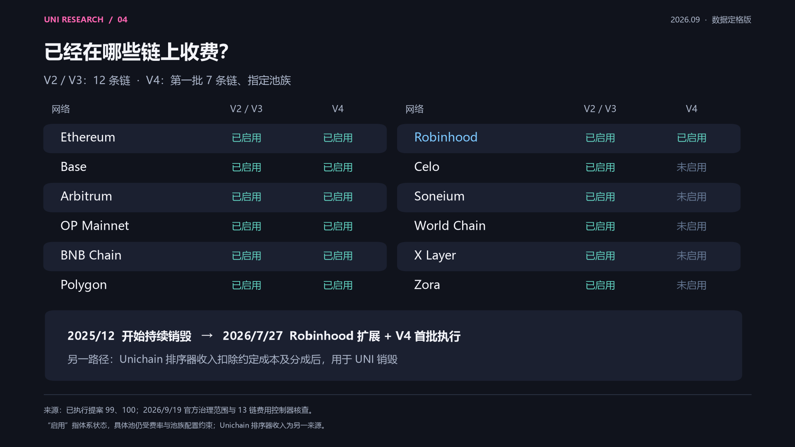
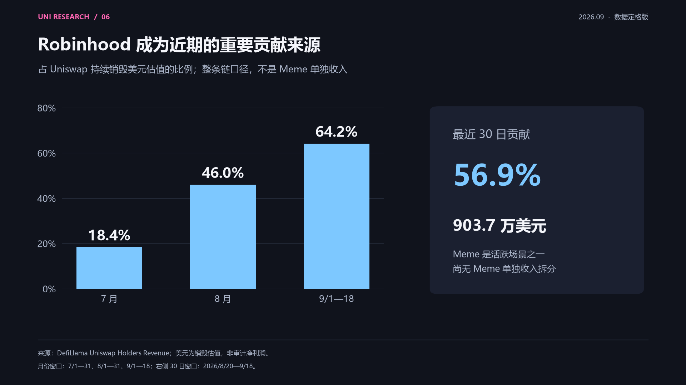
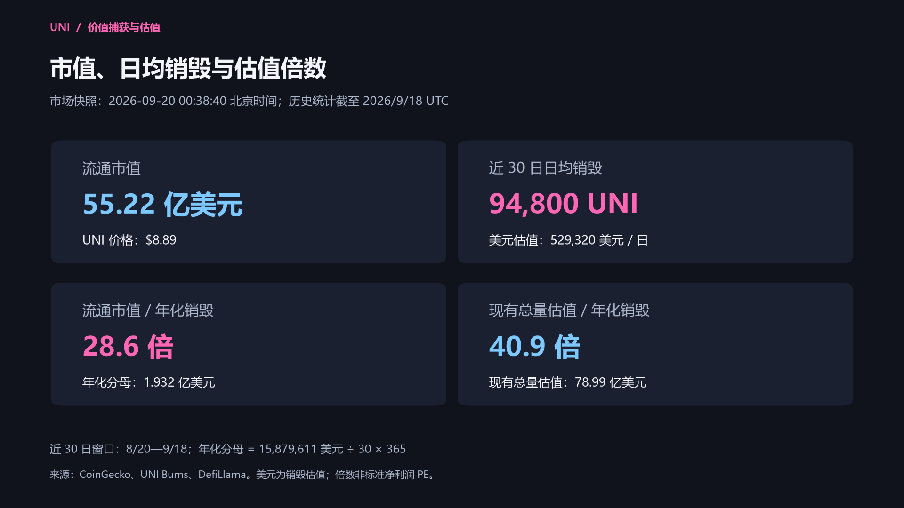
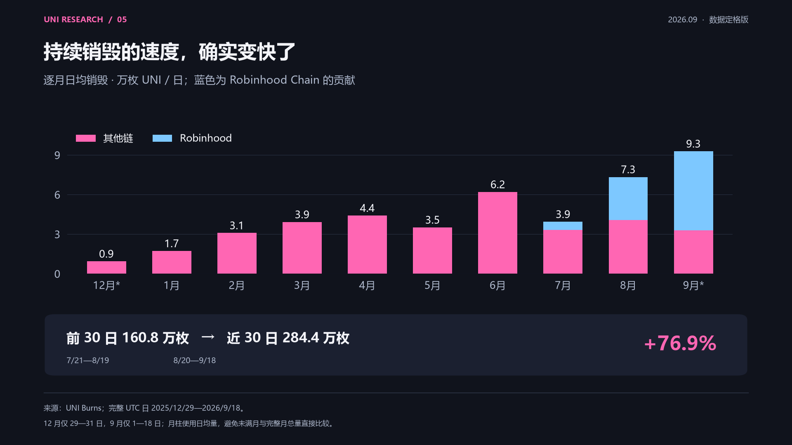

# UNI 价值捕获研究：从协议收入到代币销毁

UNI 的价值捕获，正在从治理权延伸至协议收入驱动的代币销毁。多链收费开关的扩展，以及 Robinhood Chain 近期增长的交易活动，使交易收入与 UNI 供给之间的联系更加直接。

理解这一变化，需要同时观察收入和供给：哪些交易已经向协议付费，费用如何转化为销毁，国库还持有多少 UNI，以及近期销毁规模对应怎样的估值倍数。**近 30 日日均销毁约 9.48 万枚 UNI；Robinhood Chain 贡献了同期约 56.9% 的销毁美元估值；按这一窗口年化，流通市值对应的回购销毁倍数约为 28.6 倍。**

**研究截至 2026 年 9 月 20 日。** 历史数据覆盖 2025-12-29 至 2026-09-18，共 264 个完整 UTC 日；价格与市值快照为 **2026-09-20 00:38:40（北京时间）**。持仓与销毁分布采用 Ethereum 区块 26,013,098，即北京时间 2026-09-20 01:37:35。各项指标按其统计区间比较，具体定义见文末。

## 代币经济学：发行、供给与价值捕获

### 初始发行与分配

UNI 于 **2020 年 9 月 16 日**推出，初始铸造 **10 亿枚**。社区合计 60%，团队、投资者与顾问合计 40%。

| 初始分配 | 占初始供应 | UNI 数量 |
|---|---:|---:|
| 社区国库 | 43% | 4.30 亿 |
| 历史用户与 LP 等空投 | 15% | 1.50 亿 |
| 初始流动性挖矿 | 2% | 2,000 万 |
| 团队及未来员工 | 21.266% | 2.1266 亿 |
| 投资者 | 18.044% | 1.8044 亿 |
| 顾问 | 0.69% | 690 万 |
| **合计** | **100%** | **10 亿** |

初始分配不等于当前持仓结构。原始安排包含四年释放期；即使该安排结束，国库仍可拨款并将存量代币转入市场。来源：[发行公告](https://blog.uniswap.org/uni)。

### 原始解锁计划与流通供应

- **累计计划解锁：** 图中上半部分展示初始分配的累计解锁计划，下半部分分别展示社区国库、团队、投资者、顾问、空投可申领额度与初始流动性挖矿。原始四年计划于 2024 年 9 月结束，合计 10 亿枚；计划线不扣后续销毁，也不代表当前流通量。
- **历史流通量的可比性：** CMC 快照从 2023-02-26 的约 7.622 亿枚，降到 2023-03-26 的约 5.775 亿枚，下降约 24.2%；同一来源的总量字段均为 10 亿。这两次快照之间缺少可核实的地址分类调整或资金变动解释，尚不足以据此重建同口径的历史流通曲线。
- **解锁量、流通量与剩余总量：** 累计解锁量按既定计划累计；自由流通量还受国库、团队等排除地址及其余额影响，本身可以下降；剩余总量则应按铸造和销毁核对。上图描述原始释放安排，不代表自由流通量的历史变化。

来源：[发行公告与原始释放图](https://blog.uniswap.org/uni)、[CMC 2023-02-26 快照](https://coinmarketcap.com/historical/20230226/)、[CMC 2023-03-26 快照](https://coinmarketcap.com/historical/20230326/)、[CMC 供应量定义](https://support.coinmarketcap.com/hc/en-us/articles/360043396252-Supply-Circulating-Total-Max)。下载：[4K PNG](../assets/unlock-schedule.png) · [1080P PNG](../assets/unlock-schedule-1080p.png) · [SVG](../assets/unlock-schedule.svg) · [解锁计划计算方法](../methods/unlock-schedule.html) · [历史流通量口径说明](../methods/circulating-supply.html)。

### 初始 10 亿枚的当前去向：现有持仓与已销毁

**饼图以初始发行的 10 亿枚 UNI 为分母，同时展示现有持仓与已销毁数量。** 快照为北京时间 **2026-09-20 01:37:35**，Ethereum 区块 **26,013,098**。各类别互斥，合计 10 亿枚。

| 当前去向 | UNI 数量 | 占初始发行 |
|---|---:|---:|
| 其他地址持有 | 608,426,260.730699 | 60.8426% |
| 治理国库 | 267,247,996.305835 | 26.7248% |
| 空投分发合约 | 12,508,161.879776 | 1.2508% |
| 国库一次性销毁 | 100,000,000.000000 | 10.0000% |
| 持续费用机制销毁 | 11,768,000.000000 | 1.1768% |
| 其他销毁 | 49,581.083690 | 0.0050% |

**销毁来源：** 1 亿枚由治理国库直接销毁，没有市场购币；持续费用机制已在主网结算 **1,176.80 万枚**。另有约 **4.96 万枚**其他销毁，主要在机制启动前已进入销毁地址，不归入费用回购。三者合计 **1.1182 亿枚，占初始发行 11.1818%**；扣除后剩余 **8.8818 亿枚**。合约 `totalSupply()` 本身仍返回 10 亿。

**链上结算口径：** 全历史 4,481 条 UNI 转入记录合计与销毁地址余额精确相等；持续费用金额的 265 个 UTC 日与 UNI Burns 主网已结算序列逐日一致。历史日序列统计各链已触发的销毁流程，包含跨链在途数量；饼图仅使用主网已结算数字。

**原始解锁与后续国库预算：** 原始四年分配计划已结束；当前国库仍有 **2,500 万 UNI** 季度预算待领取，每季度 **500 万**，下一期 **2026-10-01**，已包含在国库 **26.72%** 中。空投合约约 **1,250.82 万枚**没有时间解锁条件，仅标为合约余额，不等于逐笔确认过的有效未领取权利。其他地址不等于自由流通量，跨链映射币不重复计数。

**1 亿枚的来源与日期：** 治理国库 Timelock → `0xdead`，提案 93 执行于 **2025-12-27 20:33:11 UTC**，即北京时间 **2025-12-28 04:33:11**。相当于初始发行的 **10%**、原始国库 4.3 亿配额的 **23.26%**，没有按比例扣减团队或投资者钱包。

来源：[执行交易](https://eth.blockscout.com/tx/0x091f0083242a777d55821c1189e568d6d033d9da501b75087dc736fa143d2c1e)、[提案 93](https://vote.uniswapfoundation.org/proposals/93)、[UNI Burns](https://uniburns.com/)、[余额与历史转入核对](../methods/burn-reconciliation.html)。下载：[4K PNG](../assets/supply-distribution.png) · [1080P PNG](../assets/supply-distribution-1080p.png) · [SVG](../assets/supply-distribution.svg) · [分类数据](../downloads/supply-distribution.json)。

### 从发行到持续销毁的时间线

| 时间 / 阶段 | 已确认事项 | 与 UNI 的关系 |
|---|---|---|
| 2020-09-16 | 发行 UNI | 初始功能以协议治理为主 |
| 2025-12-27 UTC（北京时间 12-28） | UNIfication 提案 #93 执行 | 一次性销毁 1 亿枚国库 UNI；Ethereum V2 与选定 V3 池启用协议费；授权持续收入兑换销毁体系 |
| 2025-12-29 起 | UNI Burns 日序列开始记录持续销毁 | 统计起点晚于治理执行时点 |
| 2026-03-07 / 03-08 | #94、#95 分批执行 | 扩展多链 V2/V3 收费，并更新 V3 费档适配器；Celo 当时存在执行问题 |
| 2026-06-01 | #96 执行 | BNB Chain、Polygon 扩展；修正并完成 Celo 的跨链收费开关操作 |
| 2026-07-27 | #99、#100 执行 | Robinhood Chain V2/V3 启用；V4 第一批 7 条链启用 |

#93 的日期采用执行交易的区块时间，其他日期采用治理门户记录。跨链执行、池配置生效、收入收集和首次销毁之间可能存在时间差。来源：[提案 93 执行交易](https://eth.blockscout.com/tx/0x091f0083242a777d55821c1189e568d6d033d9da501b75087dc736fa143d2c1e)、[提案 93](https://vote.uniswapfoundation.org/proposals/93)、[94](https://vote.uniswapfoundation.org/proposals/94)、[95](https://vote.uniswapfoundation.org/proposals/95)、[96](https://vote.uniswapfoundation.org/proposals/96)、[99](https://vote.uniswapfoundation.org/proposals/99)、[100](https://vote.uniswapfoundation.org/proposals/100)。

### 累计销毁：国库处置与持续费用机制

| 项目 | UNI 数量 | 占初始 10 亿枚 | 性质 |
|---|---:|---:|---|
| 一次性国库销毁 | **100,000,000** | **10.000%** | 2025 年底将已有国库代币转入销毁地址，无新增市场买入 |
| 持续费用机制已触发 | **12,070,000** | **1.207%** | 2025/12/29—2026/9/18 累计，含跨链待结算 |
| 两项合计（含待结算） | **112,070,000** | **11.207%** | 国库处置与持续费用机制的合计，并非全部来自市场回购 |

持续机制的统计包含源链已触发、以太坊主网尚待结算的部分，因此高于上文饼图中的主网已结算数量。完整日累计为 **1,207 万枚**；9 月 19 日进行中快照约为 1,208.8 万枚，未纳入完整日汇总。来源：[UNI Burns](https://uniburns.com/api/data)、[一次性销毁执行内容](https://vote.uniswapfoundation.org/proposals/93)。

### 当前赋能与费用转换路径

| 项目 | 当前机制 |
|---|---|
| 治理 | UNI 可委托或投票，影响协议费参数、国库拨款及相关治理事项 |
| 协议收入驱动销毁 | 部分协议收入兑换成 UNI，进入销毁流程，减少可用供应 |
| 直接分红 | 当前机制不向每个 UNI 钱包自动发放现金或手续费 |
| Unichain 贡献 | 排序器收入扣除 L1 数据成本与约定的 Optimism 15% 分配后，进入销毁机制 |
| Gas 用途 | Unichain 使用 ETH 支付原生 Gas |

**机制关系：交易活动 → 已启用池的协议费 → TokenJar 累积费用资产 → 执行者交付 UNI、取走费用资产 → UNI 进入销毁流程。**

这通常被称为“回购销毁”，更准确的经济动作是“协议收入兑换 UNI 并销毁”。执行者可使用市场买入的 UNI，也可使用库存；不存在固定每天同一时刻由项目方执行的美元买单。来源：[协议费文档](https://developers.uniswap.org/docs/protocols/protocol-fee/concepts/fees)、[合约仓库](https://github.com/Uniswap/protocol-fees)、[UNIfication](https://blog.uniswap.org/unification)。

### 不同链的收费开关

**截至 2026 年 9 月 19 日，V2/V3 已在 12 条链启用协议费；V4 首批覆盖其中 7 条链的获批池族。**

| 链 | V2/V3 状态 | 对应治理执行阶段 | V4 状态 |
|---|---|---|---|
| Ethereum | 已启用 | #93：2025/12/27 UTC；#94 后续扩大 V3 覆盖 | 已启用，#100 首批 |
| Arbitrum One | 已启用 | #94：2026/3/7 | 已启用，#100 首批 |
| Base | 已启用 | #94：2026/3/7 | 已启用，#100 首批 |
| OP Mainnet | 已启用 | #94：2026/3/7 | 已启用，#100 首批 |
| Soneium | 已启用 | #95：2026/3/8 | 尚未启用 |
| X Layer | 已启用 | #95：2026/3/8 | 尚未启用 |
| World Chain | 已启用 | #95：2026/3/8 | 尚未启用 |
| Zora | 已启用 | #95：2026/3/8 | 尚未启用 |
| Celo | 已启用 | #96：2026/6/1 完成修正 | 尚未启用 |
| BNB Chain | 已启用 | #96：2026/6/1 | 已启用，#100 首批 |
| Polygon | 已启用 | #96：2026/6/1 | 已启用，#100 首批 |
| Robinhood Chain | 已启用 | #99：2026/7/27 | 已启用，#100 首批 |

Unichain 的排序器收入单列统计。Arc 收费扩展仍处于提案阶段，未计入已启用范围。V4 首批七链对应 #100 于 2026/7/27 的执行，其余五链尚未纳入已执行范围。

收费范围依据上述执行提案、[9/18 扩链讨论](https://gov.uniswap.org/t/temp-check-protocol-fee-expansion-arc/26287)和 [9/19 费用控制器快照](../downloads/fee-controllers.json)。部分概览文档更新滞后，状态以执行记录与链上配置为准。

### 具体抽成比例

以下费率的分母均为**交易输入金额**；最后一列的分母才是交易手续费。

| 版本 / 费档 | 总交易费率 | LP 所得 | 协议所得 | 协议占总手续费 |
|---|---:|---:|---:|---:|
| V2 | 0.30% | 0.25% | 0.05% | 1/6 |
| V3：0.01% 档 | 0.01% | 0.0075% | 0.0025% | 1/4 |
| V3：0.05% 档 | 0.05% | 0.0375% | 0.0125% | 1/4 |
| V3：0.30% 档 | 0.30% | 0.25% | 0.05% | 1/6 |
| V3：1% 档 | 1% | 约 0.8333% | 约 0.1667% | 1/6 |

V2 的经济分配示例：1 万美元交易产生 30 美元手续费，其中 25 美元属于 LP、5 美元属于协议。V2 实际通过协议 LP 份额等步骤收集，不是每笔即时向持有人转账。

**V4 原生池采用不同的计费顺序。** 协议费先扣，LP 费再对剩余输入收取。LP 参数 0.30%、协议参数 0.05% 时，合成总费率为约 **0.3499%**，高于 V2 示例中的 0.30% 总费率。不同池族、Hook 和动态费池受不同配置约束。来源：[费用配置](https://developers.uniswap.org/docs/protocols/protocol-fee/concepts/fees)、[V4 计算代码](https://github.com/Uniswap/v4-core/blob/main/src/libraries/ProtocolFeeLibrary.sol)。

### 国库预算与增发权限

- **国库增长预算：** 每年 2,000 万 UNI，每季度 500 万；授权两年合计 4,000 万，来自已发行国库存量。
- **治理增发权限：** 两次增发至少间隔 365 天，每次不超过当时合约总供应量的 2%；不是每年自动增发 2%。截至 2026/9/19，官方文档与链上快照均未显示后续通胀铸造已发生。
- **供给口径：** 转入销毁地址不会使 UNI 合约的 `totalSupply()` 自动减少；行情平台扣除销毁后的供应、合约原始总量与流通量是三种定义。
- **流通变化：** 预算授权、实际拨款和市场卖出发生在不同环节。销毁量减去年度预算，并不能直接衡量实际净供给变化。

来源：[执行提案 93](https://vote.uniswapfoundation.org/proposals/93)、[UNI 当前说明](https://developers.uniswap.org/docs/ecosystem/governance/uni)、[铸币权限合约](https://github.com/Uniswap/governance/blob/master/contracts/Uni.sol)。

## Robinhood Chain：Meme 交易与收入贡献

### 新链、发币产品与收费衔接

| 日期 | 事实 | 收入联系 |
|---|---|---|
| 2026-07-01 | Robinhood Chain 主网上线，Uniswap V2/V3/V4 同期部署 | 新链交易流量进入 Uniswap；部署不等于当日已启用协议抽成 |
| 2026-07-27 | #99 与 #100 执行 | Robinhood 上的 V2/V3 及获批 V4 池进入协议费体系 |
| 2026-08-05 | Uniswap Labs 推出 Pools.trade | Meme 发币与交易产品，两种发行路径最终进入 Uniswap V4 池 |

Pools.trade 官方材料说明其面向 Meme，初始 LP 费用为 0.25%，可自动复投到锁定流动性。**这笔 LP 费用不等于全部归 UNI**；代币价值捕获来自符合配置的协议收费部分。

来源：[Robinhood 扩链提案](https://vote.uniswapfoundation.org/proposals/99)、[Pools.trade 官方介绍](https://blog.uniswap.org/pools-trade-a-new-way-to-launch-on-robinhood-chain)。

### 交易活跃度与进入销毁环节的贡献

采用两个等长 30 日窗口。Robinhood 为**整条链口径**，不是 Meme 专属口径。

| 指标 | 前 30 日：7/21—8/19 | 近 30 日：8/20—9/18 |
|---|---:|---:|
| Robinhood 全链 DEX 交易量 | 138.45 亿美元 | 412.81 亿美元 |
| Robinhood 上 Uniswap 交易量 | 125.40 亿美元 | 325.93 亿美元 |
| Uniswap 占该链 DEX 交易量 | 90.6% | 79.0% |
| 归因该链的 UNI 持续销毁 | 73.6 万枚 | **154.6 万枚** |
| 该链贡献的销毁美元估值 | 279.87 万美元 | **903.68 万美元** |
| 占全 Uniswap 销毁美元估值 | 47.8% | **56.9%** |

近 30 日，Robinhood Chain 贡献的收入中，**约 903.7 万美元最终体现为 UNI 销毁估值，日均约 30.12 万美元，占 Uniswap 同期约 56.9%。** 这衡量已进入销毁环节的价值；不是 Robinhood 公司净利润，也不是链上全部用户支付的手续费。

来源：[Uniswap 交易量](https://api.llama.fi/summary/dexs/uniswap)、[Robinhood 全链 DEX 交易量](https://api.llama.fi/overview/dexs/Robinhood%20Chain)、[Uniswap Holders Revenue](https://api.llama.fi/summary/fees/uniswap?dataType=dailyHoldersRevenue)、[UNI Burns](https://uniburns.com/api/data)。

### 贡献占比的变化

| 统计期间 | Robinhood 销毁美元估值 | 占全 Uniswap 同期比例 |
|---|---:|---:|
| 2026 年 7 月 | 80.59 万美元 | 18.4% |
| 2026 年 8 月 | 408.71 万美元 | 46.0% |
| 2026 年 9 月 1—18 日 | 694.25 万美元 | 64.2% |
| 最近 30 日：8/20—9/18 | 903.68 万美元 | 56.9% |

两个 30 日窗口相比，Uniswap 全部销毁增加 123.6 万枚，其中 Robinhood 增加 81 万枚，贡献新增枚数的 **65.5%**；按美元销毁估值计算，该链贡献新增金额的 **62.2%**。这些是增长贡献的拆分，不是 UNI 涨幅的因果拆分。

**Robinhood Chain 已成为近期收入兑换销毁的重要来源。** Pools.trade 将 Meme 发行与 Uniswap V4 池连接起来，但现有数据尚不足以单独量化 Meme 交易的手续费及销毁贡献。全链 903.7 万美元的销毁估值包含不同类型交易，不能全部归因于 Meme。

## 回购销毁与估值：如何理解 28.6 倍

### 当前市场快照

| 指标 | 数值 | 定义 |
|---|---:|---|
| 市场快照时间 | **2026-09-20 00:38:40 北京时间** | CoinGecko `last_updated` |
| UNI 价格 | **8.89 美元** | 来源报价，已舍入 |
| 流通数量 | **6.2093 亿枚** | 来源统计的流通供应 |
| 流通市值 | **55.22 亿美元** | 5,522,357,332 USD |
| 现有未销毁总量 | **8.8818 亿枚** | 包含国库等未计入流通的存量 |
| 现有总量估值 / 来源 FDV | **78.99 亿美元** | 7,899,160,546 USD；未模拟未来增发 |

市值采用数据源原值；表中价格经过舍入，因此与显示供应量相乘可能存在尾差。来源：[CoinGecko UNI](https://www.coingecko.com/en/coins/uniswap) · [市场快照数据](../downloads/coingecko-snapshot.json)。

### 不同时间窗口的日均销毁

| 观察窗口 | 日数 | 窗口销毁总量（万 UNI） | 日均销毁（UNI） | 日均销毁美元估值（USD） |
|---|---:|---:|---:|---:|
| 启动以来：2025/12/29—2026/9/18 | 264 | 1,207.0 | **45,720** | **183,244** |
| 前 30 日：7/21—8/19 | 30 | 160.8 | **53,600** | **195,214** |
| 近 30 日：8/20—9/18 | 30 | 284.4 | **94,800** | **529,320** |
| 近 7 日：9/12—18 | 7 | 46.8 | **66,857** | **455,365** |

**近 30 日日均销毁约 9.48 万枚 UNI，对应历史日均销毁估值约 52.93 万美元。** 近 7 日则降至约 6.69 万枚、45.54 万美元/日。日均值反映所选窗口的平均速度，实际执行量会波动。

枚数与美元估值分别按各自日序列汇总。9.48 万枚乘以当前 8.89 美元得到的是按当前价格重估的金额，与历史日均美元值不同。来源：[UNI Burns](https://uniburns.com/api/data)、[DefiLlama Holders Revenue](https://api.llama.fi/summary/fees/uniswap?dataType=dailyHoldersRevenue)。

### 年化回购销毁倍数与 PE 的区别

**这里采用“估值 ÷ 年化回购销毁价值”，衡量估值相对于销毁规模的倍数。** 它可用于类似 PE 的比较，但分母尚未按统一净利润口径计入协议发展、团队和生态等支出，因此不等同于标准市盈率。PE 的定义取决于净利润口径，与是否发放现金分红无关。

| 计算步骤 | 算式 / 结果 |
|---|---|
| 近 30 日销毁美元估值 | 15,879,611 美元 |
| 年化销毁美元估值 | 15,879,611 ÷ 30 × 365 = **193,201,934 美元**，约 **1.932 亿美元** |
| 流通口径回购倍数 | 5,522,357,332 ÷ 193,201,934 = **28.6 倍** |
| 现有总量口径回购倍数 | 7,899,160,546 ÷ 193,201,934 = **40.9 倍** |
| 年化销毁价值 / 流通市值 | **3.50%**；回购倍数的倒数，不是现金分红率 |

同一个市场快照，使用不同收入窗口：

| 回看窗口 | 年化销毁美元估值 | 流通市值倍数 | 现有总量估值倍数 |
|---|---:|---:|---:|
| 近 7 日：9/12—18 | 1.662 亿 | 33.2 倍 | 47.5 倍 |
| 近 30 日：8/20—9/18 | 1.932 亿 | 28.6 倍 | 40.9 倍 |
| 启动以来：2025/12/29—2026/9/18 | 0.669 亿 | 82.6 倍 | 118.1 倍 |

年化只是将所选窗口的平均速度乘以 365。一次性国库销毁 1 亿枚不计入分母；近 30 日结果不能直接当作已实现全年收益。

### 最近数据变化

- 近 30 日销毁 **284.4 万 UNI**，较前 30 日的 160.8 万增加 **76.9%**。
- 同期销毁美元估值增加 **171.1%**，包含 UNI 自身价格变化的影响，不能全部解释为业务收入规模增长。
- 最近两个 7 日窗口：销毁 **72.2 万 → 46.8 万枚，下降 35.2%**；同期 9/11—9/18 UNI 收盘价上涨约 47.5%。价格与当期销毁并非同步变化。

来源为上述 UNI Burns、DefiLlama 序列，以及 [Binance 日 K 数据](https://developers.binance.com/en/docs/catalog/core-trading-spot-trading/api/rest-api/market)。

## 增长预期：收费扩展与新增收入来源

截至 **2026-09-20（北京时间）**，治理讨论与产品进展指向两类增长来源：扩大现有协议费的覆盖范围，以及引入新的费用渠道。不同方向所处阶段不同，产品上线之后仍需观察实际交易与收入。

**这些进展能否扩大 UNI 的价值捕获，取决于新增交易是否产生协议费，以及费用是否持续进入销毁机制。**

### 有明确治理步骤的收费扩展

| 事项 | 已确认的讨论或安排 | 当前阶段 | 需要继续验证的节点 |
|---|---|---|---|
| **Arc 的 V2/V3/V4 收费** | Uniswap Labs 于 2026/9/18 发起扩链提案；原帖安排 9/18—23 进行 Snapshot，成功后再进行链上投票 | **提案／温度检查阶段**；部分收费基础设施地址仍待确定 | Snapshot 结果、链上提案与执行、Arc 实际收费及首笔销毁 |
| **V4 剩余五条链** | 已执行的 #100 标题为 Part 1/2，明确将 Celo、Soneium、World Chain、X Layer、Zora 留给后续提案 | **首批七链已执行，剩余五链待后续提案**；截至统计日，尚无已核实的 Part 2 执行记录 | 后续提案范围、具体池族、链上收费控制器及实际收入 |

Arc 已于 9/16 支持 Uniswap 产品，但协议部署和收费开关是不同步骤。两项扩展的经济意义是扩大可收费交易范围；收入大小还取决于实际交易量、费率及流动性，链数增加不能直接等比例推算收入。

来源：[Arc 治理原帖](https://gov.uniswap.org/t/temp-check-protocol-fee-expansion-arc/26287)、[Arc 上线公告](https://blog.uniswap.org/uniswap-is-live-on-arc)、[已执行提案 #100](https://vote.uniswapfoundation.org/proposals/100)、[治理提案列表](https://vote.uniswapfoundation.org/proposals)。

### 聚合器 Hook：扩大可收费交易的来源

官方在 **2026/3/18** 宣布聚合器 Hook 首次在 Tempo 上线，将 Tempo 原生稳定币交易所的流动性接入 Uniswap V4 路由。官方当时表示将继续支持更多链和流动性来源。聚合器 Hook 已有产品落地，后续增长取决于支持范围的扩展与收费机制的落实。

#100 已为聚合器 Hook 池族设计收费规则，费用进入 TokenJar。**这一设计意味着，部分通过 Uniswap 路由成交的外部流动性，也可能产生协议收入。** 实际收入仍取决于各部署的收费配置；Tempo 上线本身不代表全部外部交易均已向 UNI 贡献收入，聚合器 Hook 的独立收入规模尚未核实。

来源：[Tempo 上线与首个聚合器 Hook](https://blog.uniswap.org/uniswap-is-live-on-tempo)、[提案 #100 的聚合器池族规则](https://vote.uniswapfoundation.org/proposals/100)。

### PFDA：协议费折扣拍卖

**Protocol Fee Discount Auctions，协议费折扣拍卖**，是 UNIfication 中明确提出的机制：拍卖某个地址在一段短时间内免付协议费的资格，拍卖收入用于 UNI 销毁，目标是让协议和 LP 留住一部分原本由套利与区块构建环节获取的价值。

**PFDA 已列入官方路线图，正式上线时间和独立收入尚未核实。** 现有依据主要是 2025 年的提案与说明，尚不足以量化新增收入。当前 28.6 倍采用已观察到的销毁金额，未另行加入 PFDA 的预测贡献。

UniswapX 也曾被列为后续费用来源，但其具体收费执行范围与独立收入尚未核实，仍属于待观察方向。

来源：[UNIfication 官方路线图](https://blog.uniswap.org/unification)、[Hayden 对 LP 与 PFDA 的回复](https://gov.uniswap.org/t/unification-proposal/25881/34)、[协议费架构概览](https://developers.uniswap.org/docs/protocols/protocol-fee/overview)。

### 稳定币与机构资产：从产品扩展到收入转化

| 产品方向 | 官方已披露进展 | 对未来收入的含义与边界 |
|---|---|---|
| **StablePair Hook** | 2026/9/10 上线，以太坊首批为 USDC/USDG、USDC/USDT，使用动态费改善 LP 的价值获取 | 可能提升稳定币交易竞争力；具体新增交易量和 UNI 收入仍需数据。该 Hook 的荷兰拍卖设计并不构成 PFDA 已上线的证据 |
| **Permissioned Pools** | 2026/8/24 技术说明确认标准已在以太坊主网及 Sepolia 上线，支持发行人的准入规则，适用于代币化基金等资产 | 扩大可接入的资产种类；产品可用、资产接入、成交增长、UNI 收费是不同环节，收入规模需依据实际成交和收费测算 |

上述上线进展依据官方披露。潜在收入增长属于对产品用途的推论，尚需新池交易量、收费配置和销毁数据验证。

来源：[StablePair 上线公告](https://blog.uniswap.org/stablepair-hook-a-fee-that-moves-with-the-market)、[Permissioned Pools 技术说明](https://blog.uniswap.org/how-permissioned-pools-work-on-uniswap-v4)。

### 治理讨论中的分歧：收费扩张能否持续

V4 收费讨论并非一致乐观。**Panoptic 创始人 guil-lambert** 担心 LP 在收益不足时承受更多抽成；**Gamma Strategies** 主张更谨慎地按链和竞争状况推进。**Uniswap Labs 于 2026/7/18 回复**称，其观察的以太坊前 25 个 V3 池以代币单位计保留约 98.5% 的原有流动性，并表示将持续监测、必要时提出费率调整。该数据是 Labs 披露的 V3 历史样本，其结论能否适用于不同链和 V4 池，仍需持续观察。

另有社区成员在 8/14 建议先覆盖安全、运营和储备需要，再用审计后的盈余销毁；UNIfication 讨论中也有人提出 UNI 质押设想。**这些建议仍属社区讨论，尚无已核实的生效规则。** 现有依据不足以确认 UNI 将推出分红、质押收益，或改变销毁政策。

来源：[V4 收费争议与 Labs 回复](https://gov.uniswap.org/t/temp-check-activate-v4-protocol-fees/26162)、[先留储备的社区建议](https://gov.uniswap.org/t/temp-check-activate-v4-protocol-fees/26162/25)、[UNI 质押设想](https://gov.uniswap.org/t/unification-proposal/25881/58)。

### 增长预期如何影响估值倍数

现有 **28.6 倍**采用流通市值除以近 30 日年化销毁价值。新增业务只有持续产生费用并进入 UNI 销毁，才会扩大这一分母。当前估值已经包含哪些市场预期，无法仅凭这些治理帖子量化。

**估值敏感性示例：** 假设流通市值维持上述快照水平，年度销毁美元价值恰好翻倍，倍数将从约 28.6 降至 14.3。市值变化、费用下降和代币美元估值变化都会改变结果；币价上涨也意味着相同美元费用能换取更少枚 UNI。

后续应重点跟踪：**实际收费覆盖、分来源销毁金额、LP 留存与成交量、国库预算拨付**。Robinhood 的贡献也需要观察持续性，暂时不能用其全链收入替代 Meme 专属贡献。

UNI 未来的估值判断，需要以实际收费、持续销毁和供给变化为依据。现有路线图尚未形成可核实的统一盈利或销毁数量预测，因此这些方向更适合作为收入增长的观察指标，而非一个已经确定的未来 PE。

## 历史数据：持续销毁的逐月变化

所有自然月均按完整 UTC 日；12 月和 9 月为部分月份。比较速度使用日均量，不直接比较部分月份与完整月份的总量。

| 月份 | 已统计日数 | 销毁总量（万 UNI） | 日均（万 UNI） | 销毁美元估值（万美元） | Robinhood 美元贡献占比 |
|---|---:|---:|---:|---:|---:|
| 2025-12（12/29—31） | 3 | 2.8 | 0.93 | 16.4 | 0.0% |
| 2026-01 | 31 | 53.4 | 1.72 | 286.5 | 0.0% |
| 2026-02 | 28 | 86.4 | 3.09 | 320.9 | 0.0% |
| 2026-03 | 31 | 121.4 | 3.92 | 458.8 | 0.0% |
| 2026-04 | 30 | 132.2 | 4.41 | 450.1 | 0.0% |
| 2026-05 | 31 | 108.8 | 3.51 | 385.2 | 0.0% |
| 2026-06 | 30 | 185.8 | 6.19 | 511.6 | 0.0% |
| 2026-07 | 31 | 122.0 | 3.94 | 438.4 | 18.4% |
| 2026-08 | 31 | 227.2 | 7.33 | 888.2 | 46.0% |
| 2026-09（9/1—18） | 18 | 167.0 | 9.28 | 1,081.5 | 64.2% |

全量逐日数据、价格和各链拆分见 [历史数据工作簿](../downloads/uni-burn-history.xlsx)。估值计算见 [测算数据](../downloads/valuation-calculations.json)。进行中 UTC 日仅保留快照，不进入完整日汇总。

## 数据口径与来源

- **统计区间：** 历史交易与销毁覆盖 2025-12-29 至 2026-09-18，共 264 个完整 UTC 日。市场价格、持仓分布和治理状态分别标注快照日期，不视为同一时刻的数据。
- **数量与美元估值：** UNI 枚数采用 UNI Burns；美元采用 DefiLlama Holders Revenue 的销毁估值。两套序列独立汇总，局部历史日存在差异，不构成逐笔一致的美元购币现金账，也未经全量交易逐笔独立审计。
- **已触发与已结算：** 历史日序列包含各源链已触发的销毁流程；持仓分布仅计入以太坊主网已结算销毁。跨链待结算数量不提前计入饼图，国库一次性销毁不计入持续收入及年化估值分母。
- **解锁与流通：** 解锁曲线按发行公告的原始四年安排重建，属于计划模型。自由流通量还受地址分类、国库存量和实际拨款影响。发行公告与后续概览文档的释放终点表述存在差异，精确到各钱包的结束日尚未独立确认。
- **收费覆盖：** 链与池族范围依据治理执行记录及费用控制器快照，并非对每个池当前费率的全量扫描。#96 于 2026/6/1 完成包含 Celo 修正在内的扩展；#100 于 2026/7/27 执行 V4 首批收费。
- **未来预期：** 治理讨论和产品进展更新至 2026-09-20。提案、产品上线和实际收入分别列示；产品进展依据官方披露，新增部署与各产品盈利能力未逐一独立审计。

各节附有对应原始来源。可下载 [研究全文](../downloads/uni-research.md)、[历史数据工作簿](../downloads/uni-burn-history.xlsx)及 [估值计算数据](../downloads/valuation-calculations.json)。

